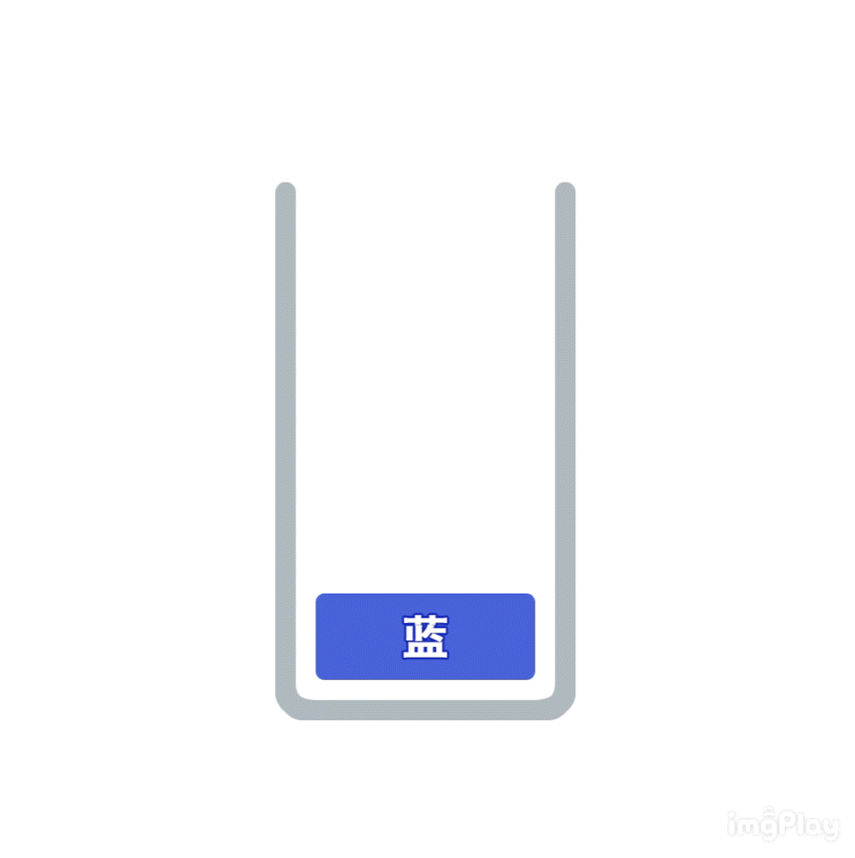
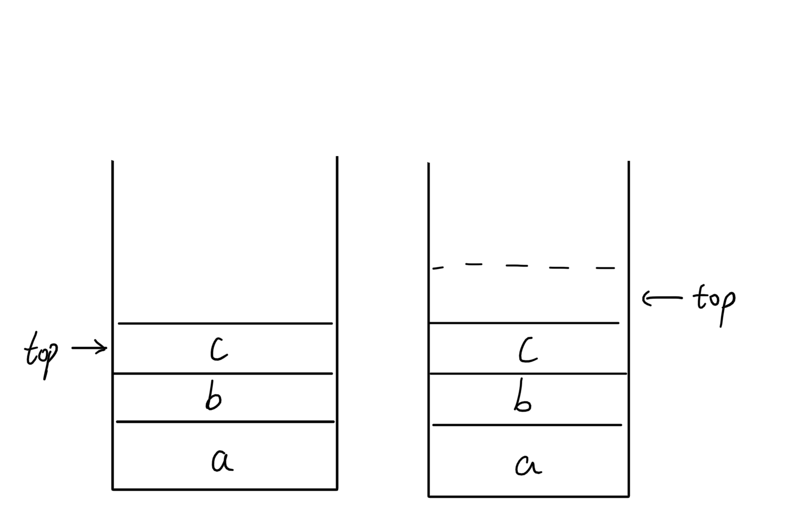
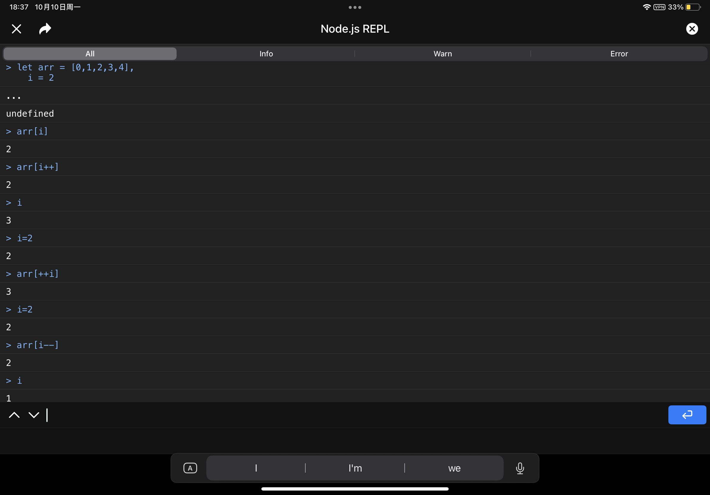
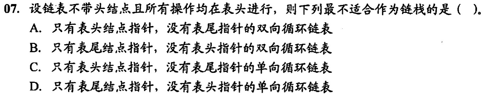
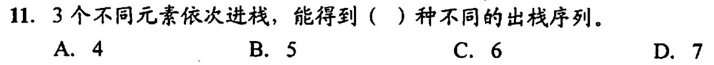

# 顺序栈


- 栈和队列具有相同的逻辑结构
- 栈是限制存取点的线性结构
- 采用共享栈的好处是节省存储空间，降低发生上溢的可能
## 两种指针不同的栈
如果栈的默认 top 指针是-1，那么 top 始终指向栈顶的一个元素，如下图左边
如果栈的默认 top 指针是 0，那么 top 始终指向栈顶的上边（也就是新元素入栈后会被放到的位置），如下图右边

top 指向不同会导致入栈和出栈的逻辑有些区别

1. top 默认为-1 时（上图左）
```c++
bool Push(SqStack &S, ElemType e) {
    if(S.top==MaxSize-1)
        return false;
    S.data[++S.top] = e;
    return true;
}

bool Pop(SqStack &S, ElemType &e) {
    if(S.top == -1)
        return false;
    e = S.data[S.top--];
    return true;
}
```
2. top 默认为 0 时（上图右）
```c++
bool Push(SqStack &S, ElemType e) {
    if(S.top==MaxSize-1)
        return false;
    S.data[S.top++] = e;
    return true;
}

bool Pop(SqStack &S, ElemType &e) {
    if(S.top == -1)
        return false;
    e = S.data[--S.top];
    return true;
}
```
> 用 js 理解下 i++ 和 ++i 的区别
> 
## 错题集
1. 
<details>
  <summary>答案与解析：</summary>
  <br />
  答案： C
  <br />
  解析：<br />
双向循环链表方便找到头结点<br />
有尾指针的单项循环链表也方便找到头结点<br />
只有表头结点没有表尾结点的单项循环链表只方便找第二个结点，要改头结点得先循环一圈
</details>
2. 
<details>
  <summary>答案与解析：</summary>
  <br />
  答案： B
  <br />
  解析：<br />
（1/(n+1))C<sup>n</sup><sub>2n</sub> = (1/(3+1))*((6*5*4)/(1*2*3)) = 5<br />
这一行换成分数写到纸上就看明白了
</details>
