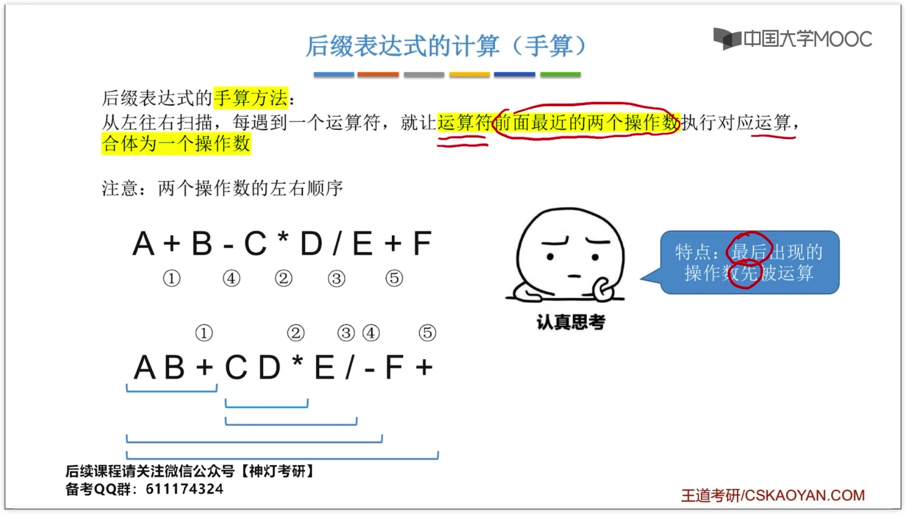
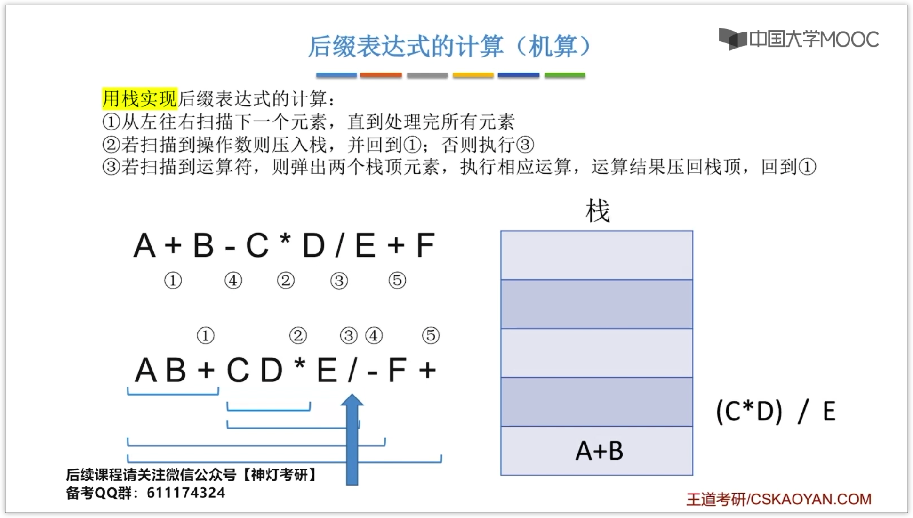
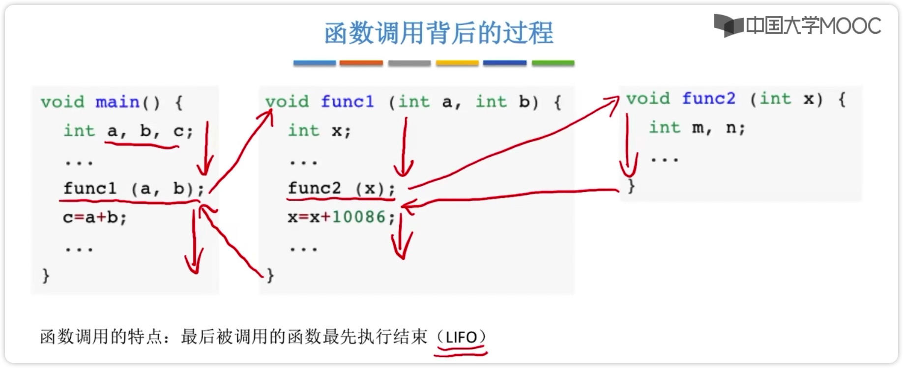

# 栈的应用
> 迷宫求解，进制转换，括号匹配，递归...
## 括号匹配
1. 左括号顺序入栈
2. 遇到右括号就从栈中弹出一个元素进行判断（匹配就下一个，不匹配就返回 false）
3. 如果最后还有右括号没匹配，但是栈里已经空就返回 false
4. 如果最后匹配完成栈还没空也返回 false
## 表达式求值
1. 中缀表达式：1+2*3/(4+5)
2. 后缀表达式(逆波兰表达式)：1 2 3 4 5 + / * +
3. 前缀表达式(波兰表达式)：+ 1 * 2 / 3 + 4 5
### 中缀表达式转后缀表达式（手算）

从左往右扫描，每遇到一个运算符，就让运算符前边最近的两个操作数执行对应运算，合成一个操作数
“左优先”原则，只要左边的运算符能先计算，就优先算左边的

### 中缀表达式转后缀表达式（机算）

1. 从左往右扫描下一个元素，知道处理完所有元素
2. 若扫描到操作数则压入栈，并回到 1；否则执行 3
3. 若扫描到运算符，则弹出两个栈顶元素，执行相应运算，运算结果压回栈顶，回到 1
> 步骤 3 中先出栈的是“右操作数”
> 减法除法要注意顺序
如果操作合法，最后栈中会留下一个元素，也就是结果
### 中缀表达式转前缀表达式（手算）
从右往左扫描，每遇到一个运算符，就让运算符后面最近的两个操作数执行对应运算，合为一个数
“右优先”原则
> 就是转后缀的方法反过来
### 中缀表达式转前缀表达式（机算）
1. 从右往左扫描下一个元素，直到处理完所有元素
2. 若扫描到操作数就压入栈，并回到 1；否则执行 3
3. 若扫描到运算符，则弹出两个栈顶元素，执行相应运算，运算结果压回栈顶，回到 1
> 步骤 3 中先出栈的是“左操作数”，注意和转后缀表达式区分
## 递归

