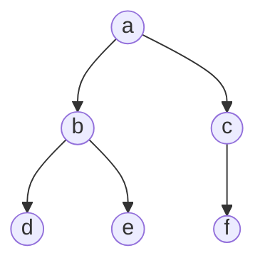
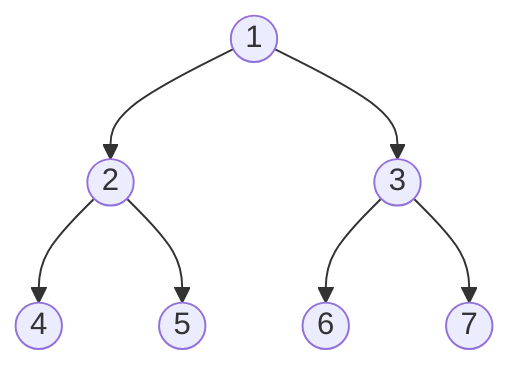
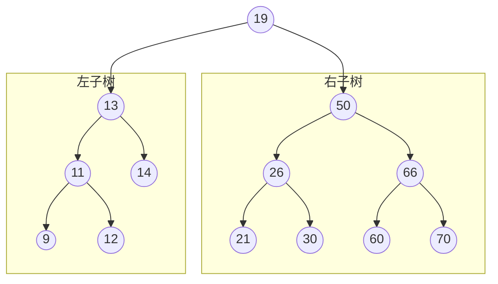

# 二叉树的定义

二叉树就是最大度为 2 的有序树
- 每个结点最多有两个子结点
- 左右子树不能颠倒

## 满二叉树
- 高度为 h，含有 2h-1 个结点
- 不存在度为 1 的结点
- 最后一层都是叶子结点，叶子结点都在最后一层
    - 叶子结点个数为 2h-1
- 按层序 1 开始编号（下图这种）
    - 结点 i 的左孩子为 2i
    - 结点 i 的右孩子为 2i+1
    - 结点 i 的父结点为 i/2（如果存在，小数向下取整）

## 完全二叉树
二叉树从左往右、从上往下一个个排，最后一层排满了就是满二叉树，没排满就是完全二叉树（如下图）

如果 14 或 15 号位置的结点存在，那也不是完全二叉树
如果没有 12 号结点但是有 13 号结点（指图上对应位置的结点），那也不是完全二叉树
- 只有最后两层可能有叶子结点
- 最多只有一个度为 1 的结点
- 按层序 1 开始编号（这条与满二叉树一致）
    - 结点 i 的左孩子为 2i
    - 结点 i 的右孩子为 2i+1
    - 结点 i 的父结点为 i/2（如果存在，小数向下取整）
- 如果一个完全二叉树有 n 个结点
    - 如果 i<=(n/2) ，那么 i 结点为分支结点
    - 如果 i>(n/2)，那么 i 结点为叶子结点
## 二叉排序树(BST)

- 左子树上左右结点的关键字均小于根结点的关键字
- 右子树上左右结点的关键字均大于根结点的关键字
- 左子树和右子树又各是一棵二叉排序树
- 可以用宇元素的排序和搜索
## 平衡二叉树
任何一个结点的左子树和右子树深度差不超过 1
下图左边为平衡二叉树，右边则不是

# 常考性质
## 二叉树
1. 
2. 
3. 
    最少有 h 个结点
## 完全二叉树
1. 具有 n 个结点的完全二叉树的高度 h=log2(n+1) 或 h=1+log2n,结果向下取整
2. 
3. 第 i 个结点所在层次为 log2(n+1) 或 1+log2n
4. 
    
    - 完全二叉树有 n 个结点
        - n 是偶数：
            - n0=n/2
            - n1=1
            - n2=n/2-1
        - n 是奇数
           - n0=(n+1)/2
            - n1=0
            - n2=(n+1)/2-1=(n-1)/2
