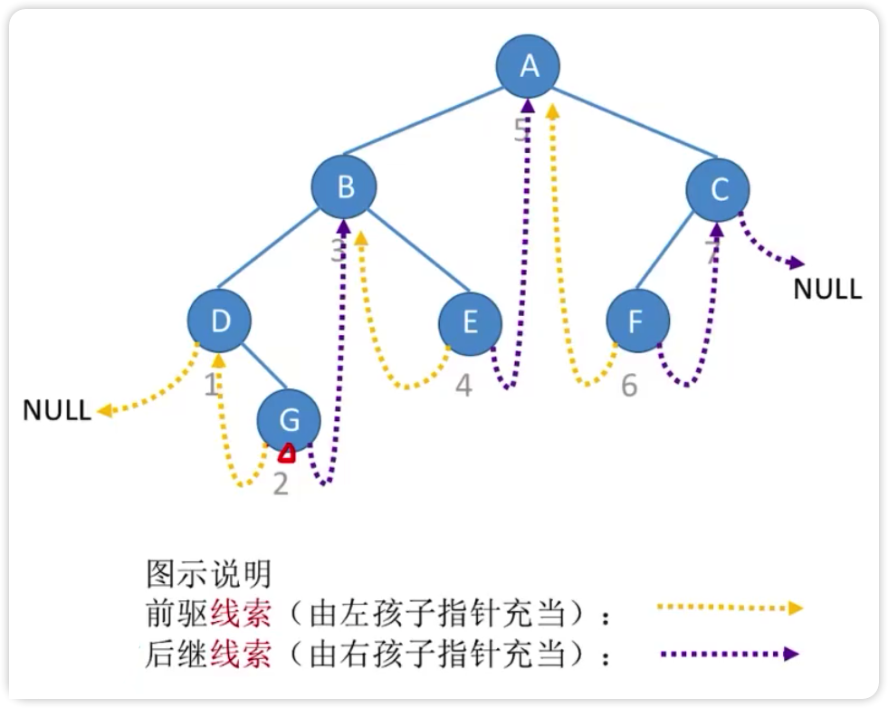
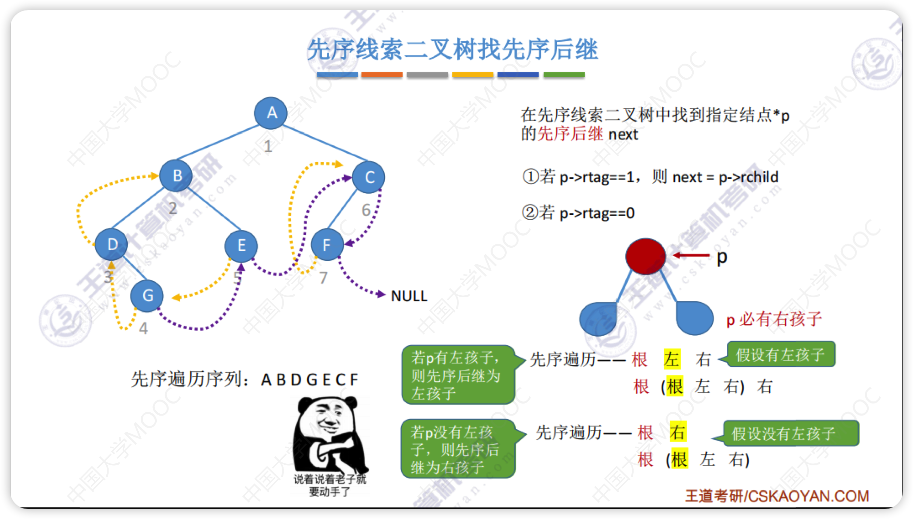
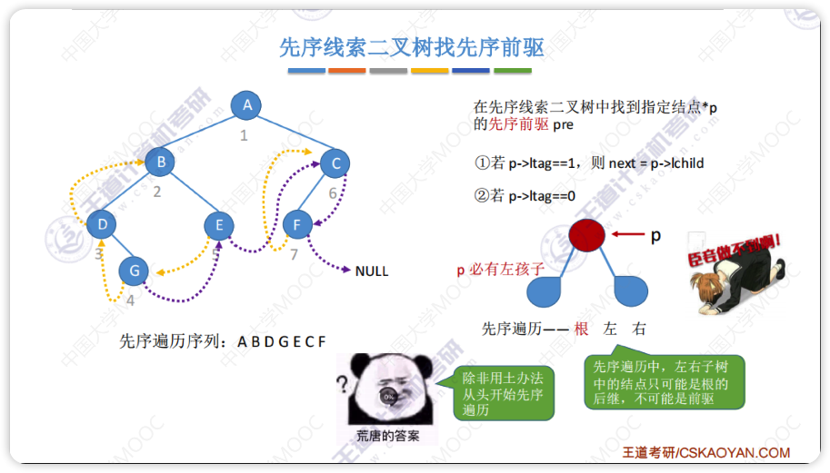
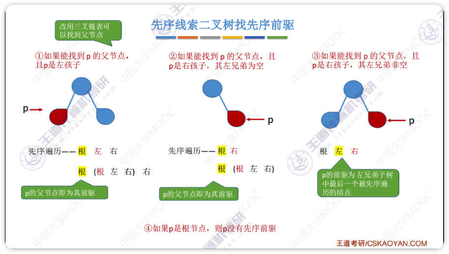
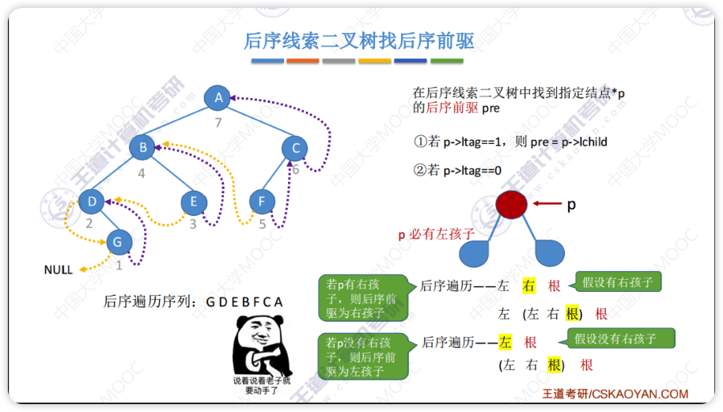
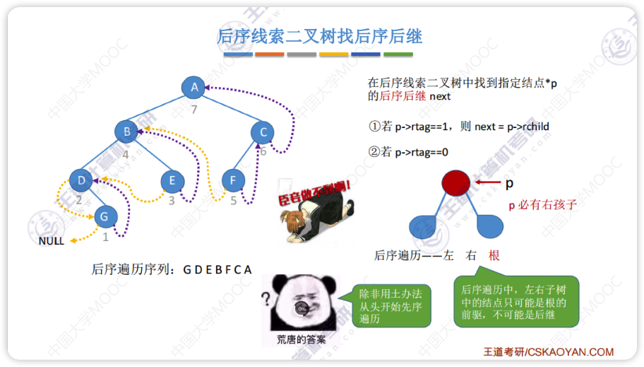
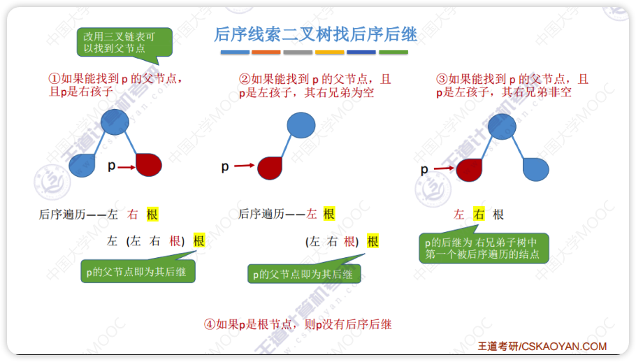

# 线索二叉树
## 中序线索二叉树
 
先使用中序遍历二叉树得到数组

```c++
[D,G,B,E,A,F,C]
```
根据数组中每个结点的前后，让没有子结点的指针指向数组中的前后结点
- D 结点没有左孩子，所以指向数组中的前边，也就是`NULL`；
- G 结点没有子结点，左结点指向数组中的前一个结点(前驱结点), D; 右结点指向数组中的后一个结点(后继结点), B
每个结点会新增两个状态`ltag`和`rtag`用来标记是指向子结点还是上面描述的前驱后继结点（0 表示是子结点，1 表示是前驱/后继）
## 其他线索二叉树
前序线索二叉树就是把数组改成前序遍历得到的数组
后序线索二叉树同理

# 二叉树线索化
二叉树线索化的实质就是遍历一次二叉树
先序线索二叉树找不到前驱
后序线索二叉树找不到后继
除非使用三叉链表或者从根开始遍历
## 中序线索二叉树
1. 设置全局变量`pre`，用于指向刚刚访问过的结点（`p`的前驱结点）
2. 指针`p`指向正在访问的结点
3. 检查`p`的左指针是否为空，为空就将它指向`pre`
4. 检查`pre`的右指针是否为空，为空就将它指向`p`
```c++
ThreadNode *pre = NULL;//全局变量用于暂存当前访问结点的前驱
void visit(ThreadNode *q) {
    if (q->lchild == NULL) {//左子树为空，建立前驱线索
        q->lchild = pre;
        q->ltag = 1;
    }
    if (pre != NULL && pre->rchild == NULL) {//建立前驱结点的后继线索
        pre->rchild = q;
        pre->rtag = 1;
    }
    pre = q;//标记当前结点为前驱
}

void InThread(ThreadTree T) {
    if (T != NULL) {
        InThread(T->lchild);//线索化左子树
        visit(T);访问根结点
        InThread(T->rchild);//线索化右子树
    }
}
```
找前驱后继结点参考[仓库代码](./3.2 线索二叉树.cpp)

## 先序线索二叉树
线索化参考[仓库代码](./3.2 线索二叉树.cpp)


如果使用三叉链表（有指向父结点的指针）可以找到，不然找不到


## 后序线索二叉树
线索化参考[仓库代码](./3.2 线索二叉树.cpp)


和先序找前驱一样，可以使用三叉链表找到后继


> 最后一个结点`rchild`和`lchild`需要进行处理％