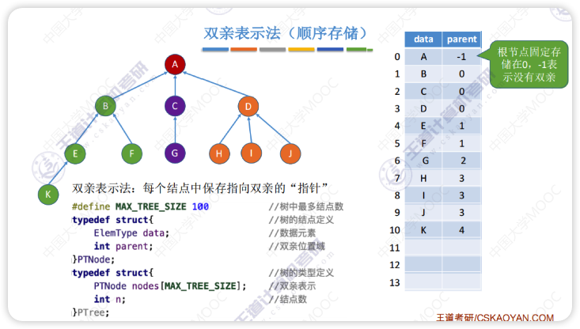
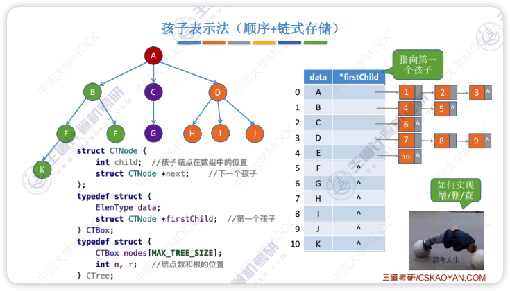
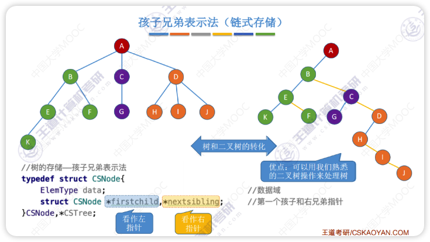
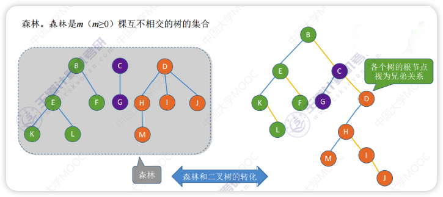
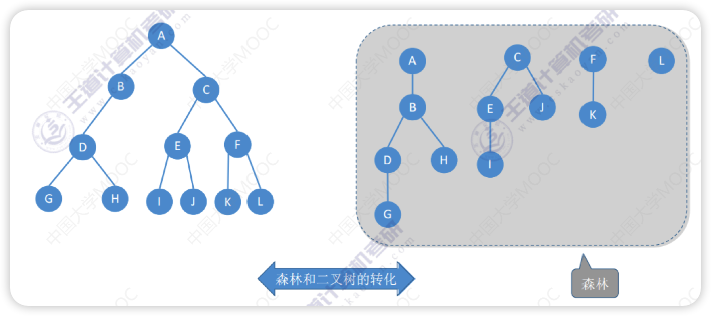
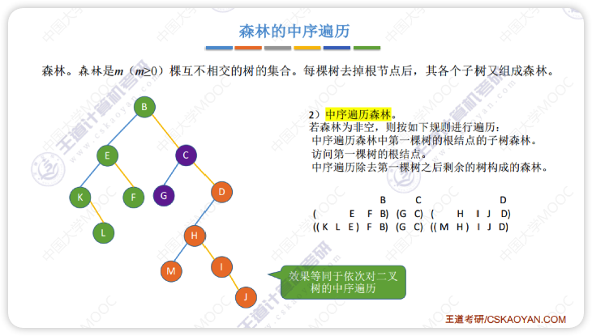
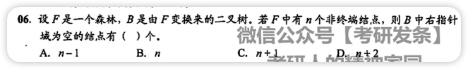

# 树的存储结构
## 双亲表示法（顺序存储）

- 优点：查找指定结点的双亲很方便
- 缺点：
    - 查找指定结点的孩子结点只能从头遍历
    - 使用删除方案一（双亲指针设为-1）删除结点时空数据会导致遍历更慢

## 孩子表示法

## 孩子兄弟表示法

左结点是孩子，右结点是兄弟

# 森林与树的转化
本质：用二叉树表示森林
森林中各个树的根结点之间视为兄弟关系

# 树与森林的遍历
## 树的遍历
1. 先根遍历
    对应二叉树的**先序遍历**
2. 后根遍历
    对应二叉树的**中序遍历**
3. 层次遍历（广度优先遍历）
    用队列实现，同二叉树的层次遍历
## 森林的遍历
1. 先序遍历
    对森林中的各个树依次进行**先根遍历**
    
2. 中序遍历
    对森林中的各个树依次进行**后根遍历**
    

| 树 | 森林 | 二叉树 |
| :----: | :----: | :----: |
| 先根遍历 | 先序遍历 | 先序遍历 |
| 后根遍历 | 中序遍历 | 中序遍历 |

# 错题集
1. 
    

      
答案与解析：

       
      答案： C
       
      解析： 
    <b>取巧思路: </b> 随便举个例子即可快速得出答案，比如森林只有一棵树，这棵树只有一个根结点。此时有 0 个非终端结点，右指针域为空的结点有 1 个
    <b>正常思路: </b>根据森林与二叉树转换规则“左孩子右兄弟”。二叉树 B 中右指针域为空代表该结点没有兄弟结点。森林中每棵树的根结点从第二个开始依次连接到前一棵树的根的右孩子，因此最后一棵树的根结点的右指针为空。另外，每个非终端结点，其所有孩子结点在转换之后，最后一个孩子的右指针也为空，故树 B 中右指针域为空的结点有 n+1 个。
    

