# 最小生成树(Minimum-Spanning-Tree, MST)

- 最小生成树一定是**带权连通无向图**
- 最小生成树可能有多个，但边的权值只和总是唯一最小的
- 最小生成树的边数 = 顶点数 - 1
- 如果一个连通图本身就是一棵树，则其最小生成树就是它本身
- 只有连通图才有生成树，非连通图只有生成森林

## Prim 算法(普里姆，用结点找MST)

从某一个顶点开始构建生成树，每次将代价最小的新顶点纳入生成树，直到所有顶点都纳入为止（贪心）

建议看下面视频理解

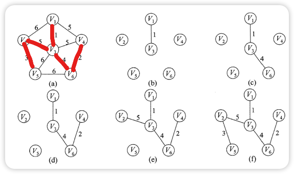

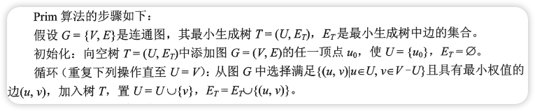

- 时间复杂度只与结点个数有关： O(|V|2)
- 适用于边稠密图

## Kruskal 算法(克鲁斯卡尔，用边找MST)

每次选择一条权值最小的边，是这条边两头连通（原本就已经连通的不选），直到所有结点都连通

建议看下面视频理解

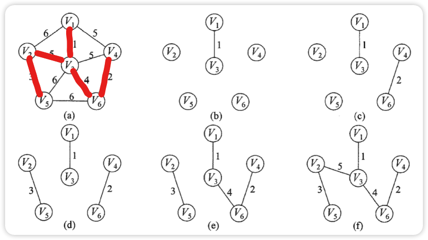

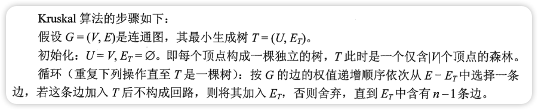

- 时间复杂度只与边的个数有关： O(\|E\| log2\|E\|)
- 适用于边稀疏图

# 最短路径

## BFS

适用于无权图

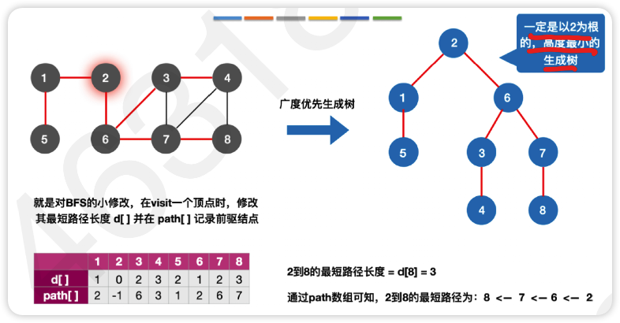

代码参考[4.2BFS(最短路径).cpp](./4.2BFS(最短路径).cpp)

思路是在原BFS算法的基础上增加两个数组`d[]`和`path[]`分别记录最短路径长度和前驱结点

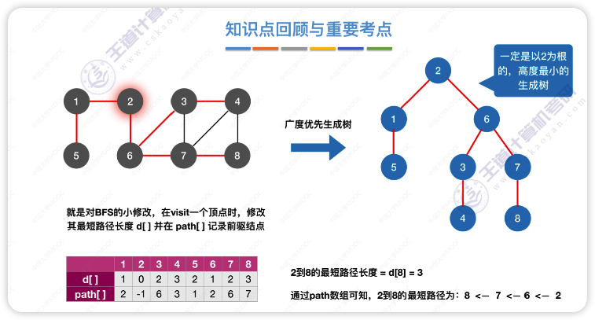

## Dijkstra 算法

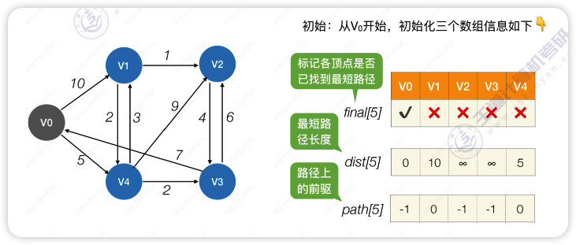

循环遍历所有结点，找到还没确定最短路径且`dist`最小的顶点<code>Vi</code>,令`final[i]=true`。检查所有邻接自<code>
Vi</code>的顶点，若其`final`值为`false`，则更新`dist`和`path`信息
重复第二步操作直至所有节点的`final`值都为`true`

- 时间复杂度：O(\|V\|2)
- Dijkstra不适用于有**负权值**的带权图

## Floyd 算法

求出每一对顶点之间的最短路径

使用动态规划，将问题的求解分为多个阶段

对于 n 个顶点的图 G，求任意一对顶点 Vi -> Vj 之间的最短路径可分为如下几个阶段：

1. 不允许在其他顶点中转，最短路径是`?`
   - 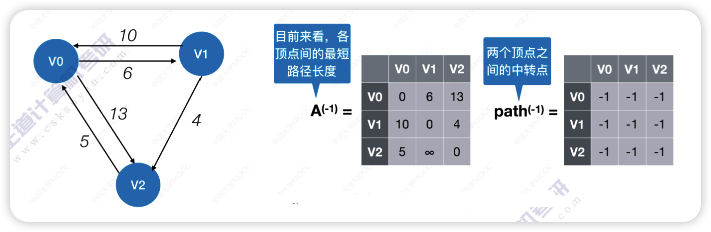
   - A矩阵可以直接用图的邻接矩阵
2. 若允许在<code>V0</code>中转，最短路径是`?`
   - 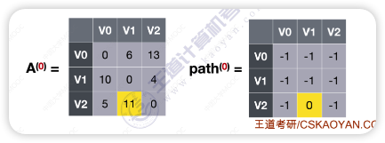
   - 因为可以在V0中转，V0到V1的距离可以更新
3. 若允许在<code>V0、V1</code>中转，最短路径是`?`
   - 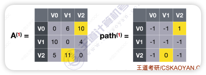
   - 这里可以忽视上边说的V0中转，直接用上一步得出的A矩阵就相当于是使用V0中转了，所以直接考虑V
     1中转
   - 循环后找到V0到V2会更短，所以更新
4. 若允许在<code>V0、V1、V2</code>中转，最短路径是`?`
   - 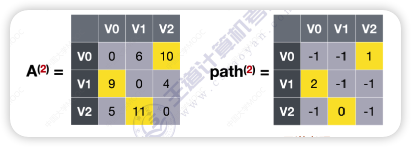
   - 重复前边的步骤一直到最后一个结点即可
5. ···
6. 若允许在<code>V0、V1、V2、...、Vn-1</code>中转，最短路径是`?`

- 时间复杂度: O(\|V\|3)
- 空间复杂度: O(\|V\|2)
- 可以用于有**负权值**的带权图，但是不允许**包含带负权的边组成的回路**（有负权回路的图可能没有最短路径）

## 对比

|         |                                                                  BFS算法                                                                   |          Dijkstra算法          |           Floyd算法            |
|:-------:|:----------------------------------------------------------------------------------------------------------------------------------------:|:----------------------------:|:----------------------------:|
|   无权图   |                                                                    ✔️                                                                    |              ✔️              |              ✔️              |
|   带权图   |                                                                    ❌                                                                     |              ✔️              |              ✔️              |
| 带负权值的图  |                                                                    ❌                                                                     |              ❌               |              ✔️              |
| 带负权回路的图 |                                                                    ❌                                                                     |              ❌               |              ❌️              |
|  时间复杂度  | O(&#124;V&#124;2)邻接矩阵或O(&#124;V&#124;+&#124;E&#124;)邻接表 | O(&#124;V&#124;2) | O(&#124;V&#124;3) |
|  通常用于   |                                                               求无权图的单源最短路径                                                                |         求带权图的单源最短路径          |        求带权图中各顶点间的最短路径        |

# 有向无环图(DAG)

不存在环的有向图被称为有向无环图

有向无环图是描述含有公共子式的表达式的有效工具

例：

`((a+b)*(b*(c+d))+(c+d)*e)*((c+d)*e)`

- 二叉树：

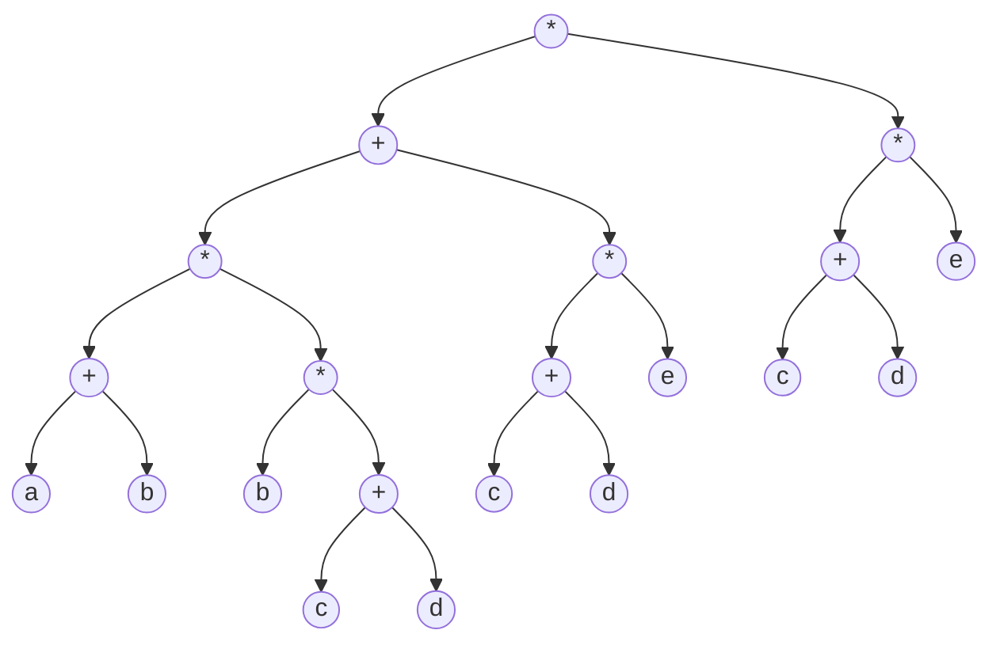

- 有向无环图：

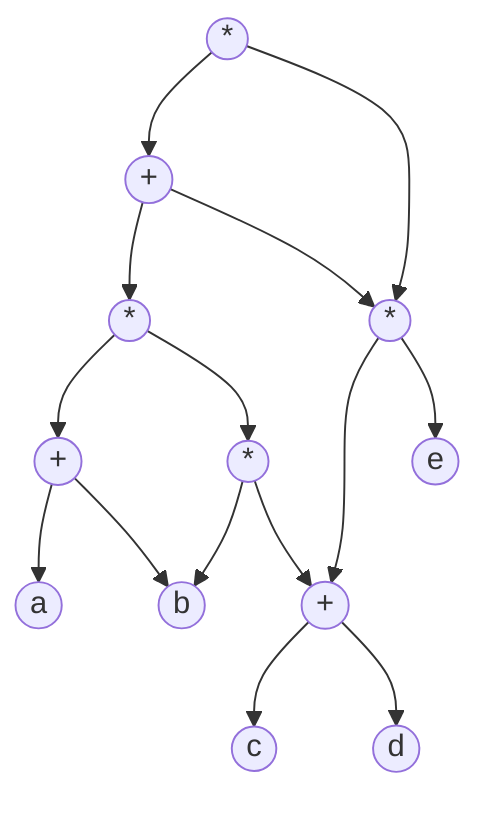

解题方法：

1. 把各个操作数不重复的排成一排
2. 标出各个运算符的生效顺序（先后顺序有些出入也无所谓）
3. 按顺序加入运算符，注意”分层“
4. 从底向上逐层检查同层的运算符是否可以合体

> 把一样的合并到一起

# 拓扑排序

找到做事的先后顺序

实现：

1. 从AOV网中选择一个没有前驱(入度为0)的顶点并输出
2. 从网中删除该顶点和所有以它为起点的有向边
3. 重复 1. 和 2. 知道当前AOV网为空或当前网中不存在无前驱的顶点为止

- 每个AOV网可能有多个拓扑排序
- 存在回路的图不能进行拓扑排序
- DFS不仅可以实现逆拓扑排序，还可以实现拓扑排序

逆拓扑排序实现：

1. 从AOV网中选择一个没有后继(出度为0)的顶点并输出
2. 从网中删除该顶点和所有以它为终点的有向边
3. 重复 1. 和 2. 知道当前AOV网为空或当前网中不存在无后继的顶点为止

# 关键路径

## AOE网

AOE(Activity On Edge)不是AOV(Activity On Vertex)

AOV是用顶点表示**活动**，是有向无环的无权图

AOE是用顶点表示**事件**，有向边表示活动，是有向无环的带权图，边权值是该活动的开销

性质：

- 只有在某顶点所代表的事件发生后，从该顶点出发的各有向边所以代表的活动才能开始
- 只有在进入某顶点的有向边所代表的活动都已结束时，该顶点所代表的事件才能发生
- 有些活动是可以并行进行的

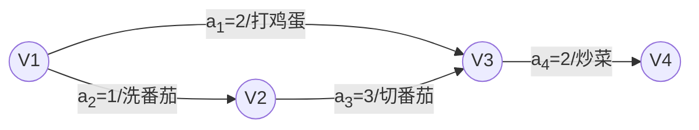

如上图`V1`是源点，`V4`是汇点

> 源点：入度为0的点，表示整个工程的开始
>
> 汇点：出度为0的点，表示整个工程的结束

## 关键路径

从源点到汇点所有路径中，具有最大路径长度的路径称为**关键路径**，关键路径上的活动称为**关键活动**

完成整个工程的最短时间就是关键路径的长度，若关键活动不能按时完成，则整个工程的完成时间就会延长

## 关键活动求法

- 事件vk的最早发生时间ve(k)：决定了所有从vk开始的活动能够开工的最早时间
- 事件vk的最晚发生时间vl(k)：指在不推迟整个工程完成的前提下，改时间最迟必须发生的时间
- 活动ai的最早开始时间e(i)：指该活动弧的起点所表示的事件的最早发生时间
- 活动ai的最晚开始时间l(i)：
  指该活动弧的终点所表示事件的最迟发生时间与该活动所需时间之差

活动ai的**时间余量d(i)=l(i)-e(i)**,表示在不增加完成真个工程所需总时间的情况下，活动ai可以拖延的时间。
若一个活动的时间余量为0，这说明该活动必须如期完成，**d(i)=0即l(i)=e(i)的活动ai是关键活动**。
由关键活动组成的路径就是**关键路径**

## 关键路径求法

1. 求所有事件的最早发生时间(ve)
   - 按**拓扑排序**序列，依次求各各顶点的**ve(k)**:
      - vl(源点)=0
      - ve(k)=Max{ve(j)+Weight(vj,vk)},vj为vk的任意前驱
2. 求所有事件的最迟发生时间(vl)
   - 按**逆拓扑排序**序列，依次求各个顶点的**vl(k)**:
      - vl(汇点)=ve(汇点)
      - vl(k)=Min{vl(j)-Weight(vk,vj)},vj为vk的任意后继
3. 求所有活动的最早发生时间(e)
    - 若边<vk,vj>表示活动ai,则有e(i)=ve(k)
4. 求所有活动的最迟发生时间(l)
    - 若边<vk,vj>表示活动ai,则有l(i)=vl(j)-Weight(vk,vj)
5. 求所有活动的事件余量(d)
    - d(i)=l(i)-e(i)

- 若关键活动耗时增加，则整个工程的工期将增长
- 缩短关键活动的时间，可以缩短整个工程的工期
- 当缩短到一定程度时，关键活动可能会变成非关键活动
- 如果一个工程有多个关键路径，需要所有关键路径都缩短才能缩短工期

# 错题集

1. 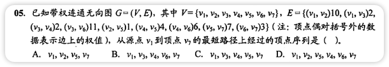
    

      
答案与解析：

       
      答案： B
       
      解析： 
      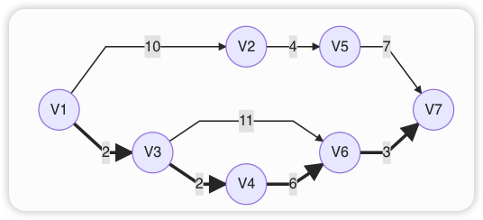
    

    
2. 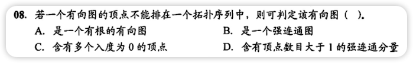
    

      
答案与解析：

       
      答案： D
       
      解析： 
        不存在拓扑序列 --> 图中存在回路 --> 回路构成一个强连通分量 
        顶点数目大于1的强连通分量中必然存在回路
    

3. 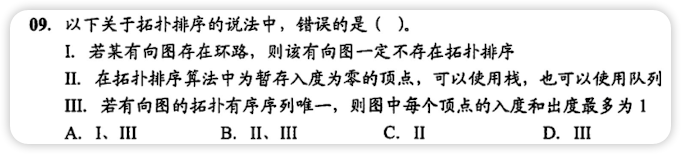
    

      
答案与解析：

       
      答案： D
       
      解析： 
        Ⅱ.若两个结点不存在子孙关系，则它们在拓扑序列中的关系是任意的，所以使用栈或者队列都可以 
        Ⅲ. 如下图 
      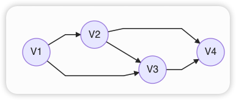
    

    
4. 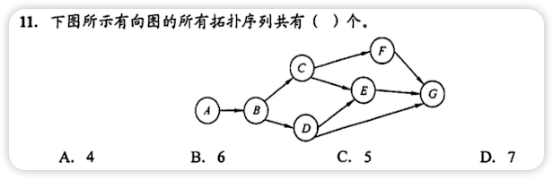
    

      
答案与解析：

       
      答案： C
       
      解析： 
        1. A B C F D E G 
        2. A B C D F E G 
        3. A B C D E F G 
        4. A B D C F E G 
        5. A B D C E F G
    

5. 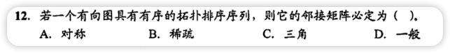
    
    

      
答案与解析：

       
      答案： C
       
      解析： 
        如果一个有向图的邻接矩阵是三角矩阵（对角线上的元素为0），这图中必不存在环，因此其拓扑序列必然存在 
        有序的拓扑排序序列的邻接矩阵必定为三角矩阵, 吐过只是具有拓扑排序序列着它的邻接矩阵必定为一般矩阵
    

    
6. 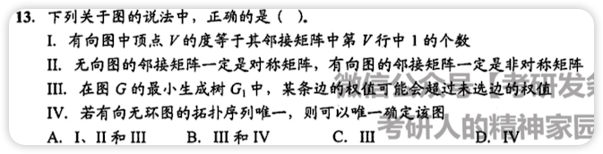
    

      
答案与解析：

       
      答案： C
       
      解析： 
        Ⅳ. 有向无环图的拓扑序列唯一并不能确定该图,如下面两个图 
        
    	  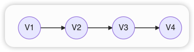
    

    
7. 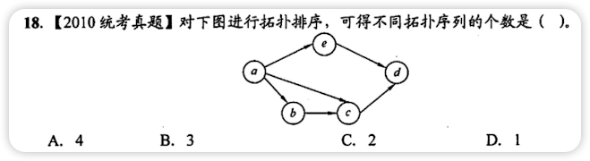
    

      
答案与解析：

       
      答案： B
       
      解析： 
        1. A B C E D
        2. A B E C D
        3. A E B C D
    

8. 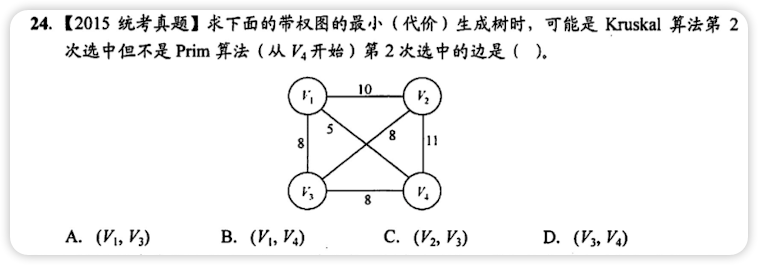
   

      
答案与解析：

       
      答案： C
       
      解析： 
        Kruskal:  
            1. V4 --> V1 
            2. V4 --> V3 
   &nbsp;&nbsp;&nbsp;&nbsp;V1 --> V3 
   &nbsp;&nbsp;&nbsp;&nbsp;V2 --> V3 
        Prim:  
            1. V1 (V4,V1) 
            2. V3 (V1,V3) 
   &nbsp;&nbsp;&nbsp;&nbsp;&nbsp;&nbsp;&nbsp;&nbsp;&nbsp;(V4,V3) 
    

9. 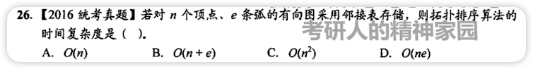
   

      
答案与解析：

       
      答案： B
       
      解析： 
        使用邻接表存储时，需要对n个顶点做进栈、出栈、输出各一次，在处理e条边时，需要检测这n个顶点的边链表的e个边结点，共需要的时间代价为 O(n+e)  
        如果使用邻接矩阵存储，在处理e条边时需对每个顶点检测相应矩阵中的某一行，寻找与它相关联的边，一边对这些边的入度 -1 
        需要的时间代价为 O(n2)
    

