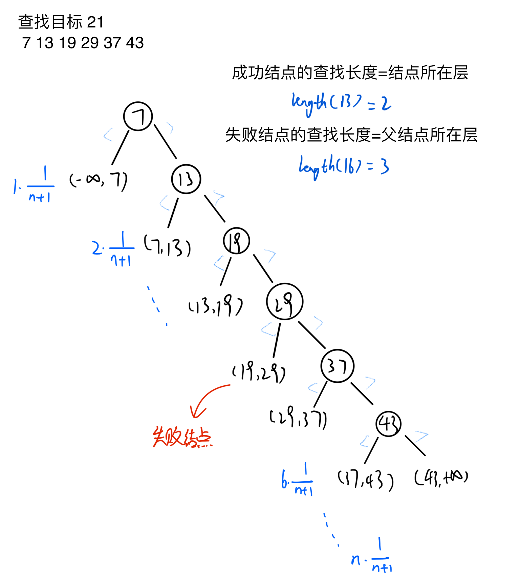
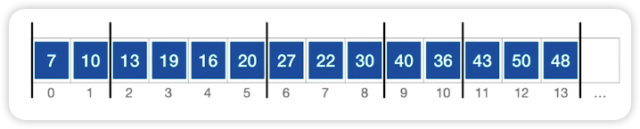
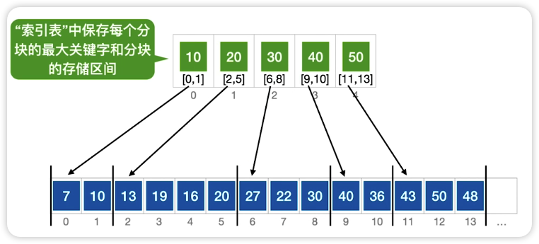
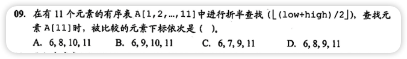
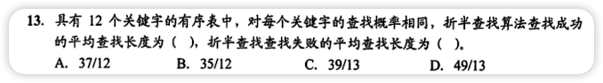
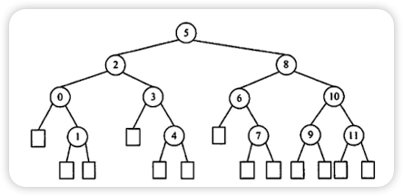
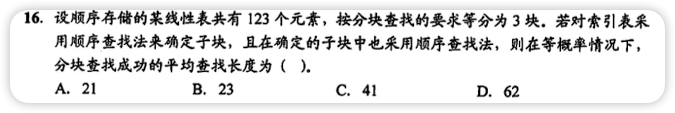
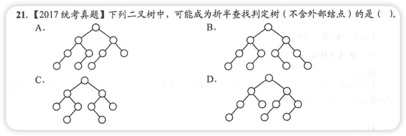
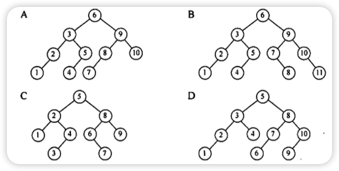

# 顺序查找和折半查找

## 顺序查找

顺序查找就是最基本的按顺序一个个查

### 一般线性表的顺序查找

- 平均查找长度
    - 成功: $ASL_{成功}=(n+1)/2$
    - 失败:
        - 有“哨点”: $ASL_{失败}=n+1$
        - 无“哨点”: $ASL_{失败}=n$
- 时间复杂度O(n)
- 缺点：当n较大时效率低
- 优点：
    - 对于数据存储方式没有要求，顺序存储或链式存储均可
    - 对表中记录的有序性也没有要求，无论是否按关键字有序均可使用

### 有序表的顺序查找

有序表就是按顺序排好，如果发现前一个数小于要查的数，后一个数大于要查的数，就可返回失败

- 平均查找长度
    - 成功: $ASL_{成功}=\sum_{i=1}^nP_i(n-i+1)=\frac{n+1}{2}$
    - 失败: $ASL_{失败}=\sum_{j=1}^nq_j(l_j-1)=\frac{1+2+...+n+n}{n+1}=\frac{n}{2}+\frac{n}{n+1}$
- 时间复杂度O(n)    
  

## 折半查找

二分查找，仅适用于**有序表**

- 平均查找长度
    - 成功: $ASL=\frac{1}{n}\sum_{i=1}^nl_i=\frac1n(1\times1+2\times2+...+h\times2^{h-1})=\frac{n+1}{n}log_2(n+1)-1\approx log_2(n+1)-1$
        - h是树的高度，元素个数为n时树的高度 $h=\lceil log_2(n+1) \rceil$
- 时间复杂度O(log<sub>2</sub>n)

例：查找33 数组`[7,10,13,16,19,29,32,33,37,41,43]`


$$
ASL_{成功} = \frac{1\times1+2\times2+3\times4+4\times8}{11} = 3    
$$

$$
ASL_{失败} = \frac{3\times4+4\times8}{12} = \frac{11}3    
$$

## 分块查找

又称索引顺序查找，一般不考察代码  


像上图将数据分成几组，第一组是10以下的，第二组是10到20的...往后以此类推



```c++  
//索引表  
typedef struct {  
ElemType maxValue;  
int low, high;  
} Index;  
  
//顺序表存储实际元素  
ElemType List[100];  
```

设长度为`n`的查找表均匀地分为`b`块，每块`s`个元素，则

$$
ASL=L_I+L_S  
$$

L<sub>I</sub> : 索引查找的平均查找长度；L<sub>S</sub>: 块内查找的平均查找长度

- 顺序查找查索引表
    - $L_I=\frac{1+2+...+b}{b}=\frac{b+1}2$
    - $L_S=\frac{1+2+...+S}S=\frac{S+1}2$
    - $ASL=\frac{b+1}2+\frac{S+1}2=\frac{S^2+2S+n}{2S}$, 当$S=\sqrt n$时,$ASL_{min}=\sqrt n+1$
- 二分查找查索引表
    - $L_I=\lceil log_2(b+1)\rceil$
    - $L_S=\frac{1+2+...+S}{S}=\frac{S+1}2$
    - $ASL=\lceil log_2(b+1)\rceil+\frac{S+1}2$

> 顺序查找效率最快时,$块数=\sqrt n$
>
>分块查找特点：块内无序、块间有序
>
>在索引表中确定待查元素所属分块可以使用顺序查找，也可以使用二分查找
>
>在块内使用顺序查找

## 错题集

1. 
    <details>
        <summary>答案与解析：</summary>
        <br />
        答案： B
        <br />
        解析：<br />
         - 第一次：low=1,high=11,mid=(1+11)/2=6<br />
         - 第二次：low=6+1=7,high=11,mid=(7+11)/2=9<br />
         - 第三次：low=9+1=10,high=11,mid=(10+11)/2=10.5=10<br />
         - 第四次：low=10+1=11,high=11,mid=11<br />
    </details>

2. 
    <details>
        <summary>答案与解析：</summary>
        <br />
        答案： A  D
        <br />
        解析：<br />
        <br />
        成功的ASL=(1+2x2+3x4+4x5)/12=37/12<br />
        失败的ASL=(3x3+4x10)=49/13<br />
        查找失败结点的ASL不是图中的方形结点，而是方形结点上一层的圆形结点
    </details>

3. 
    <details>
        <summary>答案与解析：</summary>
        <br />
        答案： B
        <br />
        解析：<br />
        S=3<br />
        ASL=(S<sup>2</sup>+2S+n)/2S=(9+6+123)/6=23
    </details>
4. 
    <details>
        <summary>答案与解析：</summary>
        <br />
        答案： A
        <br />
        解析：<br />
        <br />
        先按二叉排序树填满选项中的树<br />
        <ul>
            <li>B：4和5那里说明是向上取整，但7和8是向下取整，相矛盾所以错误</li>
            <li>C：3和4向上取整，6和7向下取整</li>
            <li>D：1和10向下取整，6和7向上取整</li>
        </ul>
    </details>
    
    
