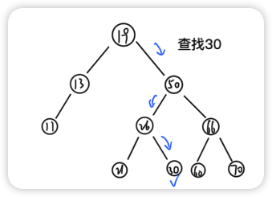
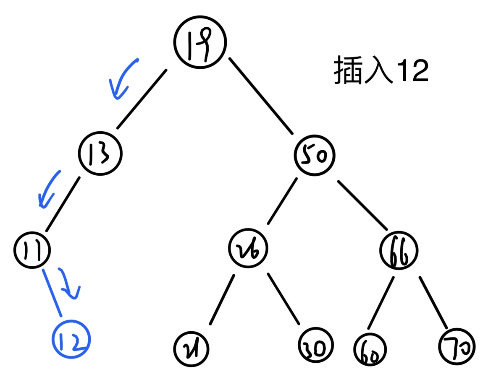
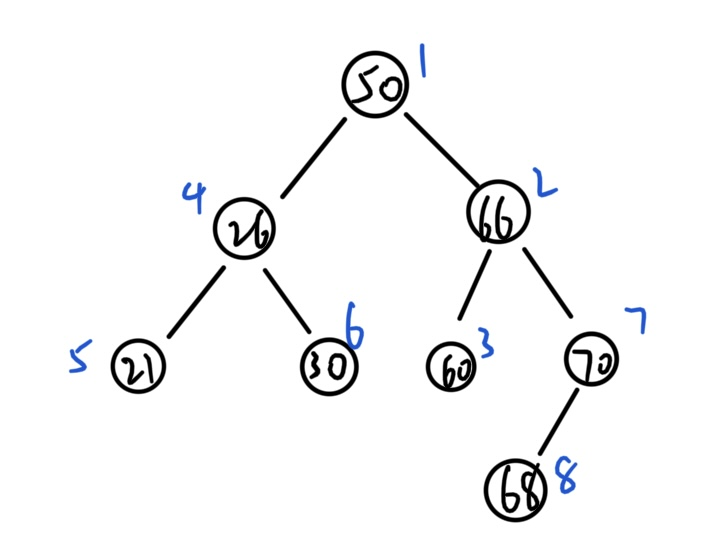

# 二叉排序树

- 当二叉树的叶子结点全部在相邻的两层时，深度最小。理想情况时从第一层到第二层是满二叉树 $h=\lceil log_2n+1 \rceil$
- 当输入序列是有序序列时，构造的二叉排序树是一支单支树，查找一个关键词最多需要比较`n`次
- 按中序遍历二叉排序树得到的是一个有序序列
- 二叉排序树中，关键字值最大的结点右指针一定为空

## 操作

- 查找
    - 
    - 递归查找
        - 最坏空间复杂度O(h) <font color="grey">h是树高</font>
            ```c++
            // 在二叉排序树查找值为key的结点（递归实现）  
            BiNode *BSTSearch_recursion(BiTree T, int key) {  
                if (T == nullptr)                                   // 二叉排序树中没有对应的值最后会变成空指针  
                    return NULL;  
                if (key == T->data.value)                           // 找到对应值为key的结点，返回当前结点  
                    return T;  
                if (key < T->data.value)                            // 要搜索的值比当前结点的值小，搜索左子结点  
                    return BSTSearch_recursion(T->lchild, key);  
                return BSTSearch_recursion(T->rchild, key);     // 要搜索的值比当前结点的值大，搜索右子结点  
            }
            ```
    - 顺序查找
        - 最坏空间复杂度O(1)
            ```c++
            // 在二叉排序树查找值为key的结点  
            BiNode *BSTSearch(BiTree T, int key) {  
                while (T != nullptr && key != T->data.value) {  // 值等于key就会跳过循环内的操作直接返回对应结点  
                    if (key < T->data.value)                    // 要搜索的值比当前结点的值小，指针变成左子结点  
                        T = T->lchild;  
                    else                                        // 要搜索的值比当前结点的值大，指针变成右子结点  
                        T = T->rchild;  
                }  
            
                return T;
            }
            ```
- 插入
    - 
      ```c++
      // 向二叉排序树T中插入key  
      int BSTInsert(BiTree &T, int key) {  
          if (T == NULL) {  
              T = (BiTree) malloc(sizeof(BiNode));     // 如果结点为空就新建一个结点  
              T->data = {key};  
              T->lchild = T->rchild = NULL;  
              return 1;  
          }  
          if (key == T->data.value)                          // 如果存在一个一样的结点就跳过  
              return 0;  
          if (key < T->data.value)                           // 如果要插入的值key比当前结点的值小就插入左子结点  
              return BSTInsert(T->lchild, key);  
          return BSTInsert(T->rchild, key);               // 如果要插入的值key比当前结点的值大就插入右子结点  
      }
      ```
- 构造
    - 按`[50,66,60,26,21,30,70,68]`建立BST
        - 
          ```c++
          void CreatBST(BiTree &T, int arr[], int n) {  
              T = NULL;  
              for (int i = 0; i < n; ++i)  
                  BSTInsert(T, arr[i]);  
          }
          ```
- 删除
    - 
    - 一边空就用另一边补
    - 两边都不空就用右子树最小的（左下角）补上，同时删除右子树最小的结点
      ```c++
      // 在二叉排序树中删除值为key的结点  
      BiNode *BSTDelete(BiTree &T, int key) {  
          if (T == NULL)                                              // 没有要被删除的结点  
              return NULL;  
          if (key == T->data.value) {                                 // 找到要被删除的结点  
              BiNode *biNode = T;                                         // biNode用来存放要被删除的结点  
              if (T->lchild == NULL)                                      // 左子树为空就把当前结点变成右子结点  
                  T = T->rchild;  
              else if (T->rchild == NULL)                                 // 右子树为空就把当前结点变成左子结点  
                  T = T->lchild;  
              else {                                                      // 左右子树都不为空就把右子树的最小结点放到当前结点位置，删除右子树最小结点  
                  BiNode *low = T;                                            // low用来存放右子树最小结点  
                  while (low->lchild != NULL)                                 // 右子树左下角为最小结点  
                      low = low->lchild;  
                  T = BSTDelete(low, low->data.value);                // 删除右子树最小结点，并将当前位置变为右子树最小结点  
                  T->lchild = biNode->lchild;                                 // 当前结点的左右子树指针修改为原结点指针  
                  T->rchild = biNode->rchild;  
              }  
              return biNode;  
          }  
          if (key < T->data.value)                                    // 要删除的值比当前结点值小，去左子树找  
              return BSTDelete(T->lchild, key);  
          return BSTDelete(T->rchild, key);                       // 要删除的值比当前结点值大，去右子树找  
      }
      ```

## 查找效率分析

```mermaid
graph TB;
A((50))-->B((26))
B-->C((21))
B-->D((30))
A-->E((66))
E-->F((65))
E-->G((94))
G-->H((81))
```

$$
ASL_{成功}=\frac{1\times1+2\times2+3\times4+4\times1}{8}=\frac{21}8
$$

$$
ASL_{失败}=\frac{3\times7+4\times2}{9}=\frac{29}9
$$

```mermaid
graph TB
A((26))-->B((21))
A-->C((30))-->D((50))-->E((65))-->F((66))-->G((81))-->H((94))
```

$$
ASL_{成功}=\frac{1\times1+2\times2+3\times1+4\times1+5\times1+6\times1+7\times1}8=\frac{30}8
$$

$$
ASL_{失败}=\frac{3\times2+1\times3+1\times4+1\times5+1\times6+2\times7}{9}=\frac{38}9
$$

# 错题集

1. 
    <details>
        <summary>答案与解析：</summary>
        <br />
        答案： D
        <br />
        解析：<br />
        当二叉排序树所有结点都在一边时（单支树）查找比较次数最多，需要n次<br/>
        n>log<sub>2</sub>n+1
    </details>
