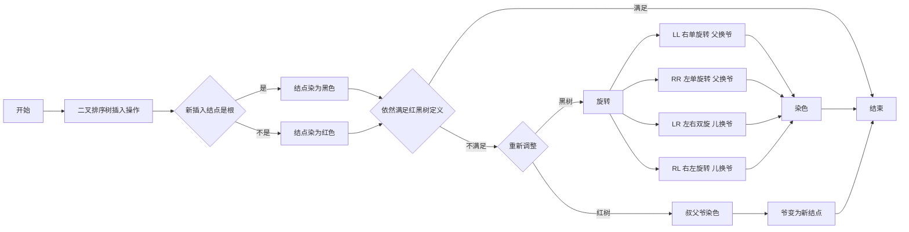

# 红黑树

平衡二叉树一般用于以查为主的场景 红黑树一般用于插入删除较多的场景

一般只考察定义和插入操作

- 一棵含有 $n$ 个结点的红黑树的高度至多为 $2log_2(n+1)$
- 红黑树是适度的平衡二叉树，查找效率低于平衡二叉树
- 红黑树可能会出现超过2次旋转的操作
- 如果红黑树的所有节点都是黑色的，那么他一定是满二叉树

## 定义

- <font color="orange">左根右</font> 满足二叉排序树的性质
- 每个结点要么黑色要么红色
- <font color="orange">根叶黑</font> 根结点是黑色
- 叶子结点（外部的结点、NULL结点、失败结点）均是黑色
- <font color="orange">不红红</font> 不存在两个相邻的红结点（红结点的父子结点都是黑色）
- <font color="orange">黑路同</font> 对于任意一个结点，从该结点到任一叶子结点的简单路径上，所含黑结点的数目相同

```c++
struct RBNode{
    ElemType data;
    RBNode* parent, lchild, rchild; // 同二叉排序树
    int color;                      // 存放红黑状态，如1/0表示红/黑
};
```

## 插入

1. 新结点是根————结点染为<font style="background: #000;" color="white">黑色</font>
2. 新结点是非根————结点染为<font style="background: #f00;" color="white">红色</font>
3. 若新插入结点后依然满足红黑树定义，插入结束
4. 若新插入结点不满足红黑树定义，需要调整使其满足定义（看新结点的叔叔结点的颜色）
    - 黑叔：旋转+染色
        - LL: 右单旋转，父换爷+染色
        - RR: 左单旋转，父换爷+染色
        - LR: 左右双旋，儿换爷+染色
        - RL: 右左双旋，儿换爷+染色
    - 红叔：染色+变新
        - 叔父爷染色，爷变为新结点


