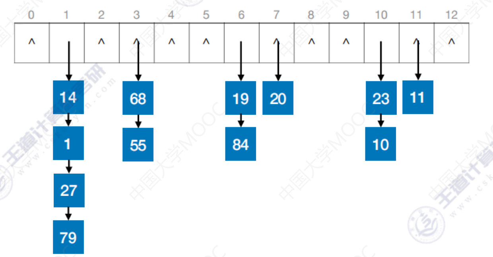

# 散列表
## 基本概念
- 散列查找一般适用于关键字集合与地址集合之间存在对应关系的情况下的查找，是典型的"**用空间换时间**"的算法
- 散列查找的思想是计算出散列地址来查找，然后比较关键字以确定是否比较成功
- 散列函数：一个把查找表中的关键字映射成该关键字对应的地址的函数，记为 Hash(key) = Addr (Addr可以是索引、数组下标、地址等)
- 冲突：散列函数可能会把两个或两个以上的不同关键字映射到同一地址(这两个或几个关键字称为同义词)
	- 冲突是不可避免的，与装填因子无关
- 散列表：根据关键字而直接进行访问的数据结构(又叫Hash表，哈希表)
- 装填因子=表中记录数/散列表长度（参考下面[构造方法中拉链法的例子](#lalianfail)）
- 散列表的平均查找长度与装填因子有关，与表长无关
- 为了提高查找效率，可以：
	- 设计冲突少的散列函数
	- 处理冲突时避免产生堆积现象（装填因子是固有属性，不可变）
- 产生了堆积(冲突)，对存储效率，散列函数和装填因子没什么影响，但ASL会随堆积现象而增大

## 构造方法
构造散列函数确定关键词存储位置
注意⚠️：
- 定义域包含全部需要存储的关键字
- 值域依赖于散列表的大小或地址范围
- 计算出来的地址应该**能等概率、均匀的分布在整个地址空间中**，从而减少冲突的发生
- 尽量简单，能在较短时间内计算出任一关键字对应的散列地址

散列函数：
- 直接定址法：
	- 直接取关键字的某个线性函数值为散列地址
	- H(key)=key或H(key)=a\*key+b, (一元一次方程)
	- 特点
		- 计算简单且不会产生冲突
		- 适合关键字分布连续的情况
		- 如果不连续会使空位较多，造成存储空间的浪费
	- 比如用学生学号作为索引，散列函数就可以为学生学号-第一个学生的学号
- 除留余数法：
	- 假定散列表长为m，取一个小于等于m的最大质数p，用下面的公式转成散列地址
	- H(key)=key%p
	- 特点：
		- 最简单、最常用的方法
		- 关键是选好p，似的每个关键字通过该函数转换后等概率的映射到散列空间上的任一地址，从而尽可能减少冲突的可能性
- 数字分析法：
	- 设关键字是r进制数，而r个数码在各位上出现的频率不一定相同，可能在某位上分布均匀一些，每种数码出现的机会均等。而在某些位上分布不均匀，只有某几种数码经常出现，此时应选取数码分布较为均匀的若干为所为散列地址
	- 特点：
		- 适合于已知的关键字集合，若更换了关键字则需要构造新的散列函数
	- 比如某一城市居民的身份证号，可以只用后四位来构造
- 平方取中法：
	- 取关键字的平方值的中间几位作为散列地址
	- 特点：
		- 散列地址分布比较均匀
		- 适用于关键字的每位取值都不够均匀或均小于散列地址所需的位数
		- 这种方法得到的散列地址与关键字的每位都有关系

## 处理冲突
- 拉链法：
	- 将相应位置上冲突的所有关键词存储在同一个单链表中
	- **空地址比较不算一次查找**
	- 🌰例子：
		- 关键字序列：`[19,14,23,1,68,20,84,27,55,11,10,79]`
		- 离散函数：$h(key) = key \% 13$
		- 
		- $19\%13=6$, $14\%13=1$, $23\%13=10$, $1\%13=1$, $68\%13=3$, $20\%13=7$, $84\%13=6$, $27\%13=1$, $55\%13=3$, $11\%13=11$, $10\%13=10$, $79\%13=1$ 
		- 查找成功的平均查找次数：$ASL_{成功}=(6\times1+4\times2+1\times3+1\times4)/12=1.75$ 
			- 表中有6个结点只需1次查找，4个结点需要2次查找，1个结点需要3次查找，1个结点需要4次查找
		- 查找失败的平均查找次数：$ASL_{失败}=(0+4+0+2+0+0+2+1+0+0+2+1+0)/13=0.92$ 
			- 这里分母的13是指哈希表长度
			- 分子是每个结点处查找失败需要的比较次数
			- 结果被称为这个散列查找的装填因子
- 开放定址法：
	- 一旦产生了冲突，就按某种规则去寻找另一空地址
	- 发生聚集的原因主要是解决冲突的方法选择不当
