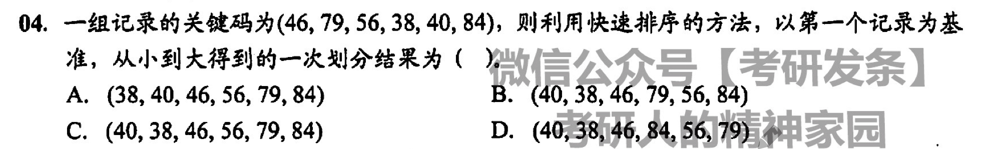
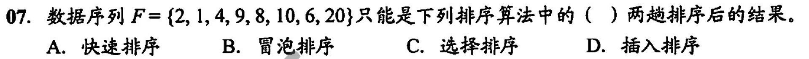
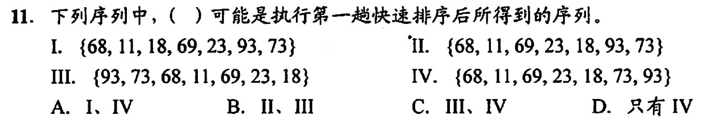
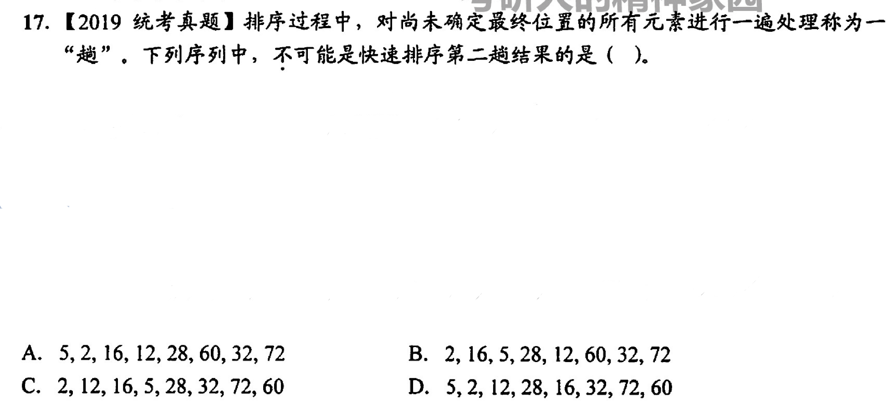

交换类排序的排序趟数与原始状态有关
## 冒泡排序🫧
两个两个的依次比较，把大的放后边小的放前边，循环到全部排序完成(没有发生交换)即可
- 空间复杂度：O(1)
- 时间复杂度：O(n2)
- 稳定排序
	- 如果遇到相同的就不会交换，所以稳定
- 每一趟最后一个元素都是最大的元素（从小到大排序）
- 元素从小到大时
	- 最坏的比较次数=$\frac{n \times (n - 1)}{2}$  
	- 最好的比较次数=$n - 1$ 

<video id="my-video_html5_api" class="vjs-tech" preload="auto" src="http://vod0vwkapu4.vod.126.net/vod0vwkapu4/4lYecUiM_11583645_shd.mp4">
		</video>

## 快速排序
快速排序基于分治法（每次都给他分成更小的块进行排序，分而治之）

任取一个枢轴赋值给`pivot`，把数组分成小于`pivot`的和大于`pivot`的两个数组
然后对这两个数组再重复这种方法直到数组的大小为1或空

- 空间复杂度：O(log2n)
	- 分治法一般用递归实现，所以容量应该于递归调用的最大深度一致
		- 最好情况(每次都分成等长的两部分)下为O(log2n)
		- 最坏情况(待排序序列基本有序，需要n-1次递归调用)下为O(n)
- 时间复杂度：O(nlog2n)
	- 最坏情况(待排序序列基本有序，需要n-1次递归调用)下为O(n2)
- 不稳定排序
- **平均性能最优的内部排序**
- **每次排序后枢轴一定在排序的最终位置上**（用于计算某一趟结果的题）
- 适合数据随机或者数据量很大的时候，不适合基本已经有序的
- 枢轴把两边数组分成等长时速度最快

<video id="my-video_html5_api" class="vjs-tech" preload="auto" src="http://vod0vwkapu4.vod.126.net/vod0vwkapu4/JKBptaMd_11586285_shd.mp4">
		</video>

# 错题集  
1. 
   

        
答案与解析：

         
        答案： C
         
        解析： 
        先从右往左👈找比<code>46</code>小的(<code>40</code>)进行交换 
        得到<code>{40, 79, 56, 38, 46, 84}</code> 
        再从左往右👉找比<code>46</code>大的(<code>79</code>)进行交换 
        得到<code>{40, 46, 56, 38, 79, 84}</code> 
        再从右往左👈找比<code>46</code>小的(<code>38</code>)进行交换 
        得到<code>{40, 38, 56, 46, 79, 84}</code> 
        再从左往右👉找比<code>46</code>大的(<code>56</code>)进行交换 
        得到<code>{40, 38, 46, 56, 79, 84}</code> 
        此时<code>46</code>处于最终位置，最后一个结果即为一次划分的结果
    

2. 
	

        
答案与解析：

         
        答案： A
         
        解析： 
        <ul>
	        <li>如果是插入排序，排序两趟后前三个元素一定是有序的(不管正序倒序)，这里显然不是，排除</li>
	        <li>如果是冒泡排序，排序两趟后最前面两位或者最后面两位一定是最终的数，这里显然不是，排除</li>
	        <li>如果是选择排序，应该和冒泡排序一样有两位处于最终位置上(最左/右端)，这里显然不是，排除</li>
	        <li>如果是快速排序，两趟排序后应该有3个元素在最终位置上，或者两个元素在最终位置上(有一个元素在边界)</li>
        </ul>
        <table>
	        <tr>
		        <td>角标</td><td>0</td><td>1</td><td style="background: green;">2</td><td>3</td><td style="background: green;">4</td><td>5</td><td>6</td><td style="background: green;">7</td>
			</tr>
			<tr>
				<td>原数组</td><td>2</td><td>1</td><td style="background: green;">4</td><td>9</td><td style="background: green;">8</td><td>10</td><td>6</td><td style="background: green;">20</td>
			</tr>
			<tr>
				<td>最终数组</td><td>1</td><td>2</td><td style="background: green;">4</td><td>6</td><td style="background: green;">8</td><td>9</td><td>10</td><td style="background: green;">20</td>
			</tr>
        </table>
	

3. 
   

        
答案与解析：

         
        答案： C
         
        解析： 
		第一趟把<code>1</code>冒泡到最前面，数组变成<code>{1, 8, 9, 10, 4, 5, 6, 20, 2}</code> 
		第二趟把<code>2</code>冒泡到最前面，数组变成<code>{1, 2, 8, 9, 10, 4, 5, 6, 20}</code> 
		第三趟把<code>4</code>冒泡到最前面，数组变成<code>{1, 2, 4, 8, 9, 10, 5, 6, 20}</code> 
		第四趟把<code>5</code>冒泡到最前面，数组变成<code>{1, 2, 4, 5, 8, 9, 10, 6, 20}</code> 
		第五趟把<code>6</code>冒泡到最前面，数组变成<code>{1, 2, 4, 5, 6, 8, 9, 10, 20}</code>
	

4. 
   

        
答案与解析：

         
        答案： A   D
         
        解析： 
		快速排序中，枢轴把数组分成等长数组时最快（数组中正好有一半大于第一位数，一半小于第一位数） 
		数组越接近有序就越慢 
		A: 第一次分为<code>{9, 17, 5, <b style="color: blue;">21</b>, 25, 23, 30}</code>, 第二次分为<code>{17, <b style="color: green;">9</b>, 5, <b style="color: blue;">21</b>, 23, <b style="color: green;">25</b>, 30}</code>;逆序数=2 
		B: 第一次分为<code>{9, 23, 5, 17, 21, <b style="color: blue;">25</b>, 30}</code>, 第二次分为<code>{5, <b style="color: green">9</b>, 23, 17, 21, <b style="color: blue;">25</b>, <b style="color: green;">30</b>}</code>;逆序数=3 
		C: 第一次分为<code>{5, 9, 17, <b style="color: blue;">21</b>, 25, 23, 30}</code>, 第二次分为<code>{<b style="color: green">5</b>, 9, 17, <b style="color: blue;">21</b>, 23, <b style="color: green;">25</b>, 30}</code>;逆序数=4 
		D: 第一次分为<code>{<b style="color: blue;">5</b>, 9, 17, 21, 23, 25, 30}</code>, 第二次分为<code>{<b style="color: blue;">5</b>, <b style="color: green;">9</b>, 17, 21, 23, 25, 30}</code>;逆序数=0 
		蓝色的是第一趟的枢轴，绿色的是第二趟的枢轴 
		可以看出A选项第二次分的最平均，所以最快 
		D选项最接近有序(逆序数越小就是越正序，反之就是越倒序，越接近(n-1)/2就是越无序)，这里找最慢就是逆序数最接近0或者6的
	

5. 
   

        
答案与解析：

         
        答案： B
         
        解析： 
        根据第一个错题解析进行移动数次数 
		A: <code>{35, 30, 88, 42, <b style="color: green;">92</b>, 96, 110, 100}</code>;有4个元素移动了，交换了3次 
		B: <code>{88, 30, 35, 42, <b style="color: green;">92</b>, 110, 100, 96}</code>;有8个元素移动了，交换了7次 
		C: <code>{42, 96, 92, 35, 30, 88, <b style="color: green;">100</b>, 110}</code>;有4个元素移动了，交换了3次 
		D: <code>{35, 30, <b style="color: green;">42</b>, 92, 100, 96, 88, 110}</code>;有2个元素移动了，交换了1次 
		绿色的是被移动的元素，加粗的是枢轴 
		王道书上的移动记录次数用的是被移动的元素个数，我觉得用交换次数也可以
	

6. 
   

        
答案与解析：

         
        答案： C
         
        解析： 
		<table>
			<tr>
				<td></td>
				<td>11</td>
				<td>18</td>
				<td>23</td>
				<td>68</td>
				<td>69</td>
				<td>73</td>
				<td>93</td>
			</tr>
			<tr>
				<td>I</td>
				<td>68</td>
				<td>11</td>
				<td>18</td>
				<td>69</td>
				<td>23</td>
				<td>93</td>
				<td>73</td>
			</tr>
			<tr>
				<td>II</td>
				<td>68</td>
				<td>11</td>
				<td>69</td>
				<td>23</td>
				<td>18</td>
				<td>93</td>
				<td>73</td>
			</tr>
			<tr>
				<td>III</td>
				<td>93</td>
				<td>73</td>
				<td>68</td>
				<td>11</td>
				<td style="background-color: green;">69</td>
				<td>23</td>
				<td>18</td>
			</tr>
			<tr>
				<td>IV</td>
				<td>68</td>
				<td>11</td>
				<td>69</td>
				<td>23</td>
				<td>18</td>
				<td style="background-color: green;">73</td>
				<td style="background-color: green;">93</td>
			</tr>
		</table> 
		快速排序交换一次，所以就有一个枢轴在最终位置，所以找与排序后的数组相同位置的元素(表中绿色的)个数为1的项，或者大于1的项（第2，3个相同的元素在两端） 
		由表格得出只有III和IV符合
	

7.  
   

        
答案与解析：

         
        答案： D
         
        解析： 
        同上一个，使用表格法 
        <table>
			<tr>
				<td></td>
				<td>2</td>
				<td>5</td>
				<td>12</td>
				<td>16</td>
				<td>28</td>
				<td>32</td>
				<td>60</td>
				<td>72</td>
			</tr>
			<tr>
				<td>A</td>
				<td>5</td>
				<td>2</td>
				<td>16</td>
				<td>12</td>
				<td style="background-color: green;">28</td>
				<td>60</td>
				<td>32</td>
				<td style="background-color: green;">72</td>
			</tr>
			<tr>
				<td>B</td>
				<td style="background-color: green;">2</td>
				<td>16</td>
				<td>5</td>
				<td>28</td>
				<td>12</td>
				<td>60</td>
				<td>32</td>
				<td style="background-color: green;">72</td>
			</tr>
			<tr>
				<td>C</td>
				<td style="background-color: green;">2</td>
				<td>12</td>
				<td>16</td>
				<td>5</td>
				<td style="background-color: green;">28</td>
				<td style="background-color: green;">32</td>
				<td>72</td>
				<td>60</td>
			</tr>
			<tr>
				<td>D</td>
				<td>5</td>
				<td>2</td>
				<td style="background-color: green;">12</td>
				<td>28</td>
				<td>16</td>
				<td style="background-color: green;">32</td>
				<td>72</td>
				<td>60</td>
			</tr>
		</table> 
		第二趟结果只能是3个处于最终位置的或者2个处于最终位置的(其中至少一个在两端) 
		显然只有D不符合
	

