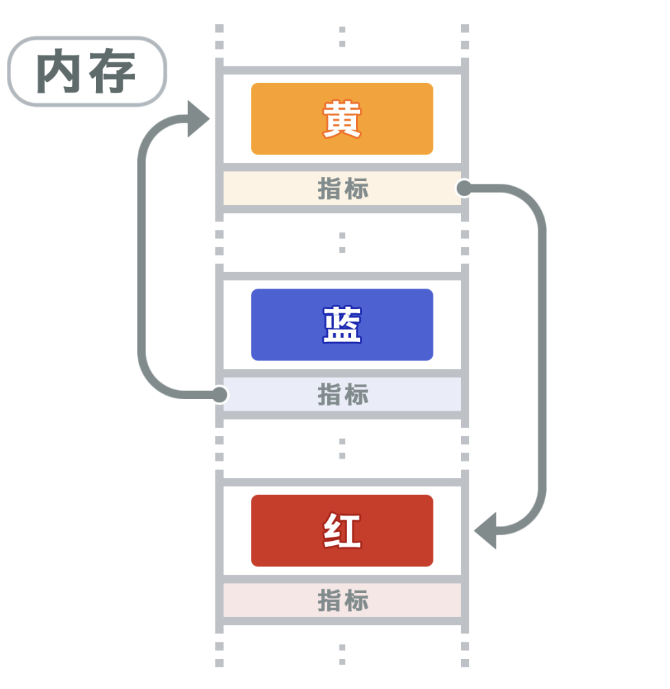

## 单链表的定义

- 用链式存储实现线性结构
  
- 单链表是非随机存取的存储结构
- 头结点：放在链表第一位，指向链表的第一个结点（有数据的第一个），头结点可以不设任何信息，也可以放一些表长等信息
- 头指针：不管有没有头结点，都指向第一个结点的地址的指针，如果位`Null`就表示链表为空

```c++
typedef struct LNode {
    // 数据
    ElemType data;
    // 指针
    struct LNode *next;
} LNode, *LinkList;
```
上面的写法等价于下面的写法
```c++
struct LNode{
    int data;
    struct LNode *next;
};

typedef struct LNode LNode;
typedef struct LNode *LinkList;
```