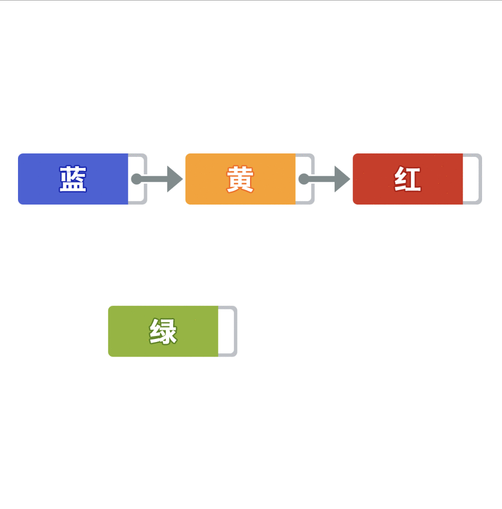
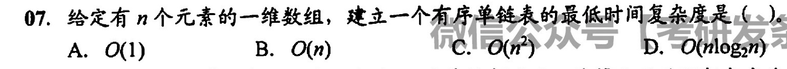

# 单链表的实现

## 插入



## 遍历
1. 后向遍历
    ```c++
    while (p != NULL) {
        // 某些处理
        p = p->next;
    }
    ```

## 时间复杂度

链表只能按顺序一个个找，所以

求表长 的时间复杂度为 **O(n)**

查找某个结点 的时间复杂度为 **O(n)**

# 错题集
1. 
<details>
  <summary>答案与解析：</summary>
  <br />
  答案： D
  <br />
  解析：<br />
  如果先建立链表，然后依次插入建立有序表，每次插入都需要遍历一次链表寻找插入位置，时间复杂度为O(n<sup>2</sup>)。<br />
  如果先对数组排序，再建立链表，建立链表的时间复杂度为O(n)，数组排序的最好时间复杂度为O(n log<sub>2</sub>n)，总时间复杂度为O(n log<sub>2</sub>n)。
</details>