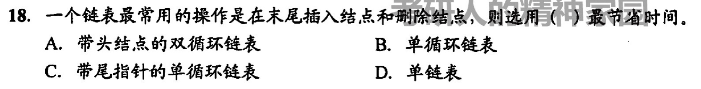
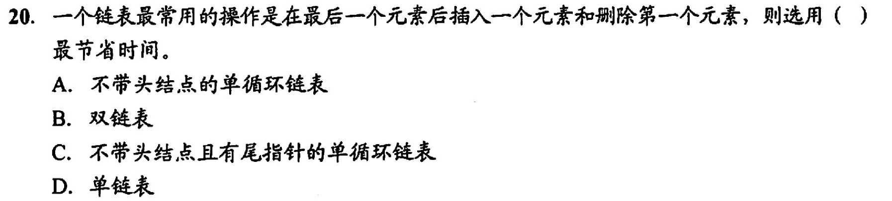
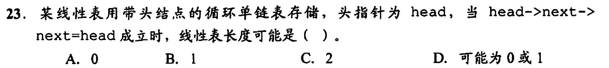
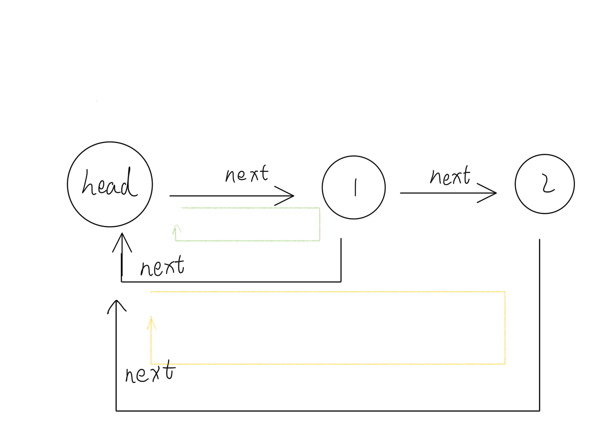

# 循环链表

如果头结点的next指向头结点，那么此链表为空链表

如果结点p的next是头结点，那么p是尾结点
# 错题集
1. 

  
答案与解析：

   
  答案： A
   
  解析： 
  只有尾指针不能方便的删除尾结点，删除尾结点需要倒数第二个结点的指针。

2. 

  
答案与解析：

   
  答案： C
   
  解析： 
  注意和上一题区分，只在最后插入元素时有尾指针最方便。又不需要删除最后一个结点，所以不使用双链表

3. 

  
答案与解析：

   
  答案： D
   
  解析： 
 一个空的循环单链表头结点的 next 还是指向头结点，所以 head->next->next=head 成立
至于 1 还是 2 可以参考下图

显然只有一个结点的时候有两个 next ，2 个结点时会有 3 个 next（可能说几个 next 不太准确，但这样好理解）

