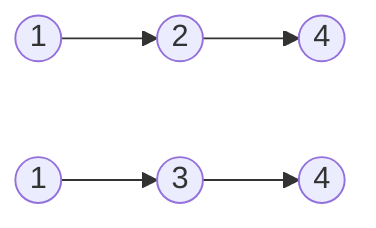
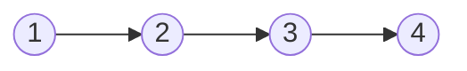
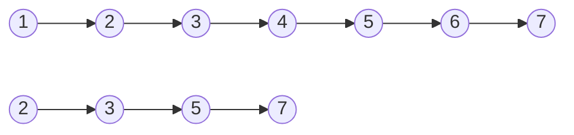
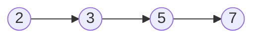

[TOC]

> 代码运行可以参考根目录下[README.md](../../README.md#程序调试)中的程序调试和[main.cpp](../main.cpp)
>
> 题目标题不能直接跳转，需要把项目拉到本地用编译器打开后才能跳转，或者去仓库里找对应路径的代码文件

# [1.合并有序链表](./code_question/mergeTwoLists.h)

将两个递增的有序链表合并为一个递增的有序链表。要求结果链表仍使用原来两表的存储空间，不另外占用其他的存储空间。表中不允许有重复的数据。

输入：



输出：




```c++
ListNode *mergeTwoLists(ListNode *list1, ListNode *list2) {
  // 利用递归进行合并
  
  // 结束条件：其中一个链表为空时不需要合并，直接返回
  if (list1 == NULL) return list1;
  if (list2 == NULL) return list2;
  
  if (list1->val < list2->val) {
    list1->next = mergeTwoLists(list1->next, list2);
    return list1;
  } else if (list1->val > list2->val) {
    list2->next = mergeTwoLists(list1, list2->next);
    return list2;
  } else {
    list1->next = mergeTwoLists(list1->next, list2->next);
    return list1;
  }
}
```


# [2.求两链表交集](./2.LinearList/code_question/getTwoListsDifference.h)

已知两个链表A和B分别表示两个集合，其元素递增排列。请设计一个算法，用于求出A与B的交集，并将结果存放在A链表中。

输入:



输出：




```c++
ListNode *mixTwoLists(ListNode *A, ListNode *B) {
  ListNode *pa = A->next; // A链表指针
  ListNode *pb = B->next; // B链表指针
  ListNode *pc = A;       // A链表父结点指针

  // 其中一个到结尾时循环停止
  while (pa && pb) {
    if (pa->val == pb->val) {
      // 两个节点相同时，保留A链表中的节点
      pc->next = pa;
      // 保留A链表中的节点后pc指针向后移动
      pc = pa;

      // 因为AB链表两项相同，所以都向后移动一位
      pa = pa->next;
      pb = pb->next;
    } else if (pa->val < pb->val) {
      // 如果A链表的节点比B链表的节点小，就删除A链表中的节点，因为两个链表是按顺序排的，pa后边可能有与pb相同的节点，所以只删除pa
      // 删除方法就是pc的next指向pa的next，这样就会跳过pa
      // pa向后移动一位，pc位置不变，因为pa被删除所以pa向后移动一位后依然是pc的下一位
      pa = pa->next;
      pc->next = pa;
    } else {
      // 如果A链表的节点比B链表的节点大，就删除B链表中的节点，因为两个链表是按顺序排的，pb后边可能有与pa相同的节点，所以只删除pb
      // 删除方法就是pc的next指向pb的next，这样就会跳过pb
      // pb向后移动一位，pc位置不变，因为pb被删除所以pb向后移动一位后依然是pc的下一位
      pb = pb->next;
      pc->next = pb;
    }
  }
  // 循环结束，到这里可能是因为B链表到了结尾，但A链表还没到结尾，所以要把pc后面的节点都删掉，直接让pc的next指向空
  pc->next = nullptr;
  // 被删除的节点和B链表系统会进行回收
  return A;
}
```


# [3.分割链表](./2.LinearList/code_question/splitLinkList.h)

设计算法将一个带头结点的单链表A分解成两个具有相同结构的链表B和链表C，其中B表的节点为A表中值小于0的节点，而C表的节点为A表中值大于0的节点(链表A中的元素为非零整数，要求B、C表利用A表的节点)
```c++
vector<ListNode*> splitListToParts(ListNode* head) {
    // 用来存放结果的两个链表
    vector<ListNode *> result(2, nullptr);
    // head有头结点所以令pa指向head的next
    ListNode *pa = head->next;
    // B、C链表为结果链表
    ListNode *B = new ListNode();
    ListNode *C = new ListNode();
    // 将B、C链表的头结点放到数组中
    result[0] = B;
    result[1] = C;

    // 循环A链表
    while (pa) {
        if (pa->val < 0){
            // 如果pa是负数，就存放到B链表
            B->next = pa;
            B = B->next;
        }else{
            // 如果pa是正数，就存放到C链表
            C->next = pa;
            C = C->next;
        }
        // 存放后让pa指针后移
        pa = pa->next;
    }
    // 将B、C节点的next指向空（下面的测试例子，如果这里不指向空，C会指向A链表的倒数第二项，导致A链表的最后一项也会在C链表中）
    B->next = nullptr;
    C->next = nullptr;
    return result;
}
```

# [4.查找链表最大值](./2.LinearList/code_question/findListMax.h)

设计一个算法，通过一趟遍历确定长度为n的单链表中值最大的节点。

```c++
int findListMax(ListNode *list) {
  // 如果传进来空链表，直接返回空
  if(!list) return NULL;

  // 令max等于list第一项的值，如果没有上一步，这里可能会报空指针错误
  int max = list->val;
  // pa指向list第二个节点
  ListNode* pa = list->next;
  // 循环找最大值
  while (pa){
    // 这一行等价于后面注释的三行，if的三元表达式
    max = max<pa->val?pa->val:max;
    //if (max<pa->val){
    //  max = pa->val;
    //}
    // pa向后移动一位
    pa = pa->next;
  }
  return max;
}
```

```c++
// 递归版本
int findListMax_recursion(ListNode *list) {
  return list ? max(list->val, findListMax_recursion(list->next)) : INT_MIN;
}
```


# [5.反转链表](./2.LinearList/code_question/reverseList.h)

设计一个算法，将链表中所有节点的链接方向“原地”逆转，即要求仅利用原表的存储空间，换句话说，要求算法的空间复杂度为O(1)

```c++
ListNode *reverseList(ListNode *head) {
  ListNode *prev, *curr = head, *next;
  while (curr) {
    // next存放下一个节点，方便修改指针后找到下一个节点
    next = curr->next;
    // 修改curr的next指针指向上一个节点
    curr->next = prev;
    
    // 准备下一次循环，prev和curr都往后移动一位
    prev = curr;
    curr = next;
  }
  // 因为循环最后会把所有指针向后移动一位，所以curr应该是指向空，prev才是新链表的头结点
  return prev;
}
```

# [6.求两链表差集](./2.LinearList/code_question/diffTwoLists.h)

已知两个链表A和B分别表示两个集合，其元素递增排列。请设计一个算法，用于求出A与B的差集，并将结果存放在A链表中。

```c++
ListNode *diffTwoLists(ListNode *list1, ListNode *list2) {
    ListNode *p1 = list1->next;
    ListNode *p2 = list2->next;
    ListNode *pre = list1;

    while (p1 && p2) {
        if (p1->val == p2->val) {
            pre->next = p1->next;
            p1 = p1->next;
            p2 = p2->next;
        } else if (p1->val > p2->val) {
            ListNode *temp = p2;
            p2 = p2->next;
            pre->next = temp;
            temp->next = p1;
            pre = pre->next;
        } else {
            pre = p1;
            p1 = p1->next;
        }
    }
    if (!p1)
        pre->next = p2;

    return list1;
}
```

# [7.数组左移](./2.LinearList/code_question/leftShift.h)


设将n(n>1)个整数存放到一维数组R中。试设计一个在时间和空间两方面都尽可能高效的算法。将R中保存的序列循环左移p(0<p<n)个位置，即将R中的数据由(X0,X1,...,Xn-1)变换为(Xp,Xp+1,...,Xn-1,X0,X1,...,Xp-1)。
要求:

1. 给出算法的基本设计思想。
2. 根据设计思想，采用C或C++语言描述算法，关键之处给出注释。
3. 说明你所设计算法的时间复杂度和空间复杂度。

解答:
1. 可以将这个问题视为把数组ab转换成数组ba(a代表数组的前p个元素，b代表数组中余下的n-p个元素)，先将a逆置得到a<sup>-1</sup>b, 再将b逆置得到a<sup>-1</sup>b<sup>-1</sup>，
    最后将整个a<sup>-1</sup>b<sup>-1</sup>逆置得到(a<sup>-1</sup>b<sup>-1</sup>)<sup>-1</sup> = ba。
    
    设Reverse函数执行将数组元素逆置的操作，对abcdefgh向左循环移动3(p=3)个位置的过程如下：
    ```
   Reverse(O,p-1) // 得到cbadefgh;
   Reverse(p,n-1) // 得到cbahgfed;
   Reverse(O,n-1) // 得到defghabc
   ```
   注： Reverse中， 两个参数分别表示数组中待转换元素的始末位置。
2. 代码如下：
    ```c++
    void Reverse(int R[], int from, int to) {
        int i, temp;
        for (i = 0; i < (to - from + 1) / 2; i++) {
            temp = R[from + i];
            R[from + i] = R[to - i];
            R[to - i] = temp;
        }   // 循环体内在考试时可以使用swap(R[from+i],R[to-i])来代替
    }
    void Converse(int R[], int n, int p) {
        if (p>0 && p< n) { // 题目中给了p的范围, 不判断应该也没事
            Reverse(R, 0, p - 1);
            Reverse(R, p, n - 1);
            Reverse(R, 0, n - 1);
        }
    }
    ```
   
3. 上述算法的时间复杂度为O(n), 空间复杂度为O(1)。

# [8.寻找两正序数组中位数](./2.LinearList/code_question/M_Search.h)


一个长度为L(L≥1)的升序序列S,处在第 $\lceil L/2 \rceil$个位置的数称为S的中位数。例如,若序列S<sub>1</sub>=(11,13,15,17,19),则S1的中位数是15,两个序列的中位数是含它们所有元素的升序序列的中位数。例如,若S<sub>2</sub>=(2,4,6,8,20),则S<sub>1</sub>和S<sub>2</sub>的中位数是11。现在有两个等长升序序列A和B,试设计一个在时间和空间两方面都尽可能高效的算法,找出两个序列A和B的中位数。要求:

1. 给出算法的基本设计思想
2. 根据设计思想,采用C、C++或Java语言描述算法，关键之处给出注释
3. 说明你说设计算法的时间复杂度和空间复杂度

解答：

1. 分别求两个升序序列A、B的中位数，设为a和b。若a=b，则a或b即为所求中位数；否则，舍弃a、b中较小者所在序列之较小一半，同时舍弃较大者所在序列之较大一半，要求两次舍弃的元素个数相同。在保留的两个序列中，求新的中位数，重复上述过程，直到两个序列中均只含一个元素时为止，则较小者为所求的中位数。
2. 代码如下：
    ```c++
   int M_Search(int A[], int B[], int L) {
        int s1, d1, m1, s2, d2, m2;
        s1 = 0; d1 = L - 1;
        s2 = 1; d2 = L - 1;
        while (s1 != d1 || s2 != d2) {
            m1 = (s1 + d1) / 2;
            m2 = (s2 + d2) / 2;
            if (A[m1] == B[m2]) return A[m1];
            if (A[m1] < B[m2]) {
                s1 = m1 + (s1 + d1) % 2;        // 需要考虑元素个数奇偶,保持两个子数组元素个数相等,(s1+d1)%2为1时,说明元素个数为奇数,此时s1=m1+1,否则就是s1=m1
                d2 = m2;
            } else {
                d1 = m1;
                s2 = m2 + (s2 + d2) % 2;
            }
        }
        return A[s1] < B[s2] ? A[s1] : B[s2];   // 三元表达式
   }
    ```
   
3. 时间复杂度为O(logn), 空间复杂度为O(1)。