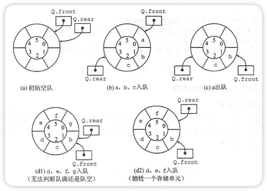
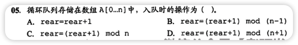
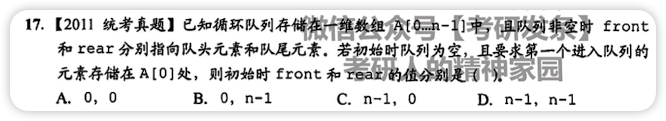

# 顺序队列

- 队列的判空条件为首尾指针相同 `Q.front==Q.rear`

# 循环队列

为了方便指针计算，使用循环队列


- 循环队列入队操作`Q.rear = (Q.rear+1) % MaxSize`
- 队满条件：`(Q.rear+1)%MaxSize==Q.front`
- 队中的元素个数：`(Q.rear-Q.front+MaxSize)%MaxSize`

这样会导致最后一个结点不可用（不然队满和队空时前后指针都是一样，无法判断）

## 解决结点浪费问题
1. 新增一个属性 size
   ```c++
      typedef struct {
       ElemType data[MaxSize];
       // 队首指针，队尾指针
       int front, rear;
       
       // 用来存放队列大小
       int size;
      } SqQueue;
      bool InitQueue(SqQueue &Q) {
       // 原来的操作
       Q.size = 0;
       return true;
      }
      bool EnQueue(SqQueue &Q, ElemType x) {
       // 原来的操作
       Q.size++;
       return true;
      }
      bool DeQueue(SqQueue &Q, ElemType &x) {
       // 原来的操作
       Q.size--;
       return true;
      }
      bool QueueEmpty(SqQueue Q) {
       return (Q.size==0);
      }
   ```

   通过`size`属性为 0 还是 MaxSize 就能判断出队列是否为空
2. 新增一个属性 tag
   ```c++
   typedef struct {
       ElemType data[MaxSize];
       // 队首指针，队尾指针
       int front, rear;
       
       // 用来存放上一个操作是增加还是删除，增加：1，删除：0
       int tag;
   } SqQueue;
   bool InitQueue(SqQueue &Q) {
       // 原来的操作
       Q.tag = 0;
       return true;
   }
   bool EnQueue(SqQueue &Q, ElemType x) {
       // 原来的操作
       Q.tag = 1;
       return true;
   }
   bool DeQueue(SqQueue &Q, ElemType &x) {
       // 原来的操作
       Q.tag = 0;
       return true;
   }
   bool QueueEmpty(SqQueue Q) {
       return (Q.front==Q.rear && Q.tag==0);
   }
   ```
   只有增加时会导致队满，只有删除时会导致队空

# 错题集
1. 
<details>
  <summary>答案与解析：</summary>
  <br />
  答案： D
  <br />
  解析：<br />
 数组 0 - n ,数组的长度为 n+1，所以入队操作为 rear = (rear+1) mod (n+1)
</details>
2. 
<details>
  <summary>答案与解析：</summary>
  <br />
  答案： B
  <br />
  解析：<br />
  front 指向队头元素，rear 指向队尾元素<br />
  第一个元素在 0 号位，所以这时候 front=rear<br />
  因为 rear 指向队尾元素，所以添加元素时会先向后移动一位在添加，队头不用动<br />
  所以队头还是 0，队尾是 0 的前边一位，也就是 n-1;<br />
</details>