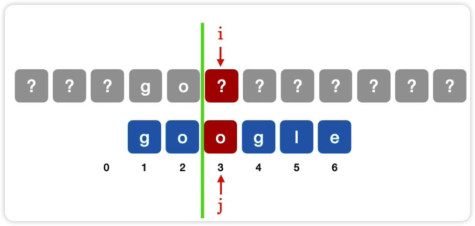

# KMP 算法
朴素模式匹配的缺点：当某些子串与模式串能部分匹配时，主串的扫描指针 1 经常回溯，导致时间开销增加，最坏时间复杂度 O(mn)
KMP 算法：当子串和模式串不匹配时，主串指针 i 不回溯，模式串指针 j=next\[j\],算法平均时间复杂度 O(n+m) ，其中求 next 数组的时间复杂度为 O(m),模式匹配过程最坏时间复杂度为 O(n)

# next[]
next[j]：在子串的第 j 个字符与主串发生失配时，则跳到子串的 next[j] 位置重新与主串当前位置进行比较
> i 不变，j 变为 next[j],从 i 处重新开始匹配
## 手算 next 数组
1. next 数组的长度与模式串 T 的长度相等，如模式串**Google**，此时 next 的最后一个元素为 next[6]  

2. 任何模式串都一样，第一个字符不匹配时去找下一个子串，所以**next[1]无脑写 0**

3. 第 2 个子串不匹配的时候肯定都是去找第一个子串，所以**next[2]无脑写 1**

4. 第 3 个子串匹配时，在不匹配的位置前边（如下图）画一根分界线，模式串 T 一步步往后移动，如果分界线前的字符能对上或者过了分界线，把此时的 j 填入 next[3]
    
    
    
5. 同第 3 步，划线，移动，把 j 填入数组

6. 例：算'ababaaababaa'的`next`数组值

    1. 先把前两位无脑写01

        ababaaababaa

        ababaaababaa

        01

    2. 判断第三位，数组右移找到前面都一样或者空的情况，将对应的数字写到next中

        ababaaababaa

        ​    ababaaababaa

        011

    3. 判断第四位，数组右移到前三位一样

        ababaaababaa

        ​    ababaaababaa

        0112

    4. 判断第五位，数组右移到前四位一样

        ababaaababaa

        ​    ababaaababaa

        01123

    5. 判断第六位，数组右移到前五位一样

        ababaaababaa

        ​    ababaaababaa

        011234

    6. 判断第七位，数组右移到前六位一样

        ababaaababaa

        ​          ababaaababaa

        0112342

    7. 判断第八位，数组右移到前七位一样

        ababaaababaa

        ​           ababaaababaa

        01123422

    8. 判断第九位，数组右移到前八位一样

        ababaaababaa

        ​           ababaaababaa

        011234223

    9. 判断第十位，数组右移到前九位一样

        ababaaababaa

        ​           ababaaababaa

        0112342234

    10. 判断第十一位，数组右移到前十位一样

        ababaaababaa

        ​           ababaaababaa

        01123422345

    11. 判断第十二位，数组右移到前十一位一样

         ababaaababaa

         ​           ababaaababaa

         011234223456

    12. 得出答案`011234223456`
# KMP 优化
先求出`next`数组，再用`next`数组求`nextval`
如果`nextval`中某个字符的值等于他指向的`next[j]`的值，就直接把他的`next[j]`替换为他原本指向的值的`next[j]`
