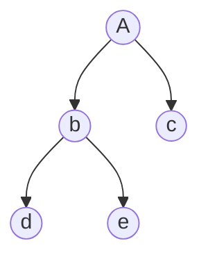
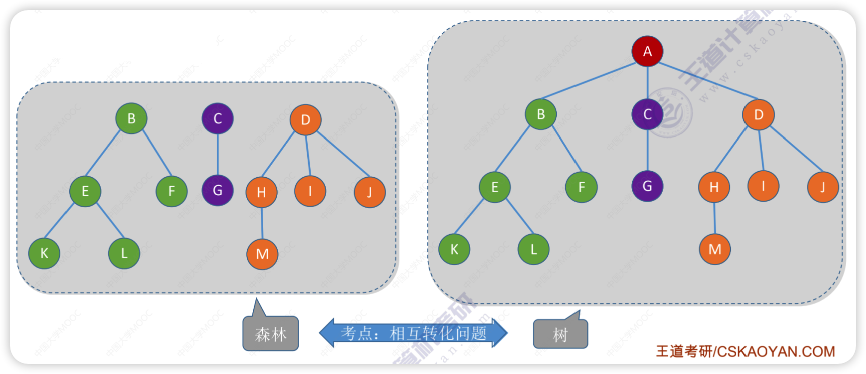
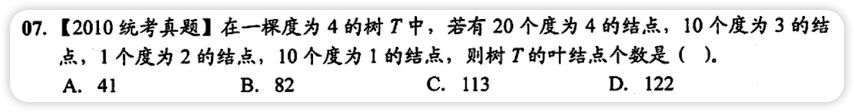
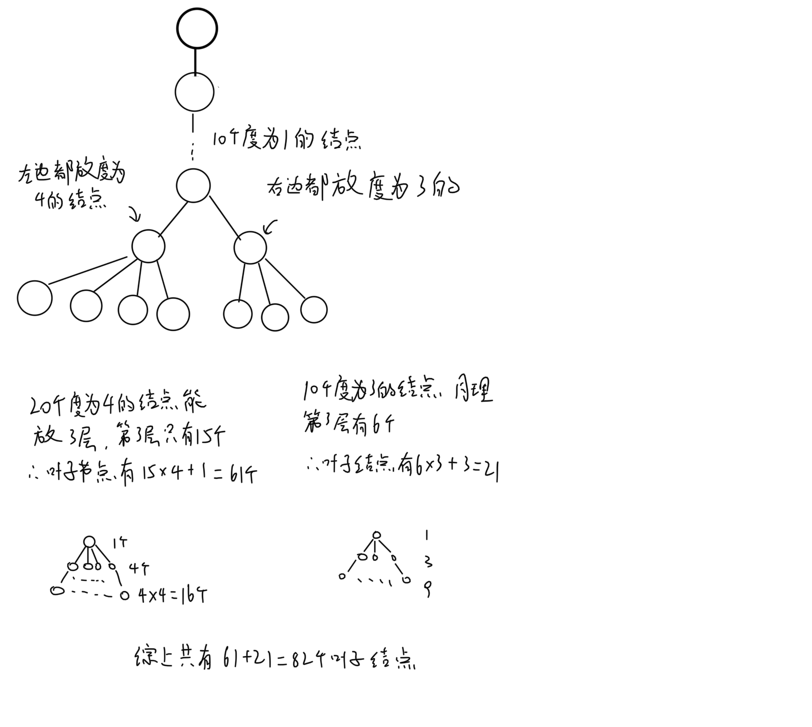

# 树的定义

像上面这种就是一棵树，有 5 个节点
树是 n(n>=0) 的结点的有限集。如果 n=0 ，那么这棵树被称为空树，计作`∅`
最顶上的结点为**根结点**，一棵树有且仅有一个根结点
没有后继结点的称为**叶子结点**（或终端结点）
有后继结点的称为**分支结点**（或非终端结点）

除根结点外每个节点都有且仅有一个父结点
每个结点可以有 0 个或多个后继结点

-  结点数 = 总度数 + 1
- 高度为 h 的 m 叉树至多有 (mh-1)/(m-1) 个结点（满 m 叉树）
    - 至少有 h 个结点（每层都只有一个结点）
    - 高度 h、度为 m 的树至少有 h+m-1 个结点
- 具有 n 个结点的 m 叉树最小高度为 logm(n(m-1)+1),结果向上取整
- - - - - -
**两个结点之间的路径**是这两个结点之间所经过的边的长度
**树的路径长度**是从树根到每个结点的路径长度的总和
最上面的树中 A 结点到 e 结点到路径长度为 2
树的路径长度为 6
- - - - - -
A 结点（根结点）在树的第一层（深度为 1），高度为 3
d 结点在树的第三层（深度为 3），高度为 1
**结点的深度**从上往下数，**结点的高度**从下往上数，都是从 1 开始，最大为树的高度
**树的高度**为 3（总共有多少层）
**结点的度**是指结点有几个子结点，A 结点的度为 2，c 结点的度为 0
**树的度**是指各结点的度的最大值
- - --
**有序树**从左到右是有次序的，不能互换，（后边查找会用到）
**无序树**没有顺序
- - --
**森林**是 m(m>=0) 棵互不相交的树的集合
m=0 的时候是**空森林**

# 错题集
1. 

  
答案与解析：

   
  答案： B
   
  解析： 
<b>正常思路</b>： 
设树中度为 i(0,1,2,3,4) 的结点数为 ni（这里度为 0 的就是叶子结点）,树中的结点总数为 n， 
则 n=分支数+1， 
分支数=树中各结点的度的和=n1+2n2+3n3+4n4， 
n = 1+n1+2n2+3n3+4n4 = n0+n1+n2+n3+n4 
n = 1+10+2x1+3x10+4x20 = n0+10+1+10+20 
解出来 n0 = 82 
即叶子结点有 82 个。
  
<b>我的思路</b>：题上没说什么最大最小，所以树上结点怎么放应该不影响结果，那么把给的结点都摆上就知道叶子结点的数量了

