# 二叉树的定义
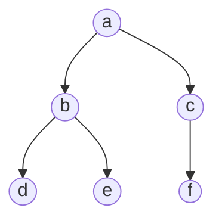
二叉树就是最大度为 2 的有序树
- 每个结点最多有两个子结点
- 左右子树不能颠倒
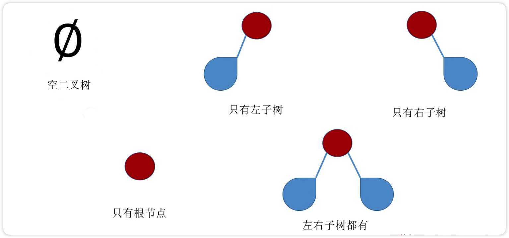
## 满二叉树
- 高度为 h，含有 2h-1 个结点
- 不存在度为 1 的结点
- 最后一层都是叶子结点，叶子结点都在最后一层
    - 叶子结点个数为 2h-1
- 按层序 1 开始编号（下图这种）
    - 结点 i 的左孩子为 2i
    - 结点 i 的右孩子为 2i+1
    - 结点 i 的父结点为 i/2（如果存在，小数向下取整）
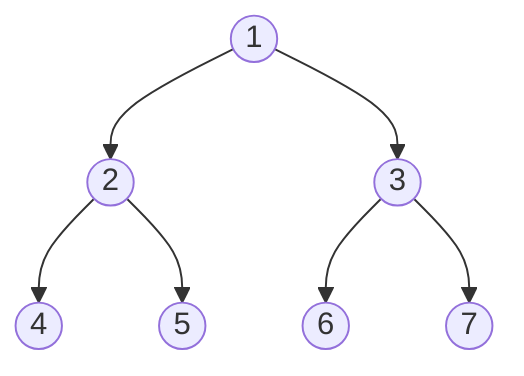
## 完全二叉树
二叉树从左往右、从上往下一个个排，最后一层排满了就是满二叉树，没排满就是完全二叉树（如下图）
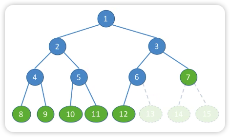
如果 14 或 15 号位置的结点存在，那也不是完全二叉树
如果没有 12 号结点但是有 13 号结点（指图上对应位置的结点)，那也不是完全二叉树

- 只有最后两层可能有叶子结点
- 最多只有一个度为 1 的结点
- 按层序 1 开始编号（这条与满二叉树一致）
    - 结点 i 的左孩子为 2i
    - 结点 i 的右孩子为 2i+1
    - 结点 i 的父结点为 i/2（如果存在，小数向下取整）
- 如果一个完全二叉树有 n 个结点
    - 如果 i<=(n/2) ，那么 i 结点为分支结点
    - 如果 i>(n/2)，那么 i 结点为叶子结点
## 二叉排序树(BST)
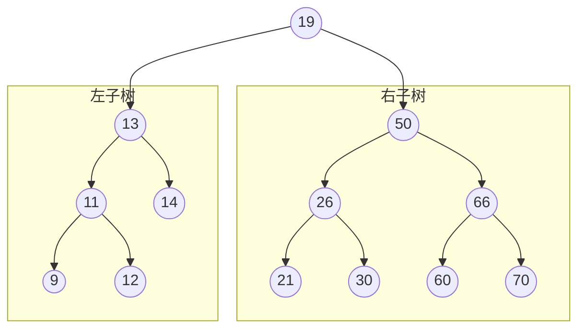
- 左子树上左右结点的关键字均小于根结点的关键字
- 右子树上左右结点的关键字均大于根结点的关键字
- 左子树和右子树又各是一棵二叉排序树
- 可以用宇元素的排序和搜索
## 平衡二叉树
任何一个结点的左子树和右子树深度差不超过 1
下图左边为平衡二叉树，右边则不是
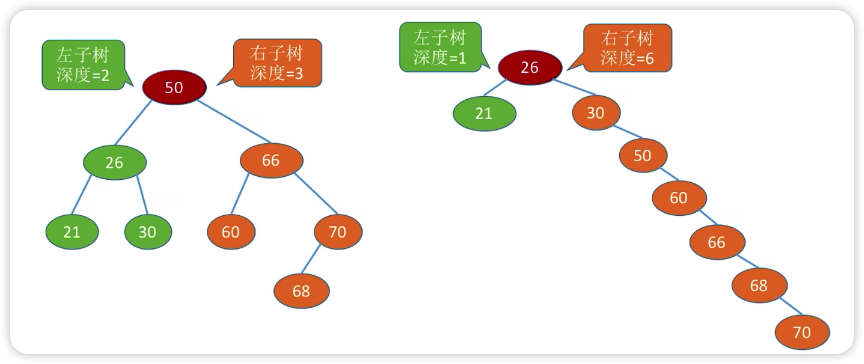

# 常考性质
## 二叉树
1. 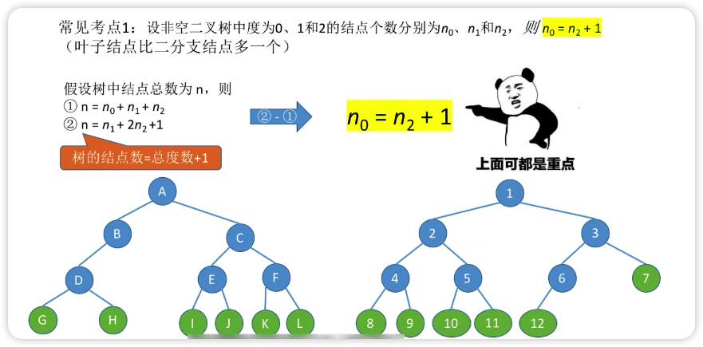
2. 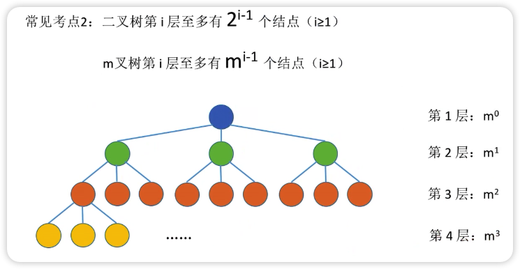
3. 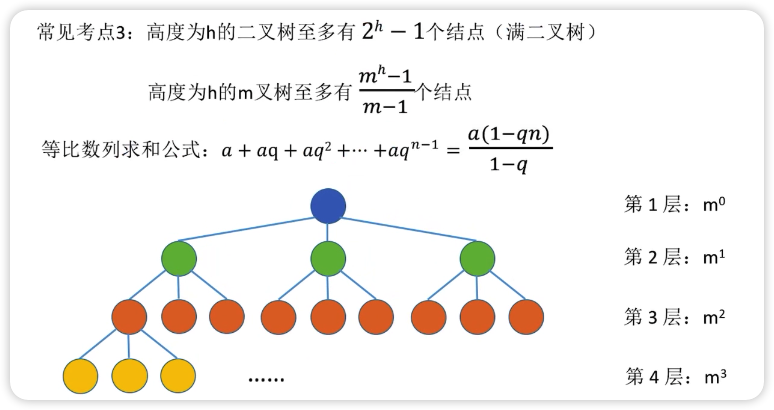
    最少有 h 个结点
## 完全二叉树
1. 具有 n 个结点的完全二叉树的高度 h=log2(n+1) （向上取整）或 h=1+log2n（向下取整）
2. 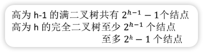
3. 第 i 个结点所在层次为 log2(n+1) 或 1+log2n
4. 
    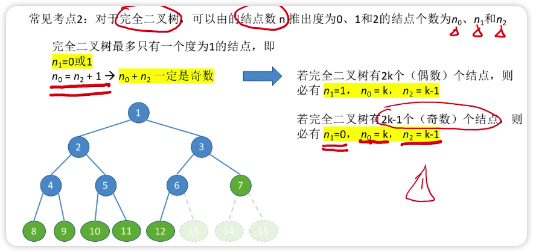
    - 完全二叉树有 n 个结点
        - n 是偶数：
            - n0=n/2
            - n1=1
            - n2=n/2-1
        - n 是奇数
           - n0=(n+1)/2
            - n1=0
            - n2=(n+1)/2-1=(n-1)/2
# 错题集
1. 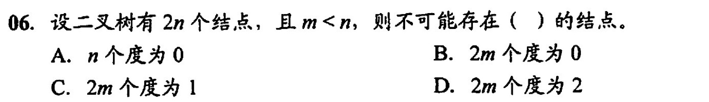

  
答案与解析：

   
  答案： C
   
  解析： 
二叉树的总结点数=n1+2n2+1 
即 2n=n1+2n2+1 
显然 n1 不能是偶数，所以 C 错

2. 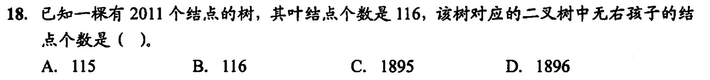

    
答案与解析：

 
答案：D
 
解析： 
先把叶子结点当成完全二叉树的叶子结点 
叶子结点的个数 n0=116 
所以总结点数 n=2n0=232 
当然也可能是 231，最后结果都一样所以用 232 算就可以 
此时 n1=1(231 的话这个值是 0) 
剩下的结点都是只有一个结点，可以都当成只有左结点连在完全二叉树的根结点上边 
剩下的结点的数量=2011-232=1779 
所以没有右结点的数量=剩下的结点的数量+n0+n1=1779+116+1=1896

3. 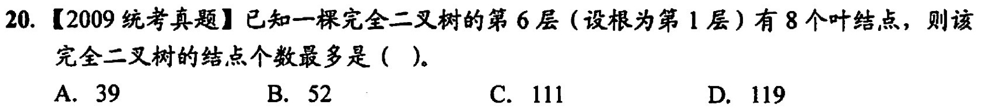

    
答案与解析：

 
答案：C
 
解析： 
完全二叉树的叶子结点可能在最后一层或者倒数第二层 
这里说结点个数最多，只有叶子结点在倒数第二层时符合 
倒数第二层(第 6 层)的结点数 = 25=32 
其中有 32-8=24 个结点有两个子结点(因为说了最多，所以不存在一个子结点的情况) 
所以第 7 层结点的个数为 24x2=48 个 
前 6 层（满二叉树）有 26-1=63 个结点 
所以一共有 63+48=111 个结点

4. 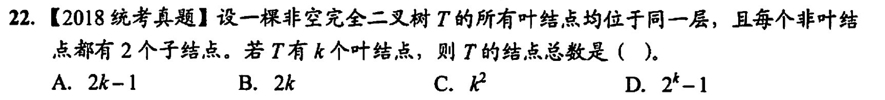

    
答案与解析：

 
答案：A
 
解析： 
如果结点总数是 2k 的话就会存在一个 n1 结点，与题意不符 
如果结点总数是奇数，与题意相符（没有子结点数为 1 的结点），总数为 2k-1

