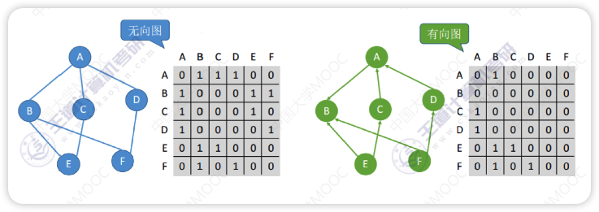
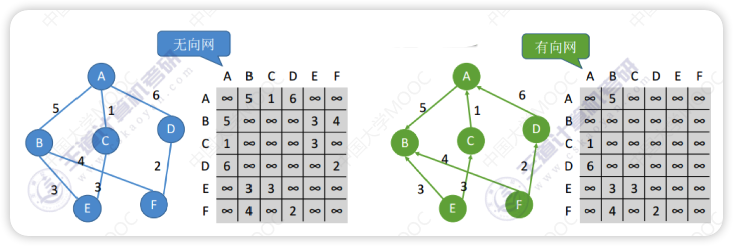
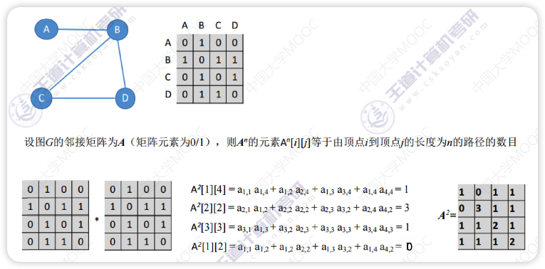
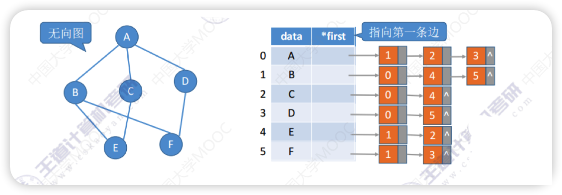
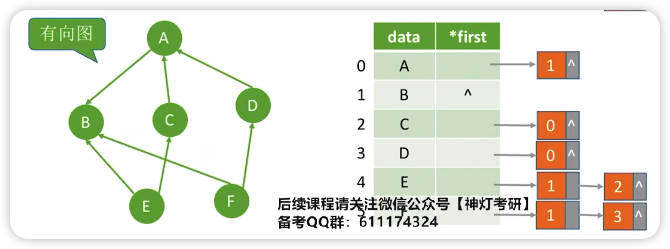
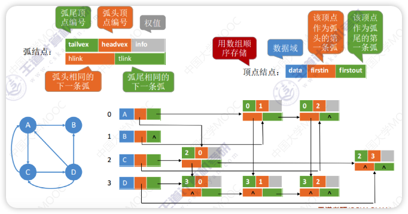
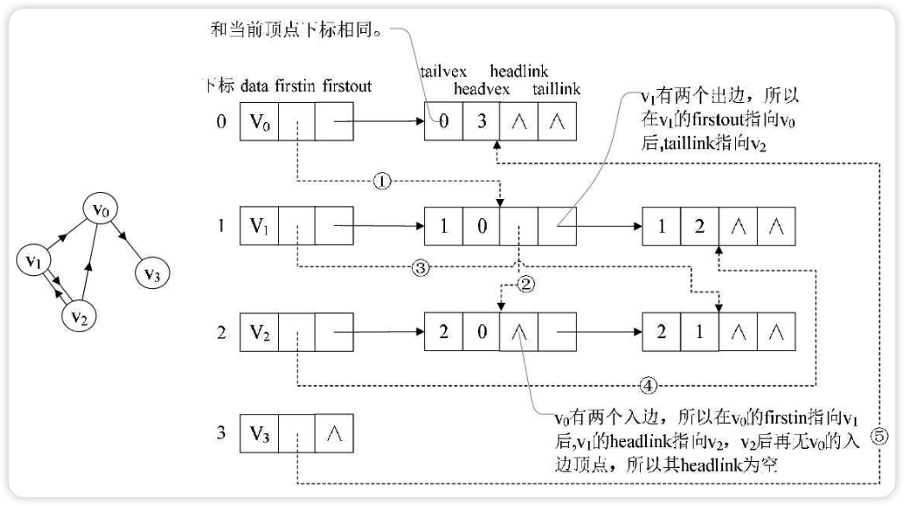
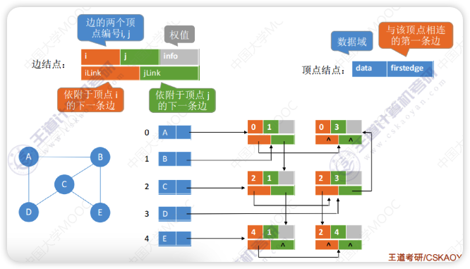
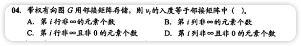
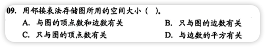

# 图的存储

## 邻接矩阵法

用一个一位数组存储图中顶点的信息，用一个二维数组存储途中边的信息（即各顶点之间的邻接关系），存储顶点之间邻接关系的二维数组成为**
邻接矩阵**

> 矩阵中只需要存放0和1(没有边和有边)，可以更换bool型或者枚举型使矩阵更小
>
> Vex中元素的位置与Edge中的行与列对应

- 无向图的邻接矩阵一定是关于斜对角线对称，压缩存储可以只存储上三角区/下三角区
- 求B元素的度可以找B所在行和列(对应出度和入度)的非0的个数
- 邻接矩阵法求顶点的度/出度/入度的时间复杂度为 O(|v|), v=顶点数
- 邻接矩阵法存储图的空间复杂度为 O(|v|2), v=顶点数
- 适合存储稠密图，稀疏图会浪费大量空间

----

如果是带权图，可以讲对应位置的 1 改为权值，用 ∞(int的上限值) 表示不存在边

如果矩阵中的值是 ∞ 或 0，表示不存在边/弧

----

- A2\[1\]\[4\]
    - 2指两步抵达，也就是上图等式中每一项都有两个数
    - 1和4指从第一个元素到第4个元素(从1开始数)，也就是等式中每一项第一个数的左坐标(行)是1，第二个数的右坐标(列)是4
    - 计算后的数字就是路径的个数

## 邻接表法

类似树的孩子表示法，是一个顺序链式表

- 无向图边结点的数量是**2|E|**,每条边在连接表中出现了两次,整体空间复杂度为**O(|V|+2|E|)**
- 有向图边结点数量是 **|E|**,整体空间复杂度为**O(|V|+|E|)**
- 有向图邻接表不方便寻找入度
- 图的邻接表不唯一，边结点的顺序结构可以改变（邻接矩阵唯一）

## 十字链表法(不用手写代码)

十字链表是有向图的一种链式存储结构。在十字链表中，对应于**有向图**中的每条弧有一个结点，对应于每个顶点也有一个结点（弧结点和顶点结点）。

- 顶点结点的 `firstin` 的链表长度就是该结点的入度
- 顶点结点的 `firstout` 的链表长度就是该结点的出度
- 顺着绿色路线可以找到指定顶点的所有出边
- 顺着橙色路线可以找到指定顶点的所有入边
- 十字链表法只存储**有向图**
- 空间复杂度同邻接表，为 O(|V|+|E|)

> 
>
> 如上图，顶点依然是存入一个一维数组{v0,v1,v2,v3}。就以顶点 v0
> 来说，firstout 指向的是出边表中第一个结点 v3。所以 v0 边表的 headvex=3，而 tailvex 其实就是当前顶点
> v0 的下标 0，由于 v0 只有一个出边顶点，所以 headlink 和 taillink 都是空。
>
> 我们重点需要来解释虚线箭头的含义，他其实就是此图的逆邻接表的表示。对于 v0 来说，它有两个顶点 v1 和
> v2 的入边。因此 v0 的 firstin 指向顶点 v1 的边表结点中 headvex 为 0 的结点，如图中的①。接着由入边结点的
> headlink 指向下一个入边顶点 v2，如图中的②。对于顶点 v1，它有一个入边顶点 v2，所以它的
> firstin 指向顶点 v2 的边表结点中 headvex 为 1 的结点，如图中的③。顶点 v2 和 v3
> 也是同样有一个入边顶点，如图中④和⑤。
>
> ---- 摘录自程杰老师的《大话数据结构》

## 邻接多重表(不用手写代码)

- 邻接多重表只存储**无向图**
- 与邻接表不同的是每条边只对应一份数据
- 空间复杂度为 O(|V|+|E|)
- 删除边、删除节点等操作很方便

## 对比

|        | 邻接表                                                                         | 邻接矩阵                              | 十字链表                           | 邻接多重表                          |
|--------|-----------------------------------------------------------------------------|-----------------------------------|--------------------------------|--------------------------------|
| 空间复杂度  | 无向图：O(&#124;V&#124;+2&#124;E&#124;) 有向图：O(&#124;V&#124;+&#124;E&#124;) | O(&#124;V&#124;2)      | O(&#124;V&#124;+&#124;E&#124;) | O(&#124;V&#124;+&#124;E&#124;) |
| 适合用于   | 存储稀疏图                                                                       | 存储稠密图                             | 只适用于有向图                        | 只适用于无向图                        |
| 表示方式   | 不唯一                                                                         | 唯一                                | 不唯一                            | 不唯一                            |
| 删除边或顶点 | 无向图中删除边或顶点都不方便                                                              | 删除边很方便，删除顶点需要大量移动数据               | 很方便                            | 很方便                            |
| 找相邻的边  | 找有向图的入边必须遍历整个邻接表                                                            | 必须遍历对应行或列，时间复杂度为 O(&#124;V&#124;) | 很方便                            | 很方便                            |

# 图的基本操作

- Adjacent(G, x, y): 判断图 G 是否存在边<x, y>或(x, y)
- Neighbors(G, x): 列出图 G 中与结点 x 邻接的边
- InsertVertex(G, x): 在图 G 中插入顶点 x
- DeleteVertex(G, x): 从图 G 中删除顶点 x
- AddEdge(G, x, y): 若无向边(x, y)或有向边<x, y>不存在，则向图 G 中添加该边
- RemoveEdge(G, x, y): 若无向边(x, y)或有向边<x, y>存在，则从图 G 中删除该边
- FirstNeighbor(G, x): 求图 G 中顶点 x 的第一个邻接点，若有则返回顶点号，否则返回 -1
- NextNeighbor(G, x, y): 假设图 G 中顶点 y 是顶点 x 的一个邻接点，返回除 y 外顶点 x 的下一个邻接点的顶点号，若 y 是 x
  的最后一个邻接点，则返回 -1
- Get_edge_value(G, x, y): 获取图 G 中边(x, y)或<x, y>对应的权值
- Set_edge_value(G, x, y, v): 设置图 G 中边(x, y)或<x, y>对应的权值为 v

# 错题集

1. 
    

    
答案与解析：

     
    答案： D
     
    解析： 
    有向图的邻接矩阵中，0和∞表示的都不是有向边
    入度由列计算出，出度由行计算出
    

2. 
    

    
答案与解析：

     
    答案： A
     
    解析： 
    邻接表存储时，顶点数n决定了顶点表的大小，边数 e 决定了边表结点的个数
    

