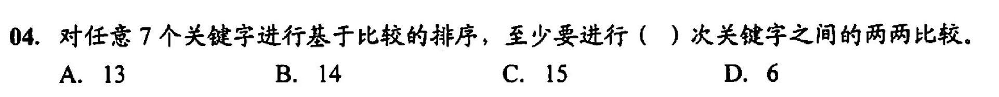
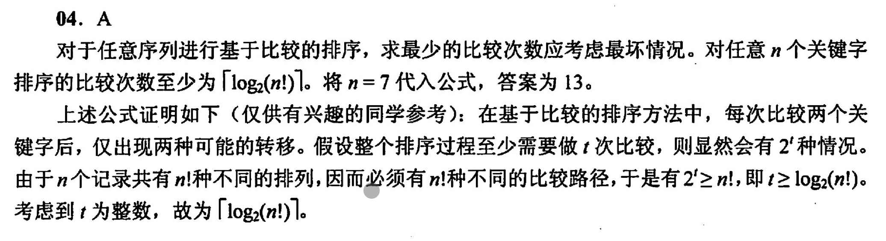

排序的评判标准不只有时间复杂度和空间复杂度，还有算法的稳定性，对于外部排序还要看外存的读取次数

- 算法的稳定性
	- 相同的关键字排序后顺序依然和原来的相对位置一样就表示算法稳定
	- 比如排序`[4,3,1,2,5,3.]`,`3.`是3，只是为了区分加了个点
	- 如果A算法结果是`[1,2,3,3.,4,5]`,B算法结果是`[1,2,3.,3,4,5]`
	- 那么A算法就是更稳定
	- 算法稳定不一定说明算法更好，需要结合实际需求判断
- 排序
	- 内部排序
		- 数据都存放在内存中
	- 外部排序
		- 数据太大内存放不开，都存放在外存中
		- 因为读取需要消耗大量时间，所以需要考虑减少从外存读取次数来降低时间复杂度

# 错题集
1. 
	

        
答案与解析：

         
        答案： A
         
        解析： 
        对n个关键字的比较次数至少为╒log2(n!)╕。将7带入结果为13 
        
    
