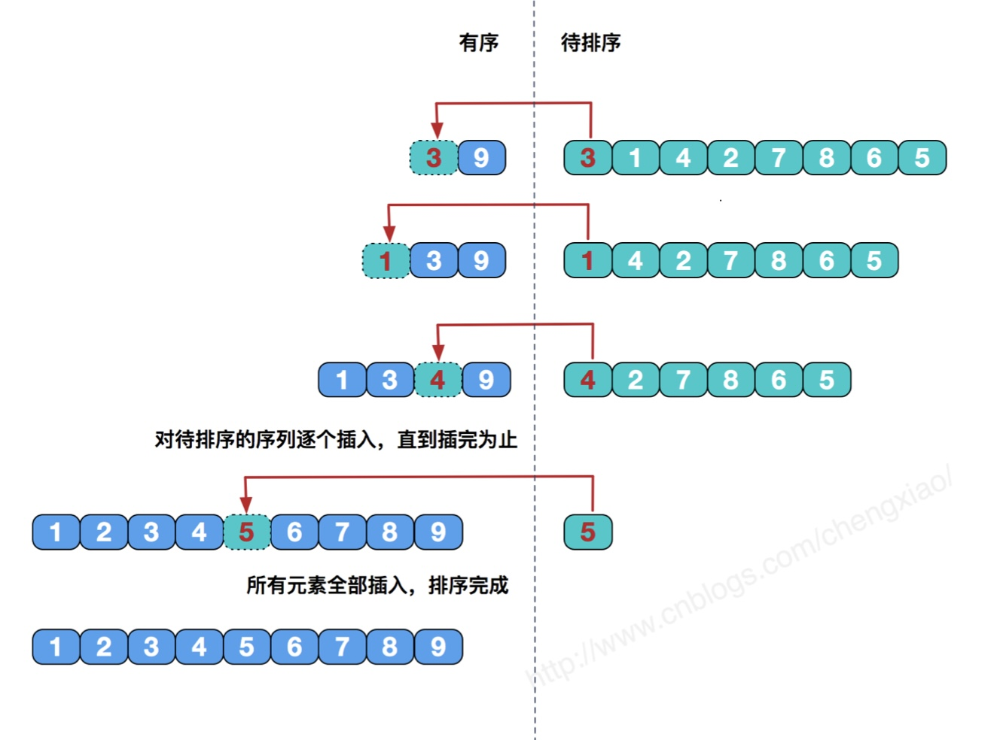

# 直接插入排序

将待排序中的元素一个个插入到有序列表中，直到全部插入完成

- 稳定算法
- 适用于 顺序存储和链式存储
## 性能分析
- 时间复杂度
	- 最好情况：表中元素有序，只需要比较一次不用移动元素
		- O(n)
	- 最坏情况：表中元素顺序刚好逆序
		- 总比较次数最大$\sum_{i=2}^{n}i$ 
		- 总移动次数也达到最大$\sum_{i=2}^{n}(i+1)$
	- 平均情况
		- O(n2)
- 空间复杂度
	- O(1)
# 折半插入排序
1. 确定折半插入排序的范围
2. 对其进行类似于二分法定界的方式不断缩小其范围
3. 对数据进行移动，对待排序算法进行插入

- 稳定算法
- 适用于顺序存储，不适用于链式存储
- 适合初始记录无序、n较大的情况
## 性能分析
- 空间复杂度
	- O(1)
- 时间复杂度
	- O(n2)
	- 该算法比较次数仅于表中元素的个数有关
	- 折半查找改进的只是比较次数，而插入时元素的移动次数不变，所以本质依然是插入排序，插入排序的时间复杂度都是O(n2)
	- 当元素的初始排列为正序或接近正序时直接插入比折半插入执行的关键字比较次数少
# 希尔排序
1. 先将待排序表分割成若干形如`L[i, i+d, i+2d,..., i+kd]`的特殊子表，对各个子表分别进行直接插入排序。缩小增量d，重复上述过程知道d=1为止
2. 每次排序去一定的步长，然后在选定的元素中进行直接插入排序
3. 步长逐渐减小，最后为1

- 不稳定算法
- 适用于顺序存储
## 性能分析
- 空间复杂度
	- O(1)
- 时间复杂度
	- O(n2)