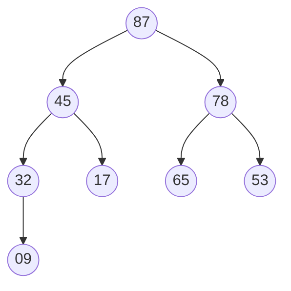
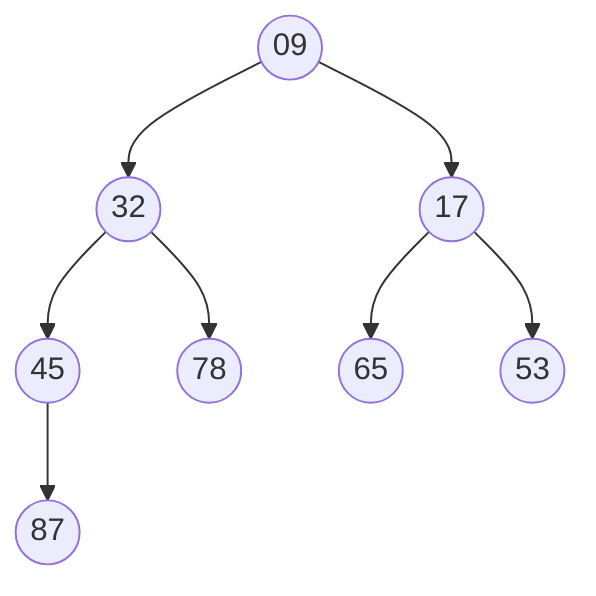
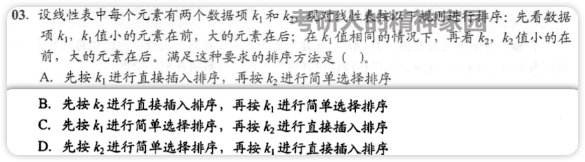
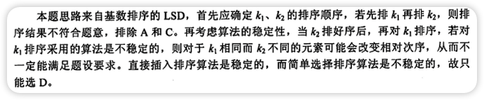
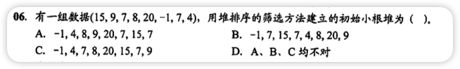
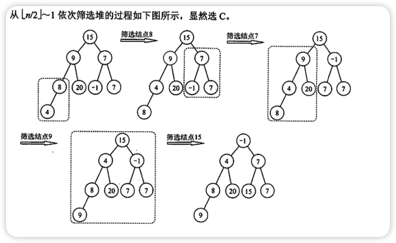
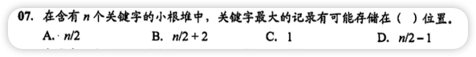
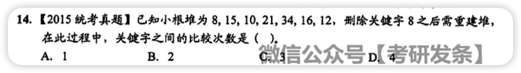
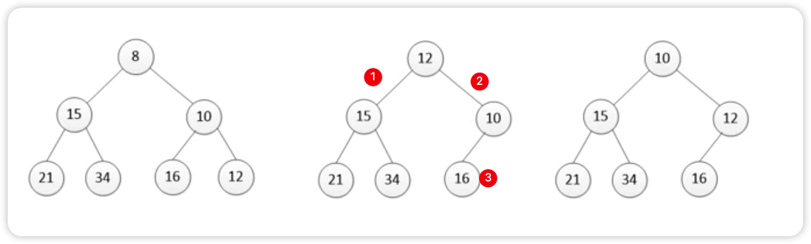

# 简单选择排序
每次从未排序数组中选择最小的放到有序数组中

- 不稳定算法
- 时间复杂度：O(n2)
- 比较次数数量级与序列初始状态无关，始终是O(n2)

> 不怎么考
# 堆排序

- 堆是特殊的完全二叉树
- 大根堆（大顶堆）👇，父节点比子节点大
	- $arr[i] \ge arr[2i+1]\ and\ arr[i] \ge arr[2i+2]$

|  0 |  1 |  2 |  3 |  4 |  5 |  6 |  7 |
| :--: | :--: | :--: | :--: | :--: | :--: | :--: | :--: |
| 87 | 45 | 78 | 32 | 17 | 65 | 53 | 09 |
- 小根堆（小顶堆）👇，父节点比子节点小
	- $arr[i] \le arr[2i+1]\ and\ arr[i] \le arr[2i+2]$ 

|  0 |  1 |  2 |  3 |  4 |  5 |  6 |  7 |
| :--: | :--: | :--: | :--: | :--: | :--: | :--: | :--: |
| 09 | 32 | 17 | 45 | 78 | 65 | 53 | 87 |
- 不稳定算法
- 时间复杂度：O(nlog2n)
  - 不管最好还是最坏都是O(nlog2n)
- 基本思想
  - 将无需序列构建成一个堆(完全二叉树)
  	- 升序就用大顶堆，降序用小顶堆
  - 将堆顶元素与末尾元素交换，将最大元素"沉"到数组末端
  	- 下次循环时就不再修改此元素
  - 重新调整结构使其满足堆定义，然后继续交换堆顶元素和末尾元素
  - 反复执行调整和交换步骤，直到整个序列有序
- 取一堆数据中最大(最小)的k个元素时优先使用堆排序
- 堆排序的序列与相当于二叉树的层次序列
- 可以讲堆视作完全二叉树，采用顺序存储方式存放堆
- 插入和删除一个新元素的时间复杂度都为O(log2n)
- 构造n个记录的初始堆，时间复杂度为O(n)
> 常考
# 错题集
1. 
   

        
答案与解析：

         
        答案： D
         
        解析： 
        没看懂 
        
   

2. 
    

    
答案与解析：

     
    答案： D
     
    解析： 
    
    

3. 
    

      
答案与解析：

       
      答案： B
       
      解析： 
	  堆是一棵完全二叉树，小顶堆的最大关键字一定在叶子结点(非叶子结点会有子结点，定义是父结点一定比子结点小) 
    	完全二叉树的最后一个非叶子结点为<mjx-container class="MathJax" jax="SVG" style="position: relative;"><svg xmlns="http://www.w3.org/2000/svg" width="5.629ex" height="2.262ex" role="img" focusable="false" viewBox="0 -750 2488 1000" xmlns:xlink="http://www.w3.org/1999/xlink" aria-hidden="true" style="vertical-align: -0.566ex;"><defs><path id="MJX-107-TEX-N-230A" d="M174 734Q174 735 175 737T177 740T180 744T184 747T189 749T196 750Q206 748 214 735V-210H310H373Q401 -210 411 -213T422 -230T411 -247T369 -251Q362 -251 338 -251T298 -250H190Q178 -246 174 -234V734Z"></path><path id="MJX-107-TEX-I-1D45B" d="M21 287Q22 293 24 303T36 341T56 388T89 425T135 442Q171 442 195 424T225 390T231 369Q231 367 232 367L243 378Q304 442 382 442Q436 442 469 415T503 336T465 179T427 52Q427 26 444 26Q450 26 453 27Q482 32 505 65T540 145Q542 153 560 153Q580 153 580 145Q580 144 576 130Q568 101 554 73T508 17T439 -10Q392 -10 371 17T350 73Q350 92 386 193T423 345Q423 404 379 404H374Q288 404 229 303L222 291L189 157Q156 26 151 16Q138 -11 108 -11Q95 -11 87 -5T76 7T74 17Q74 30 112 180T152 343Q153 348 153 366Q153 405 129 405Q91 405 66 305Q60 285 60 284Q58 278 41 278H27Q21 284 21 287Z"></path><path id="MJX-107-TEX-N-2F" d="M423 750Q432 750 438 744T444 730Q444 725 271 248T92 -240Q85 -250 75 -250Q68 -250 62 -245T56 -231Q56 -221 230 257T407 740Q411 750 423 750Z"></path><path id="MJX-107-TEX-N-32" d="M109 429Q82 429 66 447T50 491Q50 562 103 614T235 666Q326 666 387 610T449 465Q449 422 429 383T381 315T301 241Q265 210 201 149L142 93L218 92Q375 92 385 97Q392 99 409 186V189H449V186Q448 183 436 95T421 3V0H50V19V31Q50 38 56 46T86 81Q115 113 136 137Q145 147 170 174T204 211T233 244T261 278T284 308T305 340T320 369T333 401T340 431T343 464Q343 527 309 573T212 619Q179 619 154 602T119 569T109 550Q109 549 114 549Q132 549 151 535T170 489Q170 464 154 447T109 429Z"></path><path id="MJX-107-TEX-N-230B" d="M229 734Q229 735 230 737T232 740T235 744T239 747T244 749T251 750Q262 748 269 735V-235Q266 -240 256 -249L147 -250H77Q43 -250 32 -247T21 -230T32 -213T72 -209Q79 -209 99 -209T133 -210H229V734Z"></path></defs><g stroke="currentColor" fill="currentColor" stroke-width="0" transform="scale(1,-1)"><g data-mml-node="math"><g data-mml-node="mo"><use data-c="230A" xlink:href="#MJX-107-TEX-N-230A"></use></g><g data-mml-node="mi" transform="translate(444,0)"><use data-c="1D45B" xlink:href="#MJX-107-TEX-I-1D45B"></use></g><g data-mml-node="TeXAtom" data-mjx-texclass="ORD" transform="translate(1044,0)"><g data-mml-node="mo"><use data-c="2F" xlink:href="#MJX-107-TEX-N-2F"></use></g></g><g data-mml-node="mn" transform="translate(1544,0)"><use data-c="32" xlink:href="#MJX-107-TEX-N-32"></use></g><g data-mml-node="mo" transform="translate(2044,0)"><use data-c="230B" xlink:href="#MJX-107-TEX-N-230B"></use></g></g></g></svg><mjx-assistive-mml unselectable="on" display="inline"><math xmlns="http://www.w3.org/1998/Math/MathML"><mo fence="false" stretchy="false">⌊</mo><mi>n</mi><mrow data-mjx-texclass="ORD"><mo>/</mo></mrow><mn>2</mn><mo fence="false" stretchy="false">⌋</mo></math></mjx-assistive-mml></mjx-container>,所以关键字最大纪录的存储范围是<mjx-container class="MathJax" jax="SVG" style="position: relative;"><svg xmlns="http://www.w3.org/2000/svg" width="13.9ex" height="2.262ex" role="img" focusable="false" viewBox="0 -750 6144 1000" xmlns:xlink="http://www.w3.org/1999/xlink" aria-hidden="true" style="vertical-align: -0.566ex;"><defs><path id="MJX-152-TEX-N-230A" d="M174 734Q174 735 175 737T177 740T180 744T184 747T189 749T196 750Q206 748 214 735V-210H310H373Q401 -210 411 -213T422 -230T411 -247T369 -251Q362 -251 338 -251T298 -250H190Q178 -246 174 -234V734Z"></path><path id="MJX-152-TEX-I-1D45B" d="M21 287Q22 293 24 303T36 341T56 388T89 425T135 442Q171 442 195 424T225 390T231 369Q231 367 232 367L243 378Q304 442 382 442Q436 442 469 415T503 336T465 179T427 52Q427 26 444 26Q450 26 453 27Q482 32 505 65T540 145Q542 153 560 153Q580 153 580 145Q580 144 576 130Q568 101 554 73T508 17T439 -10Q392 -10 371 17T350 73Q350 92 386 193T423 345Q423 404 379 404H374Q288 404 229 303L222 291L189 157Q156 26 151 16Q138 -11 108 -11Q95 -11 87 -5T76 7T74 17Q74 30 112 180T152 343Q153 348 153 366Q153 405 129 405Q91 405 66 305Q60 285 60 284Q58 278 41 278H27Q21 284 21 287Z"></path><path id="MJX-152-TEX-N-2F" d="M423 750Q432 750 438 744T444 730Q444 725 271 248T92 -240Q85 -250 75 -250Q68 -250 62 -245T56 -231Q56 -221 230 257T407 740Q411 750 423 750Z"></path><path id="MJX-152-TEX-N-32" d="M109 429Q82 429 66 447T50 491Q50 562 103 614T235 666Q326 666 387 610T449 465Q449 422 429 383T381 315T301 241Q265 210 201 149L142 93L218 92Q375 92 385 97Q392 99 409 186V189H449V186Q448 183 436 95T421 3V0H50V19V31Q50 38 56 46T86 81Q115 113 136 137Q145 147 170 174T204 211T233 244T261 278T284 308T305 340T320 369T333 401T340 431T343 464Q343 527 309 573T212 619Q179 619 154 602T119 569T109 550Q109 549 114 549Q132 549 151 535T170 489Q170 464 154 447T109 429Z"></path><path id="MJX-152-TEX-N-230B" d="M229 734Q229 735 230 737T232 740T235 744T239 747T244 749T251 750Q262 748 269 735V-235Q266 -240 256 -249L147 -250H77Q43 -250 32 -247T21 -230T32 -213T72 -209Q79 -209 99 -209T133 -210H229V734Z"></path><path id="MJX-152-TEX-N-2B" d="M56 237T56 250T70 270H369V420L370 570Q380 583 389 583Q402 583 409 568V270H707Q722 262 722 250T707 230H409V-68Q401 -82 391 -82H389H387Q375 -82 369 -68V230H70Q56 237 56 250Z"></path><path id="MJX-152-TEX-N-31" d="M213 578L200 573Q186 568 160 563T102 556H83V602H102Q149 604 189 617T245 641T273 663Q275 666 285 666Q294 666 302 660V361L303 61Q310 54 315 52T339 48T401 46H427V0H416Q395 3 257 3Q121 3 100 0H88V46H114Q136 46 152 46T177 47T193 50T201 52T207 57T213 61V578Z"></path><path id="MJX-152-TEX-N-223C" d="M55 166Q55 241 101 304T222 367Q260 367 296 349T362 304T421 252T484 208T554 189Q616 189 655 236T694 338Q694 350 698 358T708 367Q722 367 722 334Q722 260 677 197T562 134H554Q517 134 481 152T414 196T355 248T292 293T223 311Q179 311 145 286Q109 257 96 218T80 156T69 133Q55 133 55 166Z"></path></defs><g stroke="currentColor" fill="currentColor" stroke-width="0" transform="scale(1,-1)"><g data-mml-node="math"><g data-mml-node="mo"><use data-c="230A" xlink:href="#MJX-152-TEX-N-230A"></use></g><g data-mml-node="mi" transform="translate(444,0)"><use data-c="1D45B" xlink:href="#MJX-152-TEX-I-1D45B"></use></g><g data-mml-node="TeXAtom" data-mjx-texclass="ORD" transform="translate(1044,0)"><g data-mml-node="mo"><use data-c="2F" xlink:href="#MJX-152-TEX-N-2F"></use></g></g><g data-mml-node="mn" transform="translate(1544,0)"><use data-c="32" xlink:href="#MJX-152-TEX-N-32"></use></g><g data-mml-node="mo" transform="translate(2044,0)"><use data-c="230B" xlink:href="#MJX-152-TEX-N-230B"></use></g><g data-mml-node="mo" transform="translate(2710.2,0)"><use data-c="2B" xlink:href="#MJX-152-TEX-N-2B"></use></g><g data-mml-node="mn" transform="translate(3710.4,0)"><use data-c="31" xlink:href="#MJX-152-TEX-N-31"></use></g><g data-mml-node="mo" transform="translate(4488.2,0)"><use data-c="223C" xlink:href="#MJX-152-TEX-N-223C"></use></g><g data-mml-node="mi" transform="translate(5544,0)"><use data-c="1D45B" xlink:href="#MJX-152-TEX-I-1D45B"></use></g></g></g></svg><mjx-assistive-mml unselectable="on" display="inline"><math xmlns="http://www.w3.org/1998/Math/MathML"><mo fence="false" stretchy="false">⌊</mo><mi>n</mi><mrow data-mjx-texclass="ORD"><mo>/</mo></mrow><mn>2</mn><mo fence="false" stretchy="false">⌋</mo><mo>+</mo><mn>1</mn><mo>∼</mo><mi>n</mi></math></mjx-assistive-mml></mjx-container>
    

4. 
    

      
答案与解析：

       
      答案： C
       
      解析： 
      删除后最后一位进行补位 
       
      先和<code>15</code>比较,符合定义不换位 
      再和<code>10</code>比较，不符合定义交换<code>12</code>和<code>10</code> 
      再向下判断，与<code>16</code>比较，符合定义不换位 
      一共比较3次
    

    
    

