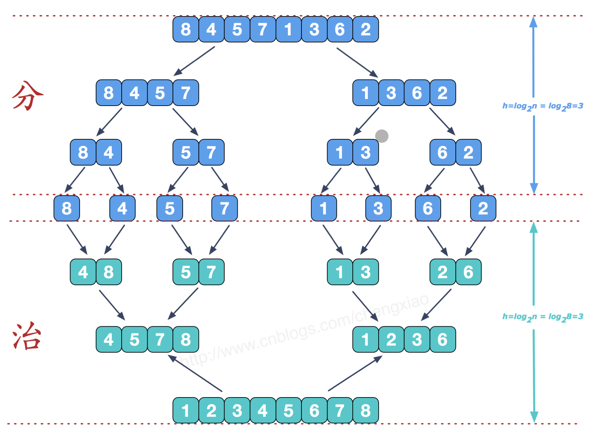
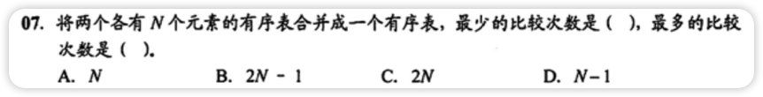

# 归并排序

- 利用归并的思想实现的排序方法
- 该算法采用经典的分治策略
- 分治法将问题分(divide)成一些小的问题然后递归求解
- 治(conquer)的阶段则将分的阶段得到的各结果“修补”在一起
- 稳定算法
- 时间复杂度：O(nlogn)
- 分阶段可以理解为就是递归拆开分子序列的过程，递归深度为log2n
- 空间复杂度：O(1)
- 比较次数数量级与序列初始状态无关
- **对`n`个元素进行`k`路归并排序的趟数满足$k^m=n$**
- 

<video id="my-video_html5_api" class="vjs-tech" preload="auto" src="http://vod0vwkapu4.vod.126.net/vod0vwkapu4/Fi0pFtc2_11586332_shd.mp4"></video>

# 基数排序

- 将整数按位数切割成不同的数字，然后按每个位数重新比较
  - 比如数字`483`分割成`[4,8,3]`
- 时间复杂度：O(n*k)
- 通常基数排序第一趟按照个位数字大小，第二趟按照十位数字大小...
- MSD是最高位优先级，LSD是最低位优先级
- 基数排序不能对`float`和`double`类型的实数进行排序

<video id="my-video_html5_api" class="vjs-tech" preload="auto" src="http://vod0vwkapu4.vod.126.net/vod0vwkapu4/cIPvwgjS_11585387_shd.mp4"></video>

# 错题集

1. 

   

        
答案与解析：

         
        答案： A  B
         
        解析： 
        当一个表中的最小元素比另一个表中最大元素大时，比较次数最小，仅比较N次 
     	 当两个表中的元素交叉时(a1&lt;b1&lt;a2&lt;b2)，比较次数最大，为2N-1次
   

   