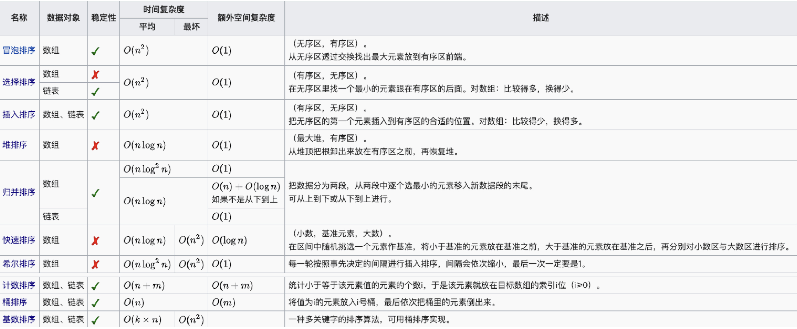
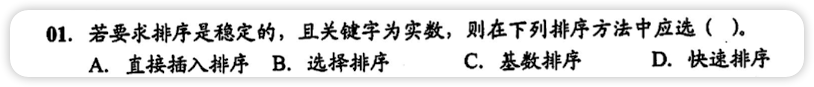
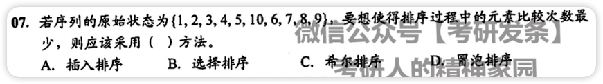
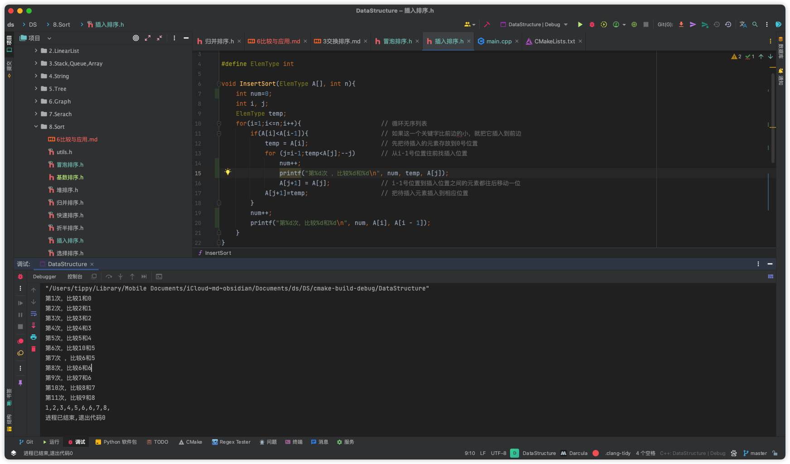
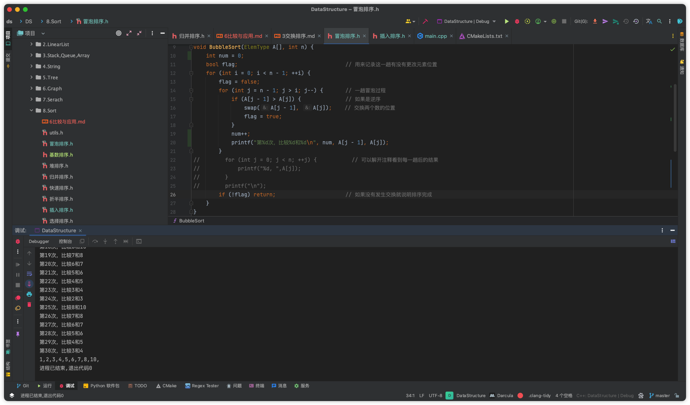
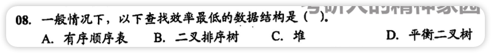

|              | 最好情况             | 平均情况             | 最坏情况             | 空间复杂度               | 稳定性     | 内外排序 | 数据对象   | 简述 | 常考点                                                       |
| ------------ | -------------------- | -------------------- | -------------------- | ------------------------ | ---------- | -------- | ---------- | ---- | ------------------------------------------------------------ |
| 直接插入排序 | **O(n)**             | O(n2)     | O(n2)     | O(1)                     | 稳定       | 内排序   | 数组、链表 |      | <ul><li>**可能出现：在最后一趟开始前，所有元素都不在最终位置**</li><li>*待排序序列基本有序的情况下，该方法效率最高*</li><li>最坏情况比较次数=n(n-1)/2</li><li>最好情况比较次数=n-1</li></ul> |
| 希尔排序     | O(nlog2n) | O(nlog2n) | O(nlog2n) | O(1)                     | **不稳定** | 内排序   | 数组       |      | <ul><li>*计算希尔排序的增量大小*</li></ul>                   |
| 冒泡排序     | **O(n)**             | O(n2)     | O(n2)     | O(1)                     | 稳定       | 内排序   | 数组       |      | <ul><li>**每一趟最后一个元素都是最大的元素(从小到大的序列)**</li><li>元素从大到小时=最坏情况比较次数=n(n-1)/2</li><li>元素从小到大时=最好情况比较次数=n-1</li></ul> |
| 快速排序     | O(nlog2n) | O(nlog2n) | O(n2)     | **O(nlog2n)** | **不稳定** | 内排序   | 数组       |      | <ul><li>蕴含了分而治之的思想</li><li>平均性能而言，目前最好的内部排序</li><li>当数据随机或者数据量很大的时候，适合快速排序；**当排序的数据已基本有序，不适合快速排序**</li><li>每次当枢轴把表分成等长部分时，速度最快</li><li>**快速排序每趟都把基准元素放在最终位置(常用来计算是不是某一趟排序结果的题目,如第一趟至少有1个元素在最终位置，第二趟至少2个或3个在最终位置)**</li><li>最大递归深度=枢轴值每次都将子表等分=树高位log2n</li><li>最小递归深度=枢轴值每次都是子表的最大值/最小值=单链表=树高为n</li><li></li></ul> |
| 简单选择排序 | O(n2)     | O(n2)     | O(n2)     | O(1)                     | **不稳定** | 内排序   | 数组、链表 |      | <ul><li>不怎么考</li><li>**比较次数数量级与序列初始状态无关**</li></ul> |
| 堆排序       | O(nlog2n) | O(nlog2n) | O(nlog2n) | O(1)                     | **不稳定** | 内排序   | 数组       |      | <ul><li>取一大堆数据中k个最大(最小)的元素时，都优先采用堆排序</li><li>可以将堆视作一棵完全二叉树，采用顺序存储方式保护堆</li><li>插入和删除一个新元素的时间复杂度都是O(log2n)</li><li>构造n个记录的初始堆，时间复杂度为O(n)</li></ul> |
| 归并排序     | O(nlog2n) | O(nlog2n) | O(nlog2n) | **O(n)**                 | 稳定       | 外排序   | 数组、链表 |      | <ul><li>分阶段可以理解为就是递归拆分子序列的过程，递归深度为log2n</li><li>比较次数数量级与序列初始状态无关</li><li>**对于N个元素进行k路归并排序对趟数满足km=N**</li></ul> |
| 基数排序     | O(d(n+r))            | O(d(n+r))            | O(d(n+r))            | O(r)                     | 稳定       | 外排序   | 数组、链表 |      | <ul><li>通常基数排序第一趟按照个位数字大小，第二趟按照十位数字大小...</li><li>MSD是最高位有限，LSD是最低位优先</li><li>基数排序不能对float和double类型的实数进行排序</li></ul> |

 

# 错题集

1. 

   

        
答案与解析：

         
        答案： A
         
        解析： 
        实数包括1.2这种小数，所以不适合基数排序
   

2. 

   

        
答案与解析：

         
        答案： A
         
        解析： 
        基本有序优先选插入排序 
        冒泡排序虽然最优也是n-1，但是冒泡的最优是完全有序，插入的是基本有序 
        用程序跑了一下，插入排序有11次，冒泡30次，确实比冒泡少不少 
        
        
   

3. 

   

        
答案与解析：

         
        答案： C
         
        解析： 
        众所周知堆排序和堆没啥关系 
     	 堆里面都是无序的，所以只能一个个找，查找效率最低
   

