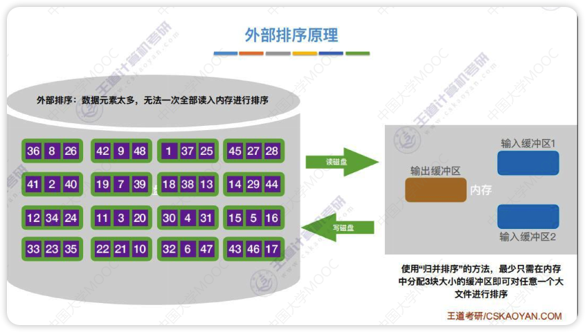
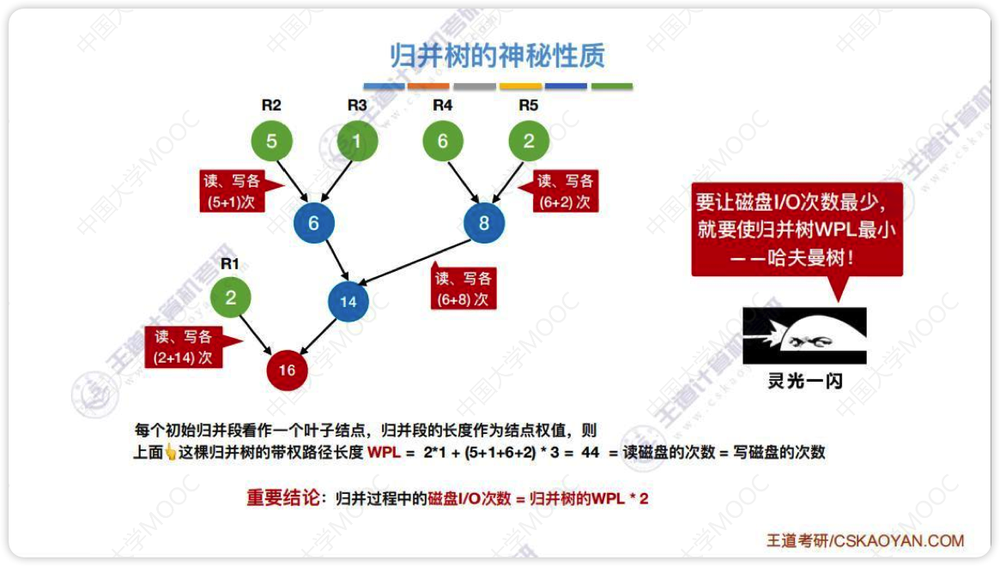
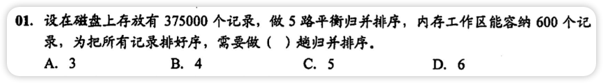
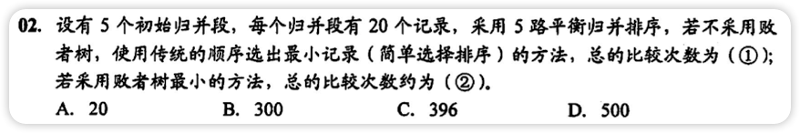

# 外部排序概念

对大文件进行排序，因为文件中的记录很多、信息量庞大，无法将整个文件复制到内存中进行排序

需要将带排序的记录存储在外存上，排序时再把一部分一部分地调入内存进行排序，在排序过程中需要多次进行内存和外存之间的交换

# 外部排序的方法

- 每次将外存中的两块(两个归并段)读到内存中的输入缓冲区
- 输入缓冲区进行排序，找到最小的依次放到输出缓冲区
- 输出缓冲区满了(有序子文件)就放回外存(放回去之后就是一个归并段)，输入缓冲区空了就从外存中读
- 内存外存之间的读写非常耗时，所以优化主要是考虑访问磁盘的次数，I/O次数
- 外部排序总时间=内部排序所需要的时间+外存信息读写时间(主要耗时)+内部归并所需时间

## 优化方式

优化主要考虑减少访问磁盘的次数

访问磁盘的次数=归并趟数$S=\lceil log_kr \rceil$

1. 增加k(归并路数)

   - 无脑增大只会增加内存消耗和内部排序的时间

   - 为了减少k增大刀子内部归并时比较次数增多的影响，可以使用[败者树](#败者树)
2. 减少r(初始归并段个数)

   - 也就是每个初始归并段长一点
   - 可以使用[置换-选择排序](#置换-选择排序)
3. 上一步如果使用置换-选择排序，会导致初始归并段的大小不同，可以优化初始归并段的顺序来降低访问磁盘的次数
   - 可以使用[最佳归并树](#最佳归并树)

# 败者树

这种对战树就是败者树

	
上图败者树生成过程
  
  <ol>
    <li>先把每个归并段段第一个数字放到败者树的叶子结点</li>
    <ul>
      <li>这里的归并段是已经读取到内存中的，n个归并段就是n路归并</li>
      <li>叶子结点可以放到一个数组里，就像前面的堆排序，0号位用来存放冠军结点，参考下面的图，ls数组就是存放的叶子结点</li>
    </ul>
    <li>27和12决斗(比较),12更小所以27留下(这里找最小)，即留在图上的1的位置</li>
    <li>1和17决斗(比较)，1更小所以17留在4的位置</li>
    <li>此时12和1都晋级到数字2那一层，12和1决斗(比较)，1胜出所以12留在图上2的位置</li>
    <li>....</li>
    <li>直到最终决斗出一个最小的放在3那个位置</li>
    <li>图中的序号对应归并段的位置，最小的是3也就是归并段3的第一个数最小，将归并段3的第一个数字放到输出缓冲区</li>
    <li>将归并段3的下一位数字放到原来的3号位置(叶子结点那里),再与1，2，5进行决斗(比较),选出新的冠军(最小值)</li>
  </ol>

- 败者树是一种特殊的完全二叉树(只不过多了个头)
- 不用败者树时每次找最小值都需要比较$k-1$次，k是归并路数，使用败者树只需要$\lceil log_2k \rceil$次 

# 置换-选择排序

- 主要用于**生成初始归并段**
- 原理：增加归并段的长度，减少初始归并段的数量，即减少r
- 置换-选择排序可以让每个初始归并段的长度超过内存工作区的大小

- 上面过程中的FI依然是一块一块的从外存中读入内存
- 输出FO依然是输出缓冲区，然后一块一块的存到外存

# 最佳归并树

上图仅为2路归并时的最佳归并树，如果是多路归并则需要使用k叉哈夫曼树

- 归并过程中**磁盘I/O次数 = 归并树的WPL\*2**

- 如果初始归并段不足以构成一棵严格k叉树时，需要添加长度为0的“虚段”(NULL)
  - 归并段不多的时候可以直接画一下，缺几个补几个
  - 设严格k叉树有n个结点，n0个度为0的结点，nk个度为k的结点
    - $n_0=(k-1)n_k + 1$=>$n_k=\frac{n_0-1}{k-1}$
    - $(n_0-1) \% (k-1) = 0$=>正好可以构造k叉归并树
    - $(n_0-1) \% (k-1) = u \not = 0$=>再加上$k-u-1$个空归并段就可以建立归并树
- 

# 错题集

1. 

   

        
答案与解析：

         
        答案： B
         
        解析： 
        工作区能容纳600个记录=>一共有37500/600=625个归并段 
     	 直接套公式可以<mjx-container class="MathJax" jax="SVG" style="position: relative;"><svg xmlns="http://www.w3.org/2000/svg" width="28.355ex" height="2.262ex" role="img" focusable="false" viewBox="0 -750 12533.1 1000" xmlns:xlink="http://www.w3.org/1999/xlink" aria-hidden="true" style="vertical-align: -0.566ex;"><defs><path id="MJX-223-TEX-I-1D446" d="M308 24Q367 24 416 76T466 197Q466 260 414 284Q308 311 278 321T236 341Q176 383 176 462Q176 523 208 573T273 648Q302 673 343 688T407 704H418H425Q521 704 564 640Q565 640 577 653T603 682T623 704Q624 704 627 704T632 705Q645 705 645 698T617 577T585 459T569 456Q549 456 549 465Q549 471 550 475Q550 478 551 494T553 520Q553 554 544 579T526 616T501 641Q465 662 419 662Q362 662 313 616T263 510Q263 480 278 458T319 427Q323 425 389 408T456 390Q490 379 522 342T554 242Q554 216 546 186Q541 164 528 137T492 78T426 18T332 -20Q320 -22 298 -22Q199 -22 144 33L134 44L106 13Q83 -14 78 -18T65 -22Q52 -22 52 -14Q52 -11 110 221Q112 227 130 227H143Q149 221 149 216Q149 214 148 207T144 186T142 153Q144 114 160 87T203 47T255 29T308 24Z"></path><path id="MJX-223-TEX-N-3D" d="M56 347Q56 360 70 367H707Q722 359 722 347Q722 336 708 328L390 327H72Q56 332 56 347ZM56 153Q56 168 72 173H708Q722 163 722 153Q722 140 707 133H70Q56 140 56 153Z"></path><path id="MJX-223-TEX-N-2308" d="M174 734Q178 746 190 750H298H369Q400 750 411 747T422 730T411 713T372 709Q365 709 345 709T310 710H214V-235Q206 -248 196 -250Q192 -250 189 -249T184 -247T180 -244T178 -241T176 -237T174 -234V734Z"></path><path id="MJX-223-TEX-I-1D459" d="M117 59Q117 26 142 26Q179 26 205 131Q211 151 215 152Q217 153 225 153H229Q238 153 241 153T246 151T248 144Q247 138 245 128T234 90T214 43T183 6T137 -11Q101 -11 70 11T38 85Q38 97 39 102L104 360Q167 615 167 623Q167 626 166 628T162 632T157 634T149 635T141 636T132 637T122 637Q112 637 109 637T101 638T95 641T94 647Q94 649 96 661Q101 680 107 682T179 688Q194 689 213 690T243 693T254 694Q266 694 266 686Q266 675 193 386T118 83Q118 81 118 75T117 65V59Z"></path><path id="MJX-223-TEX-I-1D45C" d="M201 -11Q126 -11 80 38T34 156Q34 221 64 279T146 380Q222 441 301 441Q333 441 341 440Q354 437 367 433T402 417T438 387T464 338T476 268Q476 161 390 75T201 -11ZM121 120Q121 70 147 48T206 26Q250 26 289 58T351 142Q360 163 374 216T388 308Q388 352 370 375Q346 405 306 405Q243 405 195 347Q158 303 140 230T121 120Z"></path><path id="MJX-223-TEX-I-1D454" d="M311 43Q296 30 267 15T206 0Q143 0 105 45T66 160Q66 265 143 353T314 442Q361 442 401 394L404 398Q406 401 409 404T418 412T431 419T447 422Q461 422 470 413T480 394Q480 379 423 152T363 -80Q345 -134 286 -169T151 -205Q10 -205 10 -137Q10 -111 28 -91T74 -71Q89 -71 102 -80T116 -111Q116 -121 114 -130T107 -144T99 -154T92 -162L90 -164H91Q101 -167 151 -167Q189 -167 211 -155Q234 -144 254 -122T282 -75Q288 -56 298 -13Q311 35 311 43ZM384 328L380 339Q377 350 375 354T369 368T359 382T346 393T328 402T306 405Q262 405 221 352Q191 313 171 233T151 117Q151 38 213 38Q269 38 323 108L331 118L384 328Z"></path><path id="MJX-223-TEX-I-1D45A" d="M21 287Q22 293 24 303T36 341T56 388T88 425T132 442T175 435T205 417T221 395T229 376L231 369Q231 367 232 367L243 378Q303 442 384 442Q401 442 415 440T441 433T460 423T475 411T485 398T493 385T497 373T500 364T502 357L510 367Q573 442 659 442Q713 442 746 415T780 336Q780 285 742 178T704 50Q705 36 709 31T724 26Q752 26 776 56T815 138Q818 149 821 151T837 153Q857 153 857 145Q857 144 853 130Q845 101 831 73T785 17T716 -10Q669 -10 648 17T627 73Q627 92 663 193T700 345Q700 404 656 404H651Q565 404 506 303L499 291L466 157Q433 26 428 16Q415 -11 385 -11Q372 -11 364 -4T353 8T350 18Q350 29 384 161L420 307Q423 322 423 345Q423 404 379 404H374Q288 404 229 303L222 291L189 157Q156 26 151 16Q138 -11 108 -11Q95 -11 87 -5T76 7T74 17Q74 30 112 181Q151 335 151 342Q154 357 154 369Q154 405 129 405Q107 405 92 377T69 316T57 280Q55 278 41 278H27Q21 284 21 287Z"></path><path id="MJX-223-TEX-I-1D45F" d="M21 287Q22 290 23 295T28 317T38 348T53 381T73 411T99 433T132 442Q161 442 183 430T214 408T225 388Q227 382 228 382T236 389Q284 441 347 441H350Q398 441 422 400Q430 381 430 363Q430 333 417 315T391 292T366 288Q346 288 334 299T322 328Q322 376 378 392Q356 405 342 405Q286 405 239 331Q229 315 224 298T190 165Q156 25 151 16Q138 -11 108 -11Q95 -11 87 -5T76 7T74 17Q74 30 114 189T154 366Q154 405 128 405Q107 405 92 377T68 316T57 280Q55 278 41 278H27Q21 284 21 287Z"></path><path id="MJX-223-TEX-N-2309" d="M21 717T21 730T32 746T75 750H147H256Q266 742 269 735V-235Q262 -248 251 -250Q247 -250 244 -249T239 -247T235 -244T233 -241T231 -237T229 -234V710H133Q119 710 99 710T71 709Q43 709 32 713Z"></path><path id="MJX-223-TEX-N-35" d="M164 157Q164 133 148 117T109 101H102Q148 22 224 22Q294 22 326 82Q345 115 345 210Q345 313 318 349Q292 382 260 382H254Q176 382 136 314Q132 307 129 306T114 304Q97 304 95 310Q93 314 93 485V614Q93 664 98 664Q100 666 102 666Q103 666 123 658T178 642T253 634Q324 634 389 662Q397 666 402 666Q410 666 410 648V635Q328 538 205 538Q174 538 149 544L139 546V374Q158 388 169 396T205 412T256 420Q337 420 393 355T449 201Q449 109 385 44T229 -22Q148 -22 99 32T50 154Q50 178 61 192T84 210T107 214Q132 214 148 197T164 157Z"></path><path id="MJX-223-TEX-N-36" d="M42 313Q42 476 123 571T303 666Q372 666 402 630T432 550Q432 525 418 510T379 495Q356 495 341 509T326 548Q326 592 373 601Q351 623 311 626Q240 626 194 566Q147 500 147 364L148 360Q153 366 156 373Q197 433 263 433H267Q313 433 348 414Q372 400 396 374T435 317Q456 268 456 210V192Q456 169 451 149Q440 90 387 34T253 -22Q225 -22 199 -14T143 16T92 75T56 172T42 313ZM257 397Q227 397 205 380T171 335T154 278T148 216Q148 133 160 97T198 39Q222 21 251 21Q302 21 329 59Q342 77 347 104T352 209Q352 289 347 316T329 361Q302 397 257 397Z"></path><path id="MJX-223-TEX-N-32" d="M109 429Q82 429 66 447T50 491Q50 562 103 614T235 666Q326 666 387 610T449 465Q449 422 429 383T381 315T301 241Q265 210 201 149L142 93L218 92Q375 92 385 97Q392 99 409 186V189H449V186Q448 183 436 95T421 3V0H50V19V31Q50 38 56 46T86 81Q115 113 136 137Q145 147 170 174T204 211T233 244T261 278T284 308T305 340T320 369T333 401T340 431T343 464Q343 527 309 573T212 619Q179 619 154 602T119 569T109 550Q109 549 114 549Q132 549 151 535T170 489Q170 464 154 447T109 429Z"></path><path id="MJX-223-TEX-N-34" d="M462 0Q444 3 333 3Q217 3 199 0H190V46H221Q241 46 248 46T265 48T279 53T286 61Q287 63 287 115V165H28V211L179 442Q332 674 334 675Q336 677 355 677H373L379 671V211H471V165H379V114Q379 73 379 66T385 54Q393 47 442 46H471V0H462ZM293 211V545L74 212L183 211H293Z"></path></defs><g stroke="currentColor" fill="currentColor" stroke-width="0" transform="scale(1,-1)"><g data-mml-node="math"><g data-mml-node="mi"><use data-c="1D446" xlink:href="#MJX-223-TEX-I-1D446"></use></g><g data-mml-node="mo" transform="translate(922.8,0)"><use data-c="3D" xlink:href="#MJX-223-TEX-N-3D"></use></g><g data-mml-node="mo" transform="translate(1978.6,0)"><use data-c="2308" xlink:href="#MJX-223-TEX-N-2308"></use></g><g data-mml-node="mi" transform="translate(2422.6,0)"><use data-c="1D459" xlink:href="#MJX-223-TEX-I-1D459"></use></g><g data-mml-node="mi" transform="translate(2720.6,0)"><use data-c="1D45C" xlink:href="#MJX-223-TEX-I-1D45C"></use></g><g data-mml-node="msub" transform="translate(3205.6,0)"><g data-mml-node="mi"><use data-c="1D454" xlink:href="#MJX-223-TEX-I-1D454"></use></g><g data-mml-node="mi" transform="translate(510,-150) scale(0.707)"><use data-c="1D45A" xlink:href="#MJX-223-TEX-I-1D45A"></use></g></g><g data-mml-node="mi" transform="translate(4386.4,0)"><use data-c="1D45F" xlink:href="#MJX-223-TEX-I-1D45F"></use></g><g data-mml-node="mo" transform="translate(4837.4,0)"><use data-c="2309" xlink:href="#MJX-223-TEX-N-2309"></use></g><g data-mml-node="mo" transform="translate(5559.2,0)"><use data-c="3D" xlink:href="#MJX-223-TEX-N-3D"></use></g><g data-mml-node="mo" transform="translate(6615,0)"><use data-c="2308" xlink:href="#MJX-223-TEX-N-2308"></use></g><g data-mml-node="mi" transform="translate(7059,0)"><use data-c="1D459" xlink:href="#MJX-223-TEX-I-1D459"></use></g><g data-mml-node="mi" transform="translate(7357,0)"><use data-c="1D45C" xlink:href="#MJX-223-TEX-I-1D45C"></use></g><g data-mml-node="msub" transform="translate(7842,0)"><g data-mml-node="mi"><use data-c="1D454" xlink:href="#MJX-223-TEX-I-1D454"></use></g><g data-mml-node="mn" transform="translate(510,-150) scale(0.707)"><use data-c="35" xlink:href="#MJX-223-TEX-N-35"></use></g></g><g data-mml-node="mn" transform="translate(8755.5,0)"><use data-c="36" xlink:href="#MJX-223-TEX-N-36"></use><use data-c="32" xlink:href="#MJX-223-TEX-N-32" transform="translate(500,0)"></use><use data-c="35" xlink:href="#MJX-223-TEX-N-35" transform="translate(1000,0)"></use></g><g data-mml-node="mo" transform="translate(10255.5,0)"><use data-c="2309" xlink:href="#MJX-223-TEX-N-2309"></use></g><g data-mml-node="mo" transform="translate(10977.3,0)"><use data-c="3D" xlink:href="#MJX-223-TEX-N-3D"></use></g><g data-mml-node="mn" transform="translate(12033.1,0)"><use data-c="34" xlink:href="#MJX-223-TEX-N-34"></use></g></g></g></svg><mjx-assistive-mml unselectable="on" display="inline"><math xmlns="http://www.w3.org/1998/Math/MathML"><mi>S</mi><mo>=</mo><mo fence="false" stretchy="false">⌈</mo><mi>l</mi><mi>o</mi><msub><mi>g</mi><mi>m</mi></msub><mi>r</mi><mo fence="false" stretchy="false">⌉</mo><mo>=</mo><mo fence="false" stretchy="false">⌈</mo><mi>l</mi><mi>o</mi><msub><mi>g</mi><mn>5</mn></msub><mn>625</mn><mo fence="false" stretchy="false">⌉</mo><mo>=</mo><mn>4</mn></math></mjx-assistive-mml></mjx-container>  
     	 不会套公式可以一步步算 
     	 第一趟归并排序会合并成625/5=125个归并段 
   	   第二趟归并排序会合并成125/5=25个归并段 
     	 第三趟归并排序会合并成25/5=5个归并段 
     	 第四趟归并排序会合并成5/5=1个归并段 
   

2. 

   

        
答案与解析：

         
        答案： C B
         
        解析： 
        传统顺序选(一个个比较)：每一次都要比较4次才能选出一个最小值，一共需要99次才能选完100个记录，所以总的比较次数为4*99=396次 
     	 使用败者树：树高h=⌈log25⌉=3，每一次都需要比较3次才能选出一个最小值，一共需要比较100次，所以总的比较次数为3*100=300次
   

   
