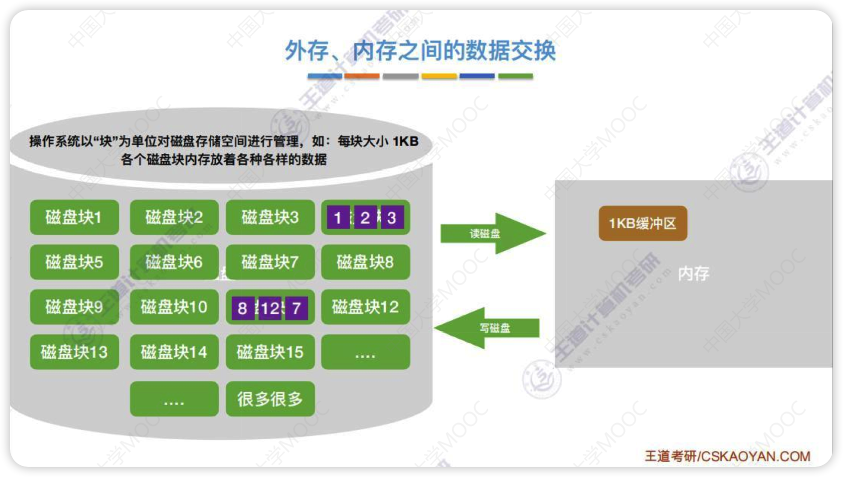
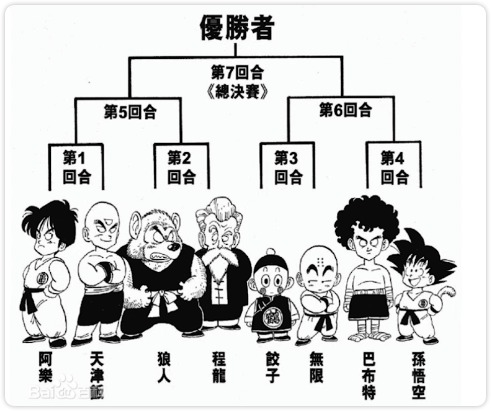

# 外部排序概念

对大文件进行排序，因为文件中的记录很多、信息量庞大，无法将整个文件复制到内存中进行排序

需要将带排序的记录存储在外存上，排序时再把一部分一部分地调入内存进行排序，在排序过程中需要多次进行内存和外存之间的交换

# 外部排序的方法

- 每次将外存中的两块(两个归并段)读到内存中的输入缓冲区
- 输入缓冲区进行排序，找到最小的依次放到输出缓冲区
- 输出缓冲区满了(有序子文件)就放回外存(放回去之后就是一个归并段)，输入缓冲区空了就从外存中读
- 内存外存之间的读写非常耗时，所以优化主要是考虑访问磁盘的次数，I/O次数
- 外部排序总时间=内部排序所需要的时间+外存信息读写时间(主要耗时)+内部归并所需时间

## 优化方式

优化主要考虑减少访问磁盘的次数

访问磁盘的次数=归并趟数$S=\lceil log_kr \rceil$

1. 增加k(归并路数)

   - 无脑增大只会增加内存消耗和内部排序的时间

   - 为了减少k增大刀子内部归并时比较次数增多的影响，可以使用[败者树](#败者树)

2. 减少r(初始归并段个数)

   - 也就是每个初始归并段长一点

# 败者树

这种对战树就是败者树

	
上图败者树生成过程
  
  <ol>
    <li>先把每个归并段段第一个数字放到败者树的叶子结点</li>
    <ul>
      <li>这里的归并段是已经读取到内存中的，n个归并段就是n路归并</li>
      <li>叶子结点可以放到一个数组里，就像前面的堆排序，0号位用来存放冠军结点，参考下面的图，ls数组就是存放的叶子结点</li>
    </ul>
    <li>27和12决斗(比较),12更小所以27留下(这里找最小)，即留在图上的1的位置</li>
    <li>1和17决斗(比较)，1更小所以17留在4的位置</li>
    <li>此时12和1都晋级到数字2那一层，12和1决斗(比较)，1胜出所以12留在图上2的位置</li>
    <li>....</li>
    <li>直到最终决斗出一个最小的放在3那个位置</li>
    <li>图中的序号对应归并段的位置，最小的是3也就是归并段3的第一个数最小，将归并段3的第一个数字放到输出缓冲区</li>
    <li>将归并段3的下一位数字放到原来的3号位置(叶子结点那里),再与1，2，5进行决斗(比较),选出新的冠军(最小值)</li>
  </ol>

- 败者树是一种特殊的完全二叉树(只不过多了个头)
- 不用败者树时每次找最小值都需要比较$k-1$次，k是归并路数，使用败者树只需要$\lceil log_2k \rceil$次 

