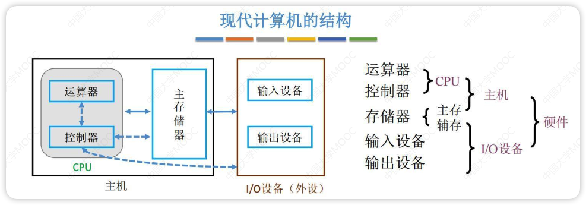
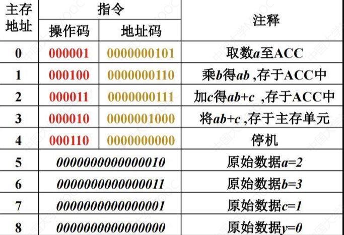
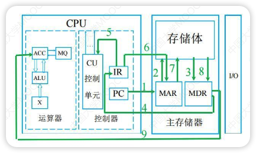
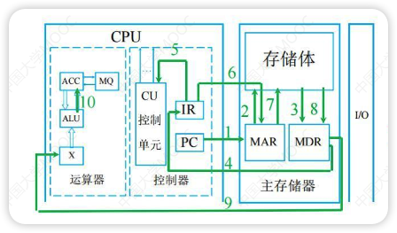
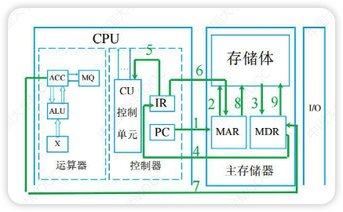
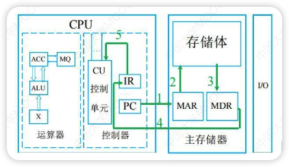
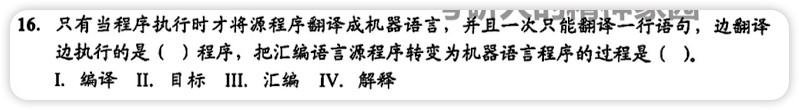

# 硬件的组成

- **冯诺依曼机的特点**：

  - 计算机由**五大部件**组成
    - 输入设备、输出设备、存储器、运算器、控制器

  - 指令和数据以同等地位存储在存储器中，并**按地址**询问
    - 指令和数据均以**二进制代码**表示
      - **CPU区分指令和数据的依据是指令周期的不同阶段**
      - **数据由指令的地址码给出**

  - **指令=操作码+地址码**。操作码用来表示操作的性质，地址码用来表示操作数在存储器中的位置

  - 指令在存储器内**按顺序**存放。通常，指令是顺序执行的，在特定条件下可根据运算结果或根据设定的条件改变执行顺序

  - 早起冯诺依曼机以**运算器**为中心，输入输出设备通过运算器与存储器传送数据

  - 是**单处理机**

  - 基本工作方式是**控制流驱动方式**
  - 

- 现代计算机的特点：

  - **计算机** = 主机+输入/输出设备
  - **主机** = CPU+主存
  - **CPU** = 运算器+控制器
    - 运算器：算术运算和逻辑运算
    - 控制器：指挥各部件使得程序执行
  - **存储器**：存放数据和指令（<font color="red">核心</font>）
  - 输入设备：将信息转换为机器能够识别的形式
    - 鼠标、摄像头
  - 输出设备：将结果转换为人们熟悉的形式
    - 显示器、音响
  - 以**主存储器**为核心
  - 
  - 


## 存储器

存储器包括MAR、MDR、时序控制逻辑、存储体
存储体如图可见由若干个存储元(unit)组成
相关知识：
- **存储元**：存储二进制的电子元件，每个存储元可以存1bit
- **存储单元**：每个存储单元存放一串二进制代码
- **存储字**：存储单元中二进制代码的组合
- **存储字长**：存储单元中二进制代码的组合
- **机器字长**：计算机能一次处理的二进制代码长度
- **指令字长**：指令的二进制长度
- **数据字长**：数据总线一次能并行传送信息的次数
- MAR(地址寄存器)：用于寻址，**位数=存储单元的个数/地址码的长度**（现代计算机已经把MAR放到CPU中）
- MDR(数据寄存器)：用于暂存数据，**位数=存储字长**
- 时序控制逻辑：用于产生存储器操作所需的各种时序信号

1个**字**(word)=16bit(不同计算机可能不同)
1个字节(1Byte)=8bit
1B=8b
## 运算器

- ACC(Accumulator): 累加器，用于存放操作数，或运算结果
- MQ(Multiple-Quotient Register): 乘商寄存器，在乘除运算时用于存放操作数或运算结果
- X: 通用的操作数寄存器，用于存放操作数
- ALU(Arithmetic and Logical Unit): 算术逻辑单元，是运算器的核心

## 控制器


- PC: 程序计数器，**存放下一条指令的地址，并跟踪下一条要执行的指令的地址**
- IR: 指令寄存器，**存放当前正在执行的指令**
- CU: 控制单元，分析指令，给出控制信号

## 计算机系统的细节

- CPU: 中央处理器
- PC: 程序计数器
- MAR: 存储器地址寄存器
- ALU: 算术逻辑部件
- IR: 指令寄存器
- MDR: 存储器数据寄存器
- GPRs: 通用寄存器组（由若干通用寄存器组成，早起就是累加器）

程序执行过程：
- 例子：
	- 下面的过程用这段C++代码举例说明
	```C++
	int a=2, b=3, C=1.y=0;
	void main(){
		y=a*b*c;
	}
	```
	
- 程序执行前
	- 数据和指令事先存放在存储器中，每条指令和每个数据都有地址，指令按序存放，指令由OP(操作码)、ADDR(地址码)字段组成，PC指向第一条指令
		- 指令就像取件码，指令参考下图内存的状态，0-4号为操作码，也就是代码逻辑
		- 数据就是快递包裹，5-8号为数据
	- 此时内存的状态为
	- 加小括号指元件内的数据，如(MAR)指MAR里的内容
	- (PC)->MAR指PC中的数据存放到MAR中
	- M(MAR)->MDR指主存储器中MAR的数据放到MDR中
	
- 程序执行
	1. (PC)=0，指向第一条存储地址
	
	   1. (PC)->MAR，导致(MAR)=0
	
	   2. 主存储器会根据(MAR)在存储体中寻找0号位置的数据
	   3. 然后将存储体中0号位置的数据放到MDR中，M(MAR)->MDR，此时(MDR)=<font color="red">000001</font> <font color="#EFDC05">0000000101</font>
	   4. (MDR)->IR, (IR)=<font color="red">000001</font> <font color="#EFDC05">0000000101</font>
	      - MDR拿到指令，返回给IR指令寄存器
	   5. OP(IR)->CU，IR将<font color="red">操作码</font>给CU，CU判断<font color="red">操作码</font>是**取数**指令
	   6. CU控制IR将<font color="#EFDC05">地址码</font> 发送给MAR，Ad(IR)->MAR，导致(MAR)=5
	      - (MAR)=<font color="#EFDC05">0000000101</font>=5
	   7. MAR去存储体中取5号地址的数据，
	   8. 将数据返回给MDR，M(MAR)->MDR，导致(MDR)=`0000000000000010`=2
	   9. (MDR)->ACC，MDR将数据送到ACC
	
	2. 到此就把a读到ACC中等待后面的指令执行，PC会自动+1，(PC)=1，然后循环1-9步直到(PC)=4执行后停止
	
	   1. (PC)->MAR，导致(MAR)=1
	   2. 主存储器会根据(MAR)在存储体中寻找1号位置的数据
	   3. 然后将存储体中1号位置的数据放到MDR中，M(MAR)->MDR，此时(MDR)=<font color="red">000100</font> <font color="#EFDC05">0000000110</font>
	   4. (MDR)->IR, (IR)=<font color="red">000100</font> <font color="#EFDC05">0000000110</font>
	      - MDR拿到指令，返回给IR指令寄存器
	   5. OP(IR)->CU，IR将<font color="red">操作码</font>给CU，CU判断<font color="red">操作码</font>是**乘法**指令
	   6. CU控制IR将<font color="#EFDC05">地址码</font> 发送给MAR，Ad(IR)->MAR，导致(MAR)=6
	      - (MAR)=<font color="#EFDC05">0000000110</font>=6
	   7. MAR去存储体中取6号地址的数据，
	   8. 将数据返回给MDR，M(MAR)->MDR，导致(MDR)=`0000000000000011`=3
	   9. (MDR)->MQ，导致(MQ)=`0000000000000011`=3
	      - 关于乘法运算，被乘数3会被放到MQ，乘数会被放到通用寄存器X，ALU会实现乘法运算然后放到ACC
	   10. (ACC)->X，导致(X)=2
	   11. (MQ)*(X)->ACC，由ALU实现乘法运算，导致(ACC)=6，如果乘积太大，则需要MQ辅助存储
	
	3. 到此执行完`a*b`，(PC)=2
	
	   1. (PC)->MAR，导致(MAR)=2
	   2. 主存储器会根据(MAR)在存储体中寻找2号位置的数据
	   3. 然后将存储体中2号位置的数据放到MDR中，M(MAR)->MDR，此时(MDR)=<font color="red">000011</font> <font color="#EFDC05">0000000111</font>
	   4. (MDR)->IR, (IR)=<font color="red">000011</font> <font color="#EFDC05">0000000111</font>
	      - MDR拿到指令，返回给IR指令寄存器
	   5. OP(IR)->CU，IR将<font color="red">操作码</font>给CU，CU判断<font color="red">操作码</font>是**加法**指令
	   6. CU控制IR将<font color="#EFDC05">地址码</font> 发送给MAR，Ad(IR)->MAR，导致(MAR)=7
	      - (MAR)=<font color="#EFDC05">0000000111</font>=7
	   7. MAR去存储体中取7号地址的数据，
	   8. 将数据返回给MDR，M(MAR)->MDR，导致(MDR)=`0000000000000001`=1
	   9. (MDR)->X，导致(X)=`0000000000000001`=1
	   10. (ACC)+(X)->ACC，导致(ACC)=7，由ALU实现加法运算
	
	4. 到此执行完`a*b+c`，(PC)=3
	
	   1. (PC)->MAR，导致(MAR)=3
	   2. 主存储器会根据(MAR)在存储体中寻找3号位置的数据
	   3. 然后将存储体中3号位置的数据放到MDR中，M(MAR)->MDR，此时(MDR)=<font color="red">000010</font> <font color="#EFDC05">0000001000</font>
	   4. (MDR)->IR, (IR)=<font color="red">000010</font> <font color="#EFDC05">0000001000</font>
	      - MDR拿到指令，返回给IR指令寄存器
	   5. OP(IR)->CU，IR将<font color="red">操作码</font>给CU，CU判断<font color="red">操作码</font>是**存数**指令
	   6. CU控制IR将<font color="#EFDC05">地址码</font> 发送给MAR，Ad(IR)->MAR，导致(MAR)=8
	      - (MAR)=<font color="#EFDC05">0000001000</font>=8
	   7. (ACC)->MDR，导致(MDR)=7
	   8. MAR等MDR拿到数据后会在存储体中找到8号位置
	   9. 将(MDR)放到地址为8的存储单元，导致y=7
	
	5. 此时执行完`y=a*b+c`，(PC)=4
	
	   1. (PC)->MAR，导致(MAR)=4
	   2. 主存储器会根据(MAR)在存储体中寻找4号位置的数据
	   3. 然后将存储体中4号位置的数据放到MDR中，M(MAR)->MDR，此时(MDR)=<font color="red">000110</font> <font color="#EFDC05">0000000000</font>
	   4. (MDR)->IR, (IR)=<font color="red">000110</font> <font color="#EFDC05">0000000000</font>
	      - MDR拿到指令，返回给IR指令寄存器
	   5. OP(IR)->CU，IR将<font color="red">操作码</font>给CU，CU判断<font color="red">操作码</font>是**停机**指令
	   6. (利用中断机制通知操作系统终止该进程)
	
	6. 到这里程序已经执行完毕，其中
	
	   1. 1-4步均为取指令操作(必经步骤)
	   2. 5步均为分析指令操作(必经步骤)
	   3. 6-最后一步均为执行 取/乘法/加法/存 等指令(不同指令的具体步骤不同)
	   4. 计算机只有识别到**停机**指令后才会通知操作系统终止该进程
# 计算机软件

| 应用软件                             | 系统软件                                                     |
| ------------------------------------ | ------------------------------------------------------------ |
| 办公软件<br />多媒体软件<br />...... | 操作系统<br />网络服务程序<br />语言处理程序<br />数据库**管理**系统<br />....... |

## 计算机应用层次结构

- 计算机
  - 软件
    - 虚拟机器M4（高级语言机器）
    - 虚拟机器M3（汇编语言机器）
    - 虚拟机器M2（操作系统机器）
  - 硬件
    - 传统机器M1（机器语言机器）
    - 微程序机器M0（微指令系统）


下层是上层的基础，上层是下层的扩展


## 三个级别的语言

- 机器语言
  - 计算机唯一可以直接识别和执行的语言
- 汇编语言
  - 由汇编程序(系统软件)翻译为机器语言后再执行
- 高级语言
  - 一种是经过编译程序得到汇编语言，然后得到机器语言在执行
    - 编译型语言，如Java，C，C++
    - 高级语言->汇编语言->机器语言
  - 一种是由高级语言程序直接翻译成机器语言
    - 解释型语言，如python，javascript
    - 高级语言->机器语言


### 翻译程序

- 汇编程序（汇编器）
  - 汇编语言-->机器语言
- 解释程序（解释器）
  - 边解释边执行
- 编译程序（编译器）
  - 高级语言-->汇编语言-->机器语言


# 错题集

1. 

   <details>
     <summary>答案与解析：</summary>
     <br />
     答案： B
     <br />
     解析：<br />
   </details>

2. 

   <details>
     <summary>答案与解析：</summary>
     <br />
     答案： C
     <br />
     解析：<br />
     寄存器在CPU内部，速度最快<br />
   </details>

3. 

   <details>
     <summary>答案与解析：</summary>
     <br />
     答案： C
     <br />
     解析：<br />
     "8位的计算机系统"：一次可以处理8位数据（答案和这个没关系）<br />
     "16位来表示地址"：一位可以表示两个数据(0或1)，两位可以表示2<sup>2</sup>=4个数据(00,01,10,11)...所以16位可以表示2<sup>16</sup>个数据，即2<sup>16</sup>=65536个地址空间
   </details>

4. 

   <details>
     <summary>答案与解析：</summary>
     <br />
     答案： IV  III
     <br />
     解析：<br />
     高级语言--<font size="0.8">编译程序</font>-->汇编语言--<font size="0.8">汇编程序</font>-->机器语言<br />
     高级语言--<font size="0.8">解释程序</font>-->机器语言<br />
     解释型语言边翻译边执行，汇编型语言需要提前编译出汇编语言的代码然后再执行
   </details>

5. 

   <details>
     <summary>答案与解析：</summary>
     <br />
     答案： A
     <br />
     解析：<br />
     数据库系统指计算机系统中引入数据库系统后的系统<br />
     数据库<font color="red">管理</font>系统属于系统软件<br />
     数据库系统包括数据库、数据库管理系统、应用系统、数据库管理员
   </details>

6. 

   <details>
     <summary>答案与解析：</summary>
     <br />
     答案： C
     <br />
     解析：<br />
     相联存储器既可按地址寻址又可按内容（通常是某些字段）寻址
   </details>

7. 

   <details>
     <summary>答案与解析：</summary>
     <br />
     答案： C
     <br />
     解析：<br />
     汇编程序和解释程序是将汇编语言/高级语言转化为机器语言，没产生代码文件<br />
     题目说的机器级目标代码文件应该是指Java/C语言那种编译后产生的文件
   </details>

