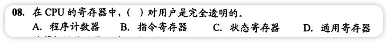
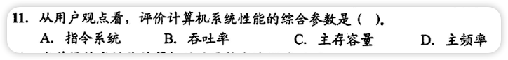
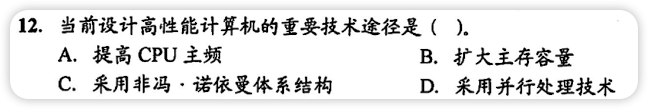
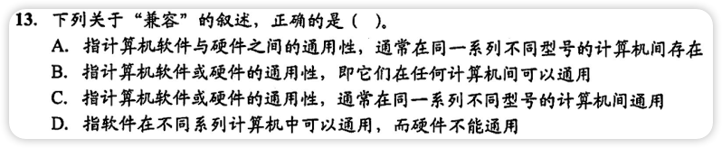
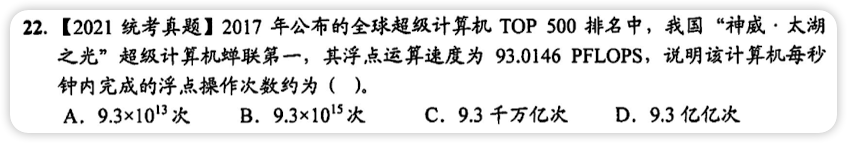

#                                                                                                                                                                                                                                                      性能指标
- 字长：计算机进行一次整数运算所能处理的二进制位数，一般与字长长度有关
	- Windows 10 64位，64位就是字长
- 数据通路带宽：外部数据总线一次能并行传送信息的位数，非CPU内数据总线宽度
- 主存容量：主存储器所能存储信息的最大容量
	- 通常用字节来衡量，1B=8bit
	- 也可以用**字数\*字长**表示
		- 例如：
			- MAR位数反应存储单元个数，MAR为16位，216=65536，即存储体内有65536个存储单元（可称作64K，1K=1024=210)
			- MDR位数反应每个存储单元大小，MDR为32位，表示每个存储单元容量为32 bit
			- 所以主存容量就是64K\*32 bit=2048 Kb = 256KB
			- 2MAR位数*MDR位数=主存容量
	- 买电脑时8+512的8G是主存容量
- 吞吐量：系统在单位时间内处理请求的数量
	- ==用户评价计算机系统性能的综合参数==
- 响应时间：指用户向计算机发送一个请求，到系统对该请求做出响应并获得所需结果的等待时间
- 主频：机器内部主时钟频率，代表每秒执行多少个时钟周期数
	- 值越大代表一个操作所需要的时间越少，CPU运行速度越快
- CPU时钟周期：主频的倒数
	- 是CPU中最小的时间单位，每个动作至少需要1个时钟周期
	- $时钟周期=\frac1{主频}$，如：主频为$2.4GHz$，$时钟周期=\frac1{2.4GHz}秒$
	- 主频就像是速度，1秒跑多远，时钟周期就像是跑完1米需要多少秒，本质都是评价CPU的性能
- CPI：执行一条指令所需要的时钟周期数
	- CPI与系统结构，指令集，计算机组织有关，与时钟频率无关
	- $CPI=\frac{时钟周期数量}{指令数量}$   
- CPU执行时间：运行一个程序所花费的时间
	- $执行时间=时钟数量 \times 时钟周期 = \frac{时钟周期数量}{主频} = \frac{指令条数 \times CPI}{主频}$ ‼️
- MIPS
	- MIPS：每秒执行多少百万条指令(Million instructions per second)
		- $MIPS = \frac{指令条数}{执行时间 \times 10^6} = \frac{主频}{CPI \times 10^6}$‼️
	- MFLOPS：每秒执行多少百万次浮点运算
		- $MFLOPS = \frac{浮点操作数次数}{执行时间 \times 10^6}$
	- GFLOPS：每秒执行多少十亿次浮点运算
		- $GFLOPS = \frac{浮点操作数次数}{执行时间 \times 10^9}$
	- TFLOPS：每秒执行多少万亿次浮点运算
		- $TFLOPS = \frac{浮点操作数次数}{执行时间 \times 10^12}$
	- 区分名字
		- MIPS -> M(int)PS 执行百万条指令(整数int运算)
		- MFLOPS -> M(float)PS 执行百万次浮点数(float)运算
		- GFLOPS -> G(float)PS 执行十亿次浮点数(float)运算
		- TFLOPS -> T(float)PS 执行万亿次浮点数(float)运算
- Others
	- $1kb = 2^{10}b = 1024b$
	- $1B = 8bit$，$1字节 = 8位/比特$
	- 描述速率/频率时
		- $1T = 10^3G = 10^6M = 10^9K$

# 错题集

1. 

   

     
答案与解析：

      
     答案： C
      
     解析： 
     本题问的是科学计算的计算机，科学计算要用到大量的浮点数运算，所以最有用的是MFLOPS
   

2. 

   

     
答案与解析：

      
     答案： B
      
     解析： 
     汇编程序猿能通过指令设置PC的值，状态寄存器、通用寄存器只有汇编程序猿可见，才能实现编程 
     IR、MAR、MDR是CPU内部工作寄存器，对程序猿均不可见
   

3. 

   

     
答案与解析：

      
     答案： A
      
     解析： 
     CPI是执行一条指令所需要的时钟周期数，也就是执行一条指令需要的时间，与时钟频率无关，与系统结构、指令集、计算机组织有关 
     CPI就好像车的速度，与1秒还是1小时无关，与汽车的发动机等因素有关
   

4. 

   

     
答案与解析：

      
     答案： B
      
     解析： 
     用户看不懂主存容量、主频率，用户没学过408 
     用户只能看懂一段时间内能干多少事（单位时间内处理请求的数量），也就是吞吐量
   

5. 

   

     
答案与解析：

      
     答案： D
      
     解析： 
     提高CPU主频、扩大主存容量对性能的提升是有限度的，并行才是提高性能的重要途径。 
     压榨一个员工是有极限的，工作还做不完可以多个员工一起压榨
   

6. 

   

     
答案与解析：

      
     答案： C
      
     解析： 
     兼容指计算机软件或硬件的通用性，载人同一系列的不同型号计算机之间通用
   

7. 

   

     
答案与解析：

      
     答案： D
      
     解析： 
     <b>P是千万亿</b> 
     千万亿=1015 
     93 x 1015=9.3 x 1016=9.3亿亿次
   

