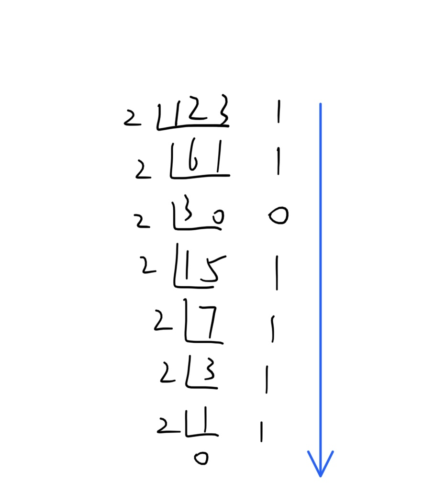
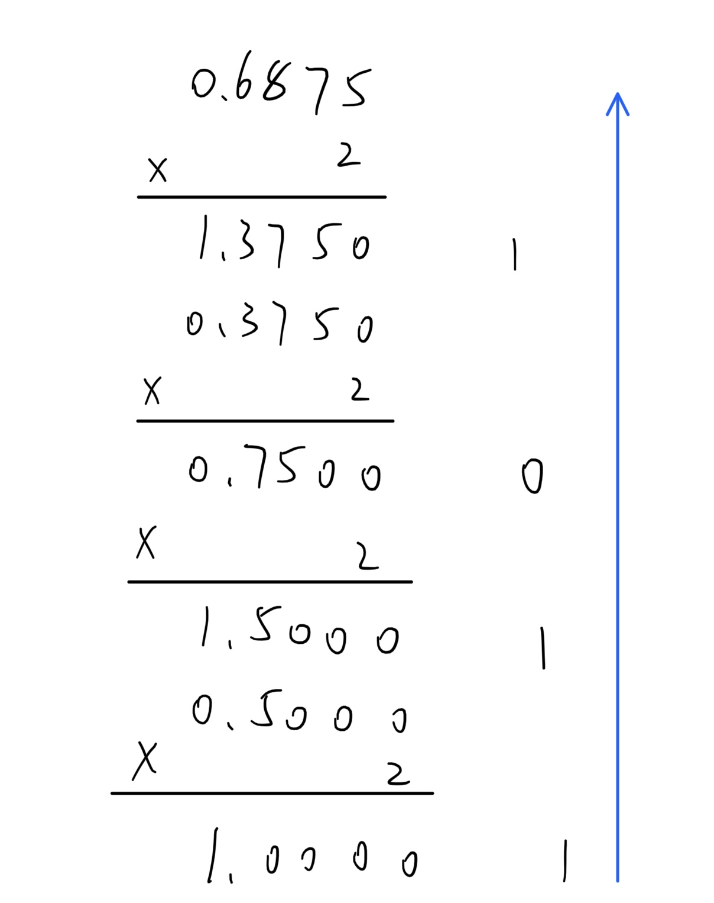

# 数制与编码
- 二进制：(1010001010010)2    1010001010010B
- 八进制：(1652)8                      1652O(这是大写字母O，不是数字0)
- 十进制：(1652)10                     1652D
- 十六进制：(1652)16                 1652H                    0x1652
>二进制：B   Binary
>八进制：O  Octal
>十进制：D  Decimal
>十六进制：H  Hex    学过前端CSS的能知道颜色值的HEX写法就是16进制

## 相互转换
- 二进制-->八进制：
	- 
	- 1010001010010.11 B = 12122.5 O
	- 将二进制数以小数点分开
	- 整数部分：
		- **从后往前**
		- 每3位转成一位8进制数（不用担心会超过8，111才等于7）
		- 如果最**前面**不足3位就在**前面**补0
	- 小数部分：
		- **从前往后**
		- 每3位转成一位8进制数
		- 如果最**后面**不足3位就在**后面**补0
- 二进制-->十六进制：
	- 
	- 1010001010010.11 B = 1452.C H
	- 将二进制数以小数点分开
	- 整数部分：
		- **从后往前**
		- 每4位转成一位16进制数（不用担心会超过16，1111才等于15）
		- 如果最**前面**不足4位就在**前面**补0
	- 小数部分：
		- **从前往后**
		- 每4位转成一位16进制数
		- 如果最**后面**不足4位就在**后面**补0
- r进制-->十进制：
	- 用$k_i$表示r进制数的第i位数字
	- i是从小数点那里开始往前数，比如1234的4就是$k_0$
	- 小数点后面的i是负数，但是是从1开始，比如1234.5的5是$k_{-1}$
	- 十进制正数 = $\sum_{i=0}^{n} k_i \times r^i$ ，负数同理
	- $11011.1 B = 1 \times 2^0 + 1 \times 2^1 + 0 \times 2^2 + 1 \times 2^3 + 1 \times 2^4 + 1 \times 2^{-1} = 27.5$ 
	- 也可以使用表格法，第一行写r进制每一位的权值，第二行对应每位数字
	- 上下两行两两相乘最后求和就是所转化的十进制数
	- 可参考下面的二进制转十进制
	- $16 \times 1 + 8 \times 1 + 4 \times 0 + 2 \times 1 + 1 \times 1 + 0.5 \times 1 = 27.5$ 
| 16 | 8 | 4 | 2 | 1 | . | 0.5 | ... |
| :--: | :--: | :--: | :--: | :--: | :--: | :--: | :--: |
| 1 | 1 | 0 | 1 | 1 | . | 1 | |
- 十进制转r进制
	- 先从小数点分为整数部分和小数部分
	- 如123.6875 D = 1111011.1011 B
	- 整数部分
		- 每次除以r，余数就写在后边
		- 算到最后把写的余数**从下往上**一个个写
		- 
	- 小数部分
		- 每次乘以r，如果结果超过1就把整数部分写在后面
		- 算到最后把写下的证书**从上往下**一个个写
		- 
## 无符号数和有符号数
- 无符号数
	- 寄存器的位数决定了无符号数的表示范围。如8位寄存器，无符号数的表示范围就是`0000000`~`1111111`, `0`~`255`
	- 用无符号数字表示主存地址
	- 8位无符号数的范围: 0~28-1 = ==0~255==
	- 16位无符号数的范围: 0~216-1 = ==0~65535==
- 有符号数
	- 真值：+5
	- 机器数：05 (0表示正，1表示负)
## 原反补移码
- 原反补移码的作用
	- 原码更便于人类理解
	- 反码作为计算机运算的中间量
	- 补码更便于计算机运算
	- 移码常用来表示浮点数的阶码,==只能表示整数==
- 符号位+数值位 = 8位（如果是8位计算机）
- ==整数的补码和移码符号位相反，数值位相同==
- 写法：
	- 原码：[x]原 = 1,0010011
	- 反码：[x]反 = 1,1101100
	- 补码：[x]补 = 1,1101101
	- 移码：[x]移 = 0,1101101
>有补码的原因：
>如果一个数+1，二进制原码是`00000001`,其负数-1的原码是`10000001`
>正常来说+1 + (-1) = 0
>但是两个原码之和等于`10000010`显然不对
>==所以可以用原码表示正数但不能表示负数==

### 相关转换
- 对于正数：
	- 原码 = 反码 = 补码
- 对于负数：
	- 原码：数字的二进制，首位0为正数1为负数
	- 反码：原码的二进制数除首位(符号位)以外都按位取反
	- 补码：反码+1
	- 移码：$[x]_移 = 2^n + x (2^n > x \ge -2^n,机器字长为n+1)$
	- **原码转补码**的手算方法：
		- 
		1. 从右往左找第一个`1`
		2. 把原码在第一个`1`左边和`符号位`右边断开
		3. 断开后中间的数字按位取反
		4. 把断开处两端的数和中间取反后的数拼在一起
	- 补码转原码的手算方法：
		- 同[原码转补码](#CalculateByHand)
	- 补码转反码：
		- 先用[补码转原码](#CalculateByHand)的方法转成原码
		- 然后数值位都取反获取反码
	- 整数原码转移码：
		- 先用[原码转补码](#CalculateByHand)获得补码
		- 对补码的符号位取反就可以获得移码
		例子：
$$
x = -19
$$
$$
[x]_原 = 1,0010011
$$$$
[x]_反 = 1,1101100
$$
$$
[x]_补 = 1,1101101
$$

常用的一些数值：
| | 原码 | 反码 | 补码 | 移码 |
| :--: | :--: | :--: | :--: | :--: |
| +1 | 0000 0001 | 0000 0001 | 0000 0001 | 1000 0001 |
| -1 | 1000 0001 | 1111 1110 | 1111 1111 | 0111 1111 |
| 0 | 0000 0000 | 0000 0000 | 0000 0000 | 0000 0000 |
| -0(等同于-128) | | | 1000 0000 | 0000 0000 |
| +127 | 0111 1111 | 0111 1111 | 0111 1111 | 1111 1111 |
| -128 | 无 | 无 | 1000 0000 | 0000 0000 |

# 错题集
1. 
	

     
答案与解析：

      
     答案： C
      
     解析： 
     8位二进制数可以表示28=256种不同的数据，但是原码中0占用了两个数据，所以8位的原码只能表示255个不同的数据 
     反码同原码也是255种，但补码和移码可以有256种
   

2. 
	

     
答案与解析：

      
     答案： A
      
     解析： 
	N位的二进制小数可以表示的数的个数为1+20+21+...+2N-1 = 2N 
	N位的十进制小数可以表示的个数为10N 
	2N / 10N = (0.2)N
	

3. 
	

     
答案与解析：

      
     答案： C
      
     解析： 
     负数的绝对值最大，所以除了第一位(符号位)剩下63位的真值最大 
     但这是补码，所以要找真值最小的，也就是000000...01(62个0)，这样转化出来的原码才能使63个1，也就是1111...11(63个1)，
	

4. 
	

     
答案与解析：

      
     答案： B
      
     解析： 
     [0]补=00000 
     [0]移=24+0=10000 
     所以B错, 表示不同，但表示形式是唯一的(指补码只有00000表示0,移码只有10000表示0) 
     对于A，补码转移码需要符号位取反，表示数字的始终一样，所以表示范围一样(C选项)
	

5. 
	

     
答案与解析：

      
     答案： C
      
     解析： 
     <b>使用补码表示时，若符号位相同，则数值位越大码值越大</b> 
     补码第一位为1，所以原码符号位为1，即为负数(参考原码转补码方法) 
     要大于-32，所以x1-x6的部分要小于32(注意这里是补码，需要转成原码小于32) 
     答案有x1=0或者1两种， 
     先假设x1=0 
     如果都是0，原码为1000000 不存在 
     如果至少有一个1，原码x1处要被反转为1，所以原码可能为1100000=-32([x]补=1010000) 
     如果x1=1 
     如果其他都是0，[x]补=1100000=1100000原=-64 
     如果至少有一个为1，最小时原码为1010000=-16([x]补=1110000) 
     所以x1=1,其他至少有一个1
	

6. 
	

     
答案与解析：

      
     答案： D
      
     解析： 
     x为正数时显然x*=x，但除此之外0*=0，0不是正数 
     题目是<b>当且仅当</b>,所以不能选B 
     C显然不对，C都不对了A更不可能对，所以选D
	
