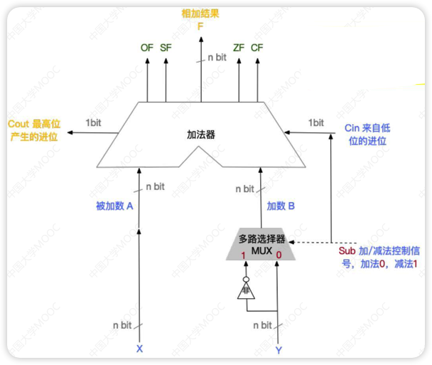

# 基本运算部件

>“我不知道你们的名字，”冯·诺伊曼拍拍前两个士兵的肩，“你们两个负责信号输入，就叫‘入1’、‘入2’吧，”他又指指最后一名士兵，“你，负责信号输出，就叫‘出’吧。”他伸手拨动三名士兵，“这样，站成一个三角形，出是顶端，入1和入2是底边。”[...]冯·诺伊曼接过来分给三名士兵，每人一白一黑，说：“白色代表０，黑色代表1。好，现在听我说，出，你转身看着入1和入2，如果他们都举黑旗，你就举黑旗，其他的情况你都举白旗，这种情况有三种：入1白，入2黑；入1黑，入2白；入1、入2都是白。”[...]“这三个人组成了一个计算系统的部件，是门部件的一种，叫‘与门’。”冯·诺伊曼说完停了一会儿，好让皇帝理解。”
>
>摘录来自
>《三体》刘慈欣

- 逻辑运算符
  - 与(·)(&&)
    - 两个都为1时结果为1
  - 或(+)(||)
    - 两个有一个为1时结果为1
  - 非(Ᾱ,表达式上边加个横线)(!)
    - 取反
  - 异或(⊕)
    - 两个不同时取1
  - 表达式(这里的`乘`和`加`是`与`和`或`)
    - $\overline{A+B} = \bar A \cdot \bar B$（离散数学德摩根率)
    - $\overline{A \cdot B} = \bar A + \bar B$
    - $A(C+D) = A \cdot C + A \cdot D$
    - $ABC = A(BC)$
    - $A+B+C=A+(B+C)$

## 一位全加器（FA）


> A<sub>i</sub>+B<sub>i</sub>如果两个数相同，加一块后一定是0(先不考虑进位)，否则一定是1，所以可以直接用异或门进行计算
>
> 因为可能有前面的进位C<sub>i-1</sub>，所以计算一次后需要与低位的进位再通过一次异或门，这样就能求出S<sub>i</sub>
>
> 只有A<sub>i</sub>与B<sub>i</sub>同时为1时需要进位，也可能是A<sub>i</sub>+B<sub>i</sub>第一次通过异或门后得到的数与C<sub>i-1</sub>同时为1时需要进位，不管哪个符合都需要进位
>
> 所以A<sub>i</sub>和B<sub>i</sub>通过一次与门，A<sub>i</sub>+B<sub>i</sub>第一次通过异或门后得到的数和C<sub>i-1</sub>通过一次与门，然后这两个结果通过一次或门就可以得到C<sub>i</sub>

这样就可以得到一个电路图

对蓝色框部分进行封装就可以变为一位全加器（full adder,简称FA）


- FA是最基本的加法单元
- input: 加数A<sub>i</sub>和B<sub>i</sub>，还有低位传进来的C<sub>i-1</sub>,默认为0
- output: 本位和S<sub>i</sub>，还有向高位的进位C<sub>i</sub>
- 和表达式: $S_i = A_i \oplus B_i \oplus C_{i-1}$
- 进位表达式: $C_i = A_iB_i + (A_i \oplus B_i)C_{i-1}$

## 串行加法器


- 把n个FA串连起来，这样就能得到n位加法器
- 每一级进位直接依赖于前一级的进位，进位信号是逐级形成的
- 最长运算时间主要由**进位信号的传递时间**决定

## 并行加法器

> 心平气和，学不会就摆烂，也不是什么重点

根据FA的表达式，如果计算两位数相加

$G_i = A_iB_i,P_i=A_i \oplus B_i$

$C_1 = G_1+P_1C_0$

$C_2 = G_2 + P_2C_1 = G_2 + P_2(G_1 + P_1C_0)=G_2+P_2G_1+P_2P_1C_0$

$C_3 =G_3+P_3G_2+P_3P_2G_1+P_3P_2P_1C_0$

$C_4 =G_4+P_4G_3+P_4P_3G_2+P_4P_3P_2G_1+P_4P_3P_2P_1C_0$


- **CLA**(超前进位部件)是实现上述表达式的部件
- 这种进位方式快速，与位数无关，当位数多时采用全先行进位是不现实的
- 采用**并行进位的目的**是：提高加法器运算速度
- 通常采用**两级或多级先行进位加法器**

## 带标志加法器

- 不仅能计算和/差，还能生成相应的标志信息
- 为了加快加法运算速度，**实际电路一定使用多级先行进位方式**
- OF(Overflow Flag): 溢出标志，溢出时为1，否则为0
  - 硬件计算方法: $OF=最高位产生的进位 \oplus 次高产生的进位=Cout \oplus C_{n-1}$
  - ==OF位对无符号数的加减法无意义==
- SF(Sign Flag): 符号标志，结果为负数时为1，否则为0
  - 硬件计算方法: $SF = 最高位的本位和=F_{n-1}$
  - ==SF位对无符号数的加减法无意义==
- ZF(Zero Flag): 零标志，结果为0时为1，否则为0
  - 硬件计算方法: 两个数的运算结果为n bit，只有n bit全为0时，ZF=1
- CF(Carry Flag): 进位/借位标志，进位/借位时为1，否则为0
  - 硬件计算方法: $CF = 最高位产生的进位 \oplus sub\left \{\begin{array}{l} sub=1, &表示减法 \\ sub=0, &表示加法 \end{array}\right. = Cout \oplus Cin$
  - ==C<sub>in</sub>=0时CF=C<sub>out</sub>;C<sub>in</sub>=1时CF=!C<sub>out</sub>(取反)==
  - ==CF位对符号数的加减法无意义==
- A-B<0时，CF=1；溢出时OF=1





| 记忆方法         | 解释                                               | 是否有意义                 |
| ---------------- | -------------------------------------------------- | -------------------------- |
| ==Zero零==       | ==ZF=1==表示结果F为0                               | 对无符号和有符号数都有意义 |
| ==Overflow溢出== | ==OF=1==表示带符号整数运算                         | 对无符号数无意义           |
| ==Signal信号==   | ==SF==表示结果的符号                               | 对无符号数无意义           |
| ==Carry进位==    | ==CF==表示无符号整数运算时的进位，判断是否发生溢出 | 对有符号数无意义           |

## 算术逻辑单元（ALU）

- ALU的核心是带标志加法器
- ALU是功能强大的组合逻辑电路，能进行算术运算，逻辑运算，移位操作
- ALUop是操作控制端，决定ALU所执行的处理操作
- ALUop的位数决定了操作的种类，位数为3时，有$2^3=8$种操作
- 在ALUop的控制下，由一个多路选择器MUX选择输出某种操作结果
- MUX是多路选择开关，它从多个输入信号中选择一个送到输出端


# 定点数的运算

- 定点数是位数不变的数
- 可以不用考虑小数还是整数

## 加减法[常考]

### 补码加减法运算

- 按二进制运算规则计算
- 符号位参与运算
- 高位丢弃


### 溢出判别方式[🌟🌟🌟]

- 仅当两符号相同的数相加或两个符号相异(其实还是同符号相加)的数相减才可能产生溢出
- 一般用**异或门**来实现溢出判断电路
- 计算时，左边出现溢出，将溢出位丢掉
- 判断溢出的方式
  - 采用一位符号法
    - 参与操作的两个数符号相同，结果又与原操作数符号不同，则溢出
  - 采用一位符号位根据数据位的判断情况判断溢出
    - 若符号位的进位和最高数位的进位相同，则没有溢出
  - 双符号法/模4补码
    - 模4补码有模2补码的所有优点，且更容易检查溢出问题
    - 模4补码存储时只需要一个符号位
    - 模4补码计算时(在ALU中)需要两个符号位
    - 最高位代表真正的符号，低位符号参与移位操作
    - 两个符号的意义
      - 00: 正数，无溢出
      - 01: 正溢出
      - 10: 负溢出
      - 11: 负数，无溢出

## 移位计算

### 算术移位

- 算术移位的对象是**有符号数**，移位过程中符号位保持不变

- 原码的算数移位：符号位保持不变，数值位进行移位

  - 右移：高位补0，低位舍弃。如果舍弃的低位=0，相当于➗2，否则会**丢失精度**

    <details>
      <summary>丢失精度</summary>
      3的原码00000011，右移后变成00000001=1<br />
      3/2=1.5，所以丢失了0.5，即丢失精度
    </details>

  - 左移：低位补0，高位舍弃。如果舍弃的高位=0，相当于✖️2，否则会出现**严重误差**

    <details>
      <summary>严重误差</summary>
      -80=11010000,左移后变成10100000=-32<br />
      -80*2=-160,与-32完全不同，即出现严重误差
    </details>

- 反码的算数移位

  - 正数原反补相同所以参考原码
  - 负数右移：高位补**1**，低位舍弃
  - 负数左移：低位补**1**，高位舍弃

- 补码的算数移位

  - 正数原反补相同所以参考原码

  - 负数右移：高位补**1**，低位舍弃(同反码)

  - 负数左移：低位补**0**，高位舍弃(同原码)

  - 规律：负数补码中，最右边的1及其右边同原码，左边同反码

    


### 逻辑移位

当作**无符号数**的算数移位

- 左移低位补0
- 右移高位补0

### 循环移位

- 不带进位位：用移出的位补上空缺（传送带）
- 带进位位：移出的位放到进位位，进位位补上空缺（传送带多了一节）


## 乘法[易考概念]

乘法运算由累加和右移操作实现

### 原码一位乘法

- 符号位和数值位是分开求的
- 符号位不参与运算，同号为正，异号为负
- **乘积符号** = 两个数的符号位的异或
- **乘积数值** = 两个数的绝对值相乘的结果
- 积和被乘数采用**双符号位**
- ==最多进行n次加法运算，n次移位==


### 补码一位乘法[Booth算法]

- 是一种**有符号数**的乘法

- ==最多进行n次移位，n+1次加法运算==

- Booth算法的**移位规则**

  | y<sub>n</sub>(高位) | y<sub>n+1</sub>(低位) | 操作                               |
  | ------------------- | --------------------- | ---------------------------------- |
  | 0                   | 0                     | 部分积右移一位                     |
  | 0                   | 1                     | 部分积加[X]<sub>补</sub>,右移一位  |
  | 1                   | 0                     | 部分积加[-X]<sub>补</sub>,右移一位 |
  | 1                   | 1                     | 部分积右移一位                     |


## 除法

除法运算由累加和(逻辑)左移实现


### 原码除法运算[不恢复余数法]

- **符号扩展**
  - 正数符号位不变，扩展位填充0
  - 负数原码表示和正数相同，符号位为1
  - 负数补码符号位不变，附加位用**1(整数)**或**0(小数)**进行填充
    - 如16位补码`Ox8FA0`扩展为32位为`OxFFFF 8FA0`
    - 如-64位的补码是`1100 0000`,则其十六进制为`OxFFFF FFC0`
- 该方法商符和商值分开进行
- 商符由两个操作数的符号位异或形成


### 补码除法运算[加减交替法]

- 该方法符号位和数值位一起参加运算，商符自然形成
  1. 根据被除数和除数的符号决定做加法还是减法
  2. 上商的原则根据余数和除数的符号位共同决定
     - 同号上商1
     - 异号上商0
  3. 最后一步商置1


# C语言中的整数类型及类型转换[🌟🌟🌟]

### 有符号数和无符号数的转换

- 强制类型转换的结果保持位置不变，改变了解释这些位的方式

```c++
int main() {
    //例1
    // x的补码为		      1110 1111 0001 1111
    short x1 = -4321;
    // 无符号位y的二进制为	1110 1111 0001 1111  真值61215
    unsigned short y1 = (unsigned short) x1;
    printf("x1=%d\ny1=%u\n\n", x1, y1);// %u是按unsigned int输出
  	// x1=-4321
		// y1=61215

    //例2
    // x2               1111 1111 1111 1111
    unsigned short x2 = 65535;
    // y2               1111 1111 1111 1111  真值-1
    short y2 = (short) x2;
    printf("x2=%u\ny2=%d", x2, y2);
    // x2=65535
		// y2=-1
    return 0;
}
```

### 不同字长正数之间的转换

- **当大字长变量向小字长变量强制类型转换时**
  - 系统把多余的高位部分直接截断，低位直接赋值
- **短字长整数到长字长整数的转换时**
  - 要使相应的位值相等，也要对高位部分进行填充
  - 原数位无符号整数，填充0
  - 原数位为有符号整数，进行符号填充
- char为8位无符号整数，转换为int时高位补0即可

```c++
int main(){
    //例1
    // int 占用32位(4B)
    //x: 0x000286a1
    //u: 0xffff7751
    int x = 165537, u = -34991;
    //y: 0x86a1
    //v: 0x7751
    short y = (short) x, v = (short) u;
    printf("x=%d, y=%d\n", x, y);//x=165537,y=-31071
    printf("u=%d, v=%d\n", u, v);//u=-34991,v=30545

    //例2
    //x1: 0xef1f
    //y1: 0xffffef1f
    short x1 = -4321;
    int y1 = x1;
    //u1: 0xef1f
    //v1: 0x0000ef1f
    unsigned short u1 = (unsigned short)x1;
    unsigned int v1 = u1;
    printf("x=%d, y=%d\n", x1, y1);//x=-4321, y=-4321
    printf("u=%d, v=%d\n", u1, v1);//u=61215, v=61215
    return 0;
}
```


# 数据的存储和排列[🌟🌟🌟]

