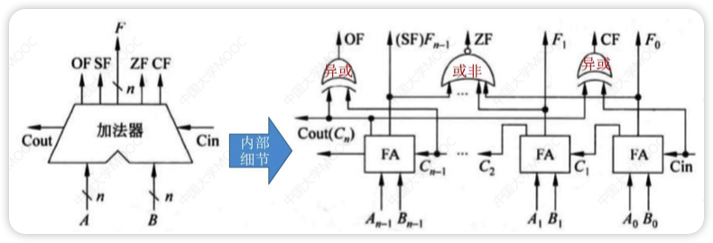

# 基本运算部件

>“我不知道你们的名字，”冯·诺伊曼拍拍前两个士兵的肩，“你们两个负责信号输入，就叫‘入1’、‘入2’吧，”他又指指最后一名士兵，“你，负责信号输出，就叫‘出’吧。”他伸手拨动三名士兵，“这样，站成一个三角形，出是顶端，入1和入2是底边。”[...]冯·诺伊曼接过来分给三名士兵，每人一白一黑，说：“白色代表０，黑色代表1。好，现在听我说，出，你转身看着入1和入2，如果他们都举黑旗，你就举黑旗，其他的情况你都举白旗，这种情况有三种：入1白，入2黑；入1黑，入2白；入1、入2都是白。”[...]“这三个人组成了一个计算系统的部件，是门部件的一种，叫‘与门’。”冯·诺伊曼说完停了一会儿，好让皇帝理解。”
>
>摘录来自
>《三体》刘慈欣

- 逻辑运算符
  - 与(·)(&&)
    - 两个都为1时结果为1
  - 或(+)(||)
    - 两个有一个为1时结果为1
  - 非(Ᾱ,表达式上边加个横线)(!)
    - 取反
  - 异或(⊕)
    - 两个不同时取1
  - 表达式(这里的`乘`和`加`是`与`和`或`)
    - $\overline{A+B} = \bar A \cdot \bar B$（离散数学德摩根率)
    - $\overline{A \cdot B} = \bar A + \bar B$
    - $A(C+D) = A \cdot C + A \cdot D$
    - $ABC = A(BC)$
    - $A+B+C=A+(B+C)$

## 一位全加器（FA）

> Ai+Bi如果两个数相同，加一块后一定是0(先不考虑进位)，否则一定是1，所以可以直接用异或门进行计算
>
> 因为可能有前面的进位Ci-1，所以计算一次后需要与低位的进位再通过一次异或门，这样就能求出Si
>
> 只有Ai与Bi同时为1时需要进位，也可能是Ai+Bi第一次通过异或门后得到的数与Ci-1同时为1时需要进位，不管哪个符合都需要进位
>
> 所以Ai和Bi通过一次与门，Ai+Bi第一次通过异或门后得到的数和Ci-1通过一次与门，然后这两个结果通过一次或门就可以得到Ci

这样就可以得到一个电路图

对蓝色框部分进行封装就可以变为一位全加器（full adder,简称FA）

- FA是最基本的加法单元
- input: 加数Ai和Bi，还有低位传进来的Ci-1,默认为0
- output: 本位和Si，还有向高位的进位Ci
- 和表达式: $S_i = A_i \oplus B_i \oplus C_{i-1}$
- 进位表达式: $C_i = A_iB_i + (A_i \oplus B_i)C_{i-1}$

## 串行加法器

- 把n个FA串连起来，这样就能得到n位加法器
- 每一级进位直接依赖于前一级的进位，进位信号是逐级形成的
- 最长运算时间主要由**进位信号的传递时间**决定

## 并行加法器

> 心平气和，学不会就摆烂，也不是什么重点

根据FA的表达式，如果计算两位数相加

$G_i = A_iB_i,P_i=A_i \oplus B_i$

$C_1 = G_1+P_1C_0$

$C_2 = G_2 + P_2C_1 = G_2 + P_2(G_1 + P_1C_0)=G_2+P_2G_1+P_2P_1C_0$

$C_3 =G_3+P_3G_2+P_3P_2G_1+P_3P_2P_1C_0$

$C_4 =G_4+P_4G_3+P_4P_3G_2+P_4P_3P_2G_1+P_4P_3P_2P_1C_0$

- **CLA**(超前进位部件)是实现上述表达式的部件
- 这种进位方式快速，与位数无关，当位数多时采用全先行进位是不现实的
- 采用**并行进位的目的**是：提高加法器运算速度
- 通常采用**两级或多级先行进位加法器**

## 带标志加法器

- 不仅能计算和/差，还能生成相应的标志信息
- 为了加快加法运算速度，**实际电路一定使用多级先行进位方式**
- OF(Overflow Flag): 溢出标志，溢出时为1，否则为0
  - 硬件计算方法: $OF=最高位产生的进位 \oplus 次高产生的进位=Cout \oplus C_{n-1}$
  - ==OF位对无符号数的加减法无意义==
- SF(Sign Flag): 符号标志，结果为负数时为1，否则为0
  - 硬件计算方法: $SF = 最高位的本位和=F_{n-1}$
  - ==SF位对无符号数的加减法无意义==
- ZF(Zero Flag): 零标志，结果为0时为1，否则为0
  - 硬件计算方法: 两个数的运算结果为n bit，只有n bit全为0时，ZF=1
- CF(Carry Flag): 进位/借位标志，进位/借位时为1，否则为0
  - 硬件计算方法: $CF = 最高位产生的进位 \oplus sub\left \{\begin{array}{l} sub=1, &表示减法 \\ sub=0, &表示加法 \end{array}\right. = Cout \oplus Cin$
  - ==Cin=0时CF=Cout;Cin=1时CF=!Cout(取反)==
  - ==CF位对符号数的加减法无意义==
- A-B<0时，CF=1；溢出时OF=1

## 算术逻辑单元（ALU）

- ALU的核心是带标志加法器
- ALU是功能强大的组合逻辑电路，能进行算术运算，逻辑运算，移位操作
- ALUop是操作控制端，决定ALU所执行的处理操作
- ALUop的位数决定了操作的种类，位数为3时，有$2^3=8$种操作
- 在ALUop的控制下，由一个多路选择器MUX选择输出某种操作结果
- MUX是多路选择开关，它从多个输入信号中选择一个送到输出端

# 定点数的运算

- 定点数是位数不变的数
- 可以不用考虑小数还是整数

## 加减法[常考]

### 补码加减法运算

- 按二进制运算规则计算
- 符号位参与运算
- 高位丢弃

### 溢出判别方式[🌟🌟🌟]

## 移位计算

### 算术移位

- 算术移位的对象是**有符号数**，移位过程中符号位保持不变

- 原码的算数移位：符号位保持不变，数值位进行移位

  - 右移：高位补0，低位舍弃。如果舍弃的低位=0，相当于➗2，否则会**丢失精度**

    

      
丢失精度

      3的原码00000011，右移后变成00000001=1 
      3/2=1.5，所以丢失了0.5，即丢失精度
    

  - 左移：低位补0，高位舍弃。如果舍弃的高位=0，相当于✖️2，否则会出现**严重误差**

    

      
严重误差

      -80=11010000,左移后变成10100000=-32 
      -80*2=-160,与-32完全不同，即出现严重误差
    

- 反码的算数移位

  - 正数原反补相同所以参考原码
  - 负数右移：高位补**1**，低位舍弃
  - 负数左移：低位补**1**，高位舍弃

- 补码的算数移位

  - 正数原反补相同所以参考原码

  - 负数右移：高位补**1**，低位舍弃(同反码)

  - 负数左移：低位补**0**，高位舍弃(同原码)

  - 规律：负数补码中，最右边的1及其右边同原码，左边同反码

    

### 逻辑移位

当作**无符号数**的算数移位

- 左移低位补0
- 右移高位补0

### 循环移位

- 不带进位位：用移出的位补上空缺（传送带）
- 带进位位：移出的位放到进位位，进位位补上空缺（传送带多了一节）

# C语言中的整数类型及类型转换[🌟🌟🌟]

# 数据的存储和排列[🌟🌟🌟]

