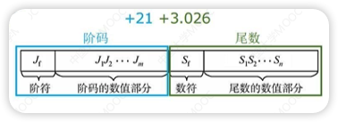
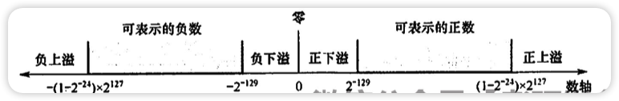
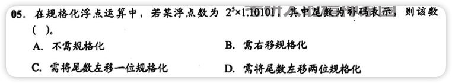
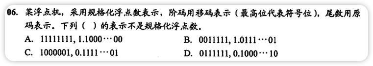
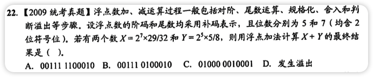
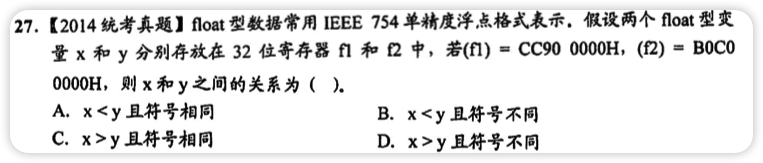

# 浮点数的表示

## 为什么要有浮点数

- 由于二进制表示小数会出现问题，如不能⽤⼆进制表示0.1，所以设计了浮点数来表示⼩数。
- 浮点数表示法能以适当的形式将⽐例因⼦表示再数据中，让⼩数点的位置根据需要⽽浮动。
- 在位数有限的情况下，既扩⼤了数的表示范围，⼜保持了数的有效精度

## 浮点数格式

- 浮点数是指⽤**符号**，**尾数**，**基数**和**指数**来表示的⼩数
- 浮点数有两种：**双精度浮点数double**, 64位；**单精度浮点数float**, 32位
- 浮点数通常表示为==$N=(-1)^S \times M \times R^E$==
  - $(-1)^S$表示符号(±)，机器码中用1表示负，0表示正
  - $M$表示尾数
    - 尾数的位数反映**浮点数的精度**
    - 使用正则表达式、将表现形式多样的浮点数统一为一种表达式
    - 规则：基数为2时，将⼩数点前⾯的值固定为1；基数为4时，尾数的最⾼两位不全为0
  - R表示基数
    - 二进制的基数为2
    - 基数越⼤，表示范围越⼤，但是精度越低
  - E表示指数(阶码)
    - 阶码的位数反映**浮点数的表示范围**

## 浮点数的表示范围

- 正上溢：大于最大正数

- 负上溢：小于绝对值最大负数

- 正下溢：0到最小正数之间

- 负下溢：0到绝对值最小负数之间

- 通俗来说，上溢就是大于最大数，下溢就是小于最小数

- a=001;1.1001;
  - 001对应真值为1，即阶码为1，尾数$1.1001$对应值$- \frac7{16}$
  - $a=2^1 \times \frac9{32}=\frac9{16}$
- b=001;0.01001
  - 001对应真值为1，即阶码为1，尾数$0.01001$对应值$+\frac9{32}$
  - $b=2^1 \times \frac9{32}=\frac9{16}$

## 浮点数尾数的规格化

- 规格化：规定尾数的最⾼数位必须是⼀个**有效值**(1)

- 采用规格化浮点数的目的是为了增加数据的表示精度

- 左归：当浮点数运算的结果为非规格化时要进行规格化处理,将**尾数算术左移一位,阶码减1**。

- 右归：当浮点数运算的结果尾数出现溢出(双符号位为01或10)时,将**尾数算术右移一位,阶码加1**。

- 原码表示的尾数规格化，尾数的最高数值位必须是1

- 补码表示的尾数规格化，尾数的最高数值位必须和尾数符号位相反

  

  

### IEEE 754浮点数的范围[🌟🌟🌟常考选择]

尾数用原码表示，阶码用移码表示(移码符号位与补码相反)

- 单精度
  - 最小值：E=1，M=0，$1.0\times 2^{1-127}=2^{-126}$
  - 最大值：E=254，M=.111...，$1.1....1 \times 2^{254-127} = 2^{127} \times (2 - 2^{-23})$
  - ==单精度阶码取值1～254，偏移值为**127**，最小值为$1 \times 2^{1-127}$，最大值为$(2-2^{23}) \times 2^{234-127}$==
- 双精度
  - 最小值：E=1，M=0，$1.0 \times 2^{1-1023} = 2^{-1022}$
  - 最大值：E=2046，M=.111...，$1.1....1 \times 2^{2046-1023} = 2^{1023} \times (2 - 2^{-52})$
  - ==双精度阶码取值1～2046，偏移值为1023==
- ==规定除去E为全0和全1表示0和无穷大的情况，所有阶码范围为1～254==

# 浮点数的加减运算

- 对阶
  - ⽬的：使两个操作数的⼩数点位置对⻬
  - 对阶操作是把较⼩的阶码调整到较⼤的阶码
  - 阶码增⼤，尾数右移
  - ⽆阶码减⼩的情况
- 尾数求和
  - 对尾数进行加减法
- 规格化
  - [规格化浮点数](#normalization)
- 舍入
  - 舍入是浮点数概念，定点数无舍入
  - 浮点数舍入的情况：对阶或者右规格化
  - 舍入不一定产生误差(后几位为0时不产生误差)
  - 0舍1入
- 溢出判断
  - 如果双符号位为01或10时，溢出
- 选择题可以直接用数学知识计算

## C语言中的浮点数

- 以下转换的范围和精度都从小到大，转换过程没有损失
  - char --> int --> long --> double
  - float -->double
- int/float --> double (能保留精确值)
- int --> float (不会发生溢出，int过大可能会发生舍入)
- double --> float (可能会发生溢出和舍入)
- float/double --> int (可能会发生溢出和舍入)

# 定点数与浮点数的区别

|                | 定点数                         | 浮点数                             |
| -------------- | ------------------------------ | ---------------------------------- |
| 数值的表示范围 |                                | 更大                               |
| 精度           | 更高                           |                                    |
| 数的运算       |                                | 更复杂                             |
| 溢出问题       | 运算结果超出数的表示范围则溢出 | 运算结果超出数的表示范围不一定溢出 |

# 错题集

1. 

   

     
答案与解析：

      
     答案： C
      
     解析： 
    	尾数为补码表示，且为1.0xxx或者0.1xxx时为规格化数据，所以需要左移一位，同时阶码-1
   

2. 

   

     
答案与解析：

      
     答案： B
      
     解析： 
     原码表示时，正数的规格化形式为0.1xxx，负数为1.1xxx
   

3. 

   

     
答案与解析：

      
     答案： C
      
     解析： 
     对接操作中，只有小阶调整到与大阶一致，不存在阶码减小的情况，AB错误
   

4. 

   

     
答案与解析：

      
     答案： D
      
     解析： 
     
   

5. 

   

     
答案与解析：

      
     答案： A
      
     解析： 
     (f1) = <b>1</b>100 1100 1001 0000 ... 0000 
     (f2) = <b>1</b>011 0000 1100 0000 ... 0000 
     显然第一位都是1，符号相同，都是负数 
     f1 = -(1.001)2 * 226 
     f2 = -(1.1)2 * 2-30 
     显然f1绝对值更大，即x < y
   

6. 

   

     
答案与解析：

      
     答案： D
      
     解析： 
     I: 对阶是阶码小的变成与阶码大的一致，阶码大的都没溢出，所以肯定不会引起溢出 
     II: 右规和尾数舍入过程，阶码+1可能引起阶码上溢 
     III: 同II 
     IV: 尾数溢出可能只产生误差，不一定溢出
   

7. 

   

     
答案与解析：

      
     答案： A
      
     解析： 
     C800 0000H = <b>1</b>100 1000 000 ... 0000 
     1. 如果是float型：-1.0*217 
     2. 如果是int型：原码为1011 1000 ... 0000 = -7*227
   
