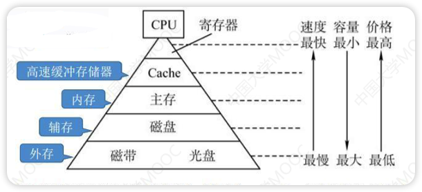
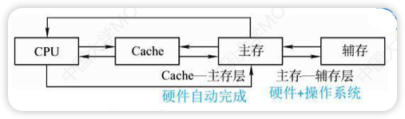
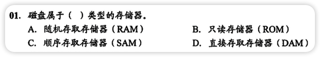
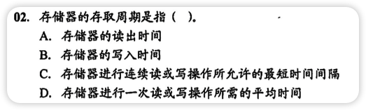
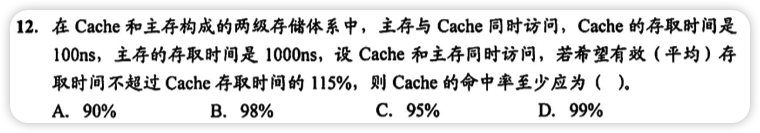
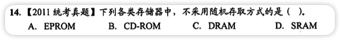

# 存储器的分类
- 按作用分类
	- 高速缓存器(Cache)
		- 容量小
		- 速度可与CPU匹配
		- 价格高
		- 位于主存和CPU之间
		- 用来存放当前CPU经常使用的指令和数据，以便CPU能高速地访问他们(解决主存与CPU之间速度不匹配的问题)
		- 现代计算机通常将其制作在CPU中
	- 主存储器(主存)
		- 容量较小
		- 速度较快
		- 价格较高
		- 用来存放计算机运行期间所需的程序(指令)和数据，由ROM和RAM实现
		- 在CPU外，按地址访问
	- 辅助存储器(辅存/外存)
		- 容量大
		- 速度慢
		- 价格低
		- 用来存放当前暂时不用的程序和数据以及一些需要永久性保存的信息
		- 辅存的内容需要调入主存后才能被CPU访问
- 按存储介质分类
	- 磁表面存储器
		- 磁带、软盘...
	- 磁芯存储器
		- 机械硬盘
	- 半导体存储器
		- 固态硬盘，MOS型存储器，双极型存储器
	- 光存储器
		- 光盘
- 按存取方式分类
	- 相联存储器(CAM)
		- 可以按内容访问
	- 随机存储器(RAM)
	  - 读写方便、使用灵活
	  - RAM分为**静态RAM**和**动态RAM**
	  - RAM主要为用户编程设置的
	- 只读存储器(ROM)
	  - ROM与RAM一起统一构成主存的**地址域**
	  - ROM和RAM的存取方式**均为随机存取**
	  - 操作系统的内存储器既有RAM也有ROM
	  - ROM存放系统程序，标准子程序和各类常数
	- 串行访问存储器
	  - 读写某个存储单元所需要的时间与存储单元物理位置有关
	  - 顺序存取存储器(磁带)(SAM)
	    - 存取速度慢
	    - 只能按照某种顺序存取
	  - 直接存取存储器(DAM)
	    - 既有随机存取特性，也有顺序存取特性
	    - 先直接选取信息所在区域，然后按顺序方式存取
- 按信息可保持性分类
	- 易失性存储器
		- 断电后存储信息消失(如RAM)
	- 非易失性存储器
		- 断电后存储信息仍保存(如ROM, 磁表面存储器，光存储器)
# 多级层次的存储系统

- **层次结构**：Cache——主存层——辅存

  - 主存—辅存：实现了虚拟存储系统，**解决了主存容量不够的问题**

  - Cache—主存：**解决了主存与CPU速度不匹配的问题**

- **层次思想**：上一层的存储器作为低一层存储器的高速缓存，上一层的内容是下一层的内容的一部分

- Cache和主存能与CPU直接交换信息，辅存要通过主存与CPU交换信息

- 主存与CPU、Cache、辅存都能交换信息

- 主存和Cache之间的数据调动是由硬件自动完成的，**对所有程序员透明**

- 主存和辅存之间的数据调动是由操作系统完成的(换入换出技术)，**对应用程序员透明**

# 存储器的性能指标

- 存储容量
  - 存储容量 = 存储字数 * 字长(如1M*8bit)
  - 存储字数表示存储器的地址空间大小(MAR)
  - 字长表示一次存取操作的数据量(MDR)
- 单位成本
  - 每位价格 = 总成本 / 总容量
- 存取速度
  - 数据传输率 = 数据的宽度 / 存储周期
  - 数据传输率中的K, M基数为10(是10的次方，不是2，只有存储容量基数为2)
  - 存储周期大于存取时间，因为有一段恢复内部状态的复原时间
    - 存取时间Ta = 从启动一次存储器到完成该操作所经历的时间
    - 存取周期Tm = 存储器进行连续读或写操作所允许的最短时间间隔
    - 主存带宽Bm = 数据传输率 = 每秒从主存进出信息的最大数量 = 单位 字/秒

# 错题集

1. 

   

     
答案与解析：

      
     答案： D
      
     解析： 
     磁盘属于DAM，速度介于随机存取存储器和顺序存取存储器之间
   

2. 

   

     
答案与解析：

      
     答案： C
      
     解析： 
     C说的对
   

3. 

   

     
答案与解析：

      
     答案： D
      
     解析： 
     假设命中率为x，可知 100x + 1000(1 - x) ≤ 100 * 115% 
     x ≥ 98.33%
   

4. 

   

     
答案与解析：

      
     答案： B
      
     解析： 
     EPROM、DRAM、SRAM均采用随机存取方式(RAM都叫随机存取器了) 
     CD-ROM是只读型光盘存储器💿，顺序访问，不属于只读存储器ROM
   
