# 主存储器的基本组成
- 存储器最小的存储结构为存储元，0和1存储在电容中，通过MOS管的通断点控制电容充放电(存0或1)

	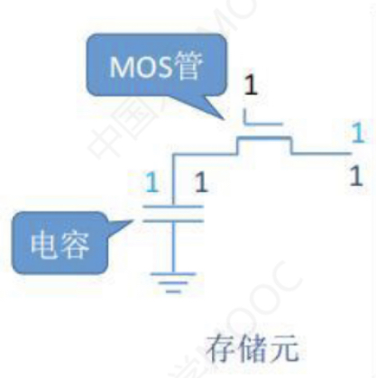
  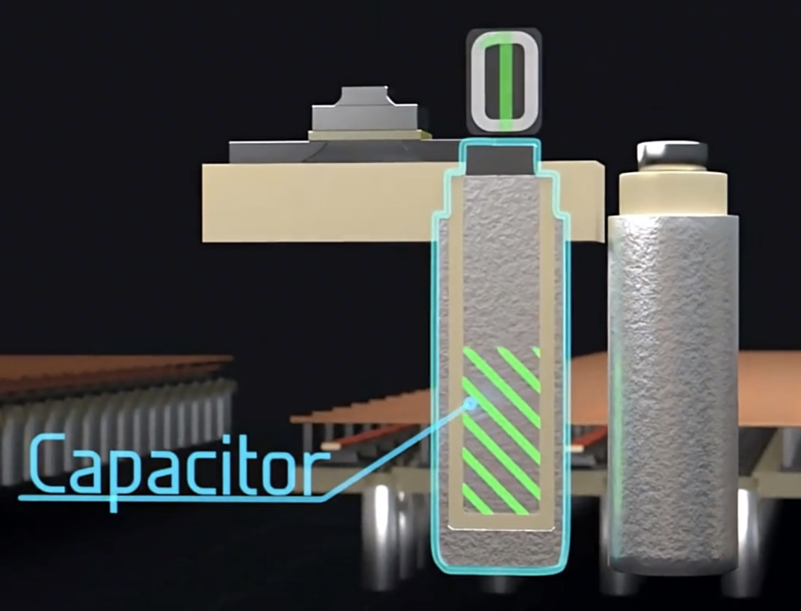

- 8个存储元(存储字长=8)排在一排就构成了一个存储单元，接在一根数据总线上(总线宽度=存储字长=8)，若干个存储单元放一块就成了存储体(硬盘上的一个黑块块)
	- 总容量 = 存储字数 * 存储字长
	- 数据线的宽度 = MDR的宽度 = 存储字长
	- 地址线的宽度 = MAR的宽度 = 存储字数 = 2存储单元行数
		- 36位地址线的宽度为236
		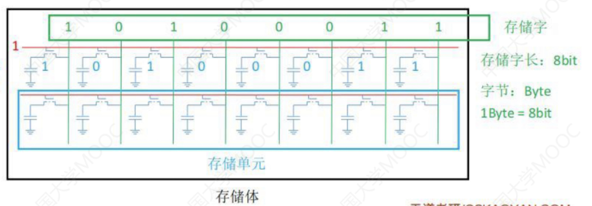
		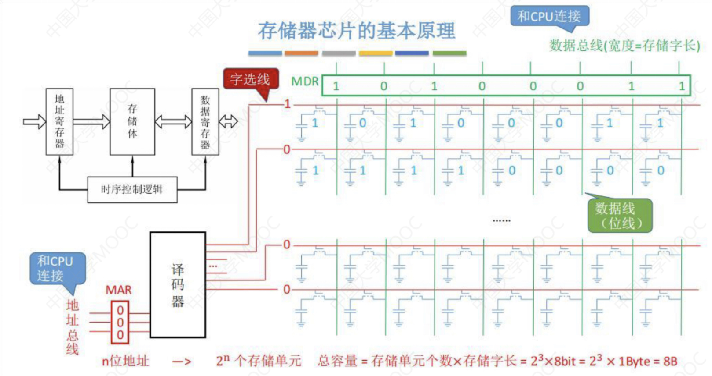
		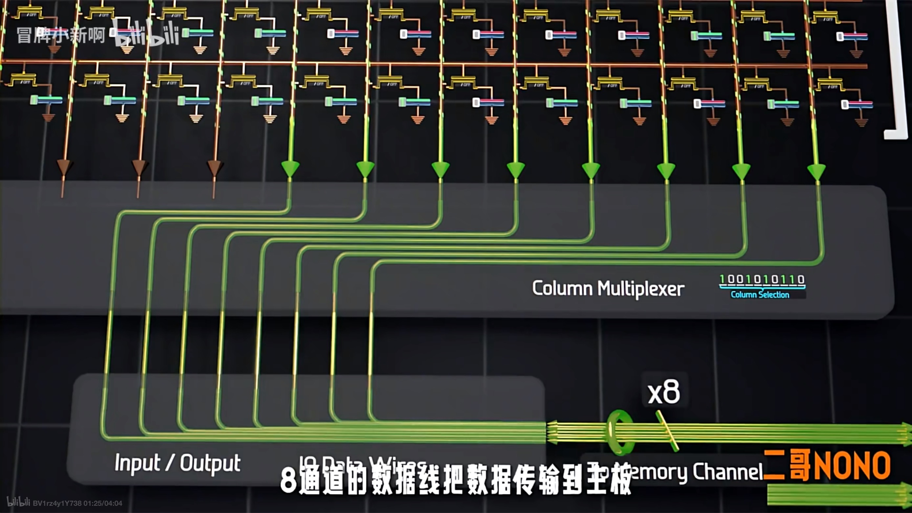
- 存储体+IO/读写电路+地址译码器+读写控制信号 = 主存储器
	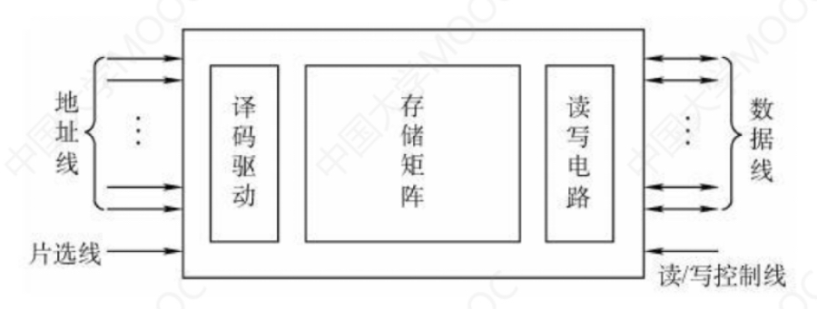
	- **读RD/写WR控制线**：决定芯片是进行读还是写操作
	- **片选线CS**：确定那个存储芯片被选中。可用于容量扩充
	- **引脚最低数目** = 片选线(1条) + 控制线(RD+WR = 2条) + 数据线 + 地址线 
<iframe src="https://player.bilibili.com/player.html?aid=570598432&bvid=BV1rz4y1Y738&cid=1114421215&page=1" scrolling="no" border="0" frameborder="no" framespacing="0" allowfullscreen="true" style="width: 80vw;height:45vw;margin: 0 calc((100% - 80vw) / 2);"></iframe>

## 寻址方式
- 题目没有明确指定按字编址，默认就是按字节编址(一字节8位)
	- 64位计算机中，64位(bit) = 8字节(byte) = 1字(word)
	- 32位计算机中，32位(bit) = 4字节(byte) = 1字(word)
- 存放一个机器字的存储单元，通常称为字存储单元，相应的单元地址叫**字地址**
- 存放一个字节的存储单元，称为字节存储单元，相应的地址称为**字节地址**
- 如果计算机中可编程的最小单位是字存储单元，则该计算机称为**按字寻址**的计算机
- 如果计算机中可编程的最小单位是字节，则该计算机称为**按字节寻址**的计算机
- 一个**机器字可以包含数个字节**，所以**一个存储单元也可以包含数个能够单独编制的字节地址**
  - 例：一个16位二进制的字存储单元可以存放两个字节，可以按字编址，也可以按字节编址。当用字节编址时，16位存储单元占用两个字节地址
# SRAM芯片和DRAM芯片

|                                    | SRAM(Static Random Access Memory)     | DRAM(Dynamic Random Access Memory)        |
| ---------------------------------- | ------------------------------------- | ----------------------------------------- |
| 主要用途                           | Cache                                 | 主机内存                                  |
| ==存储信息==(核心区别)             | 触发器，双稳态电路                    | 栅极电容(前面的存储元)                    |
| 破坏性读出(读出后需要重写)         | ❌                                     | ⭕️                                         |
| 需要刷新                           | ❌                                     | [⭕️](#DRAM的刷新)                          |
| 送行列地址                         | 同时                                  | 分两次送([地址线复用技术](#地址复用技术)) |
| 运行速度                           | 快(读出后不用重写)                    | 慢                                        |
| ==集成度==(容易混)                 | 低                                    | 高                                        |
| 存储成本(对比两种存储元结构就知道) | 高                                    | 低                                        |
| 功耗(发热量)                       | 高                                    | 低                                        |
| 易失/非易失性存储器                | 易失(断电后信息消失,电脑一关机就没了) | 易失(断电后信息消失,电脑一关机就没了)     |

> 双稳态电路：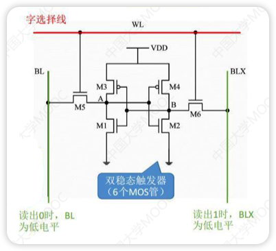

> 破坏性读出：前面的存储元结构，读出数据时，如果是1，电容中的电荷会流失，导致原有的信息被破坏，读出后需要有重写操作（再生）

## DRAM的刷新

 DRAM电容的电荷维持时间短，即使电源不断电信息(电荷)也会自动消失。因此每隔一段时间必须刷新，==一般取2ms(刷新周期/再生周期)==

- DRAM的刷新是以行为为单位
- 一次完整的刷新过程只需要占用一个存储周期
- 
- ==刷新时间=存取周期==
  - 刷新其实还是往电容里充放电，与存取一样，所以时间相同
  - 存取周期如果是0.5μs
- ==存取周期>真正用于存取的时间==
  - 存取周期内，存取操作结束后仍然需要一些时间来改变状态
- 行列地址
  - 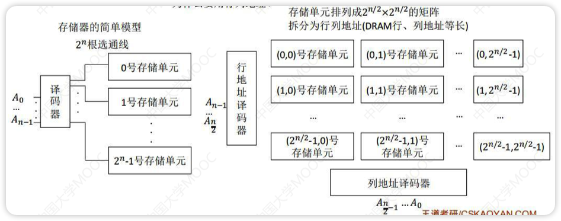
  - 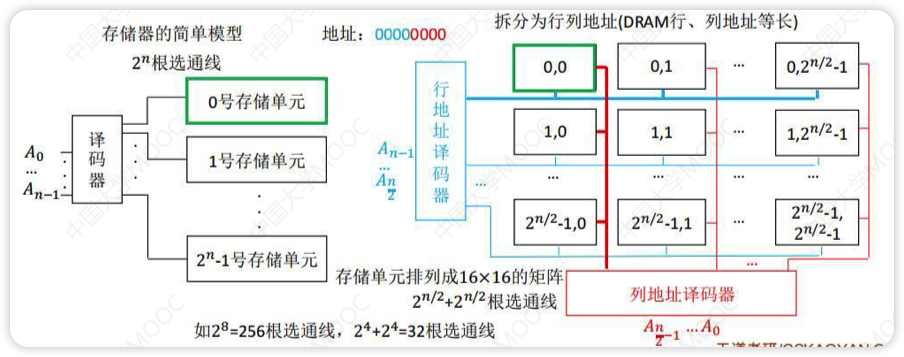
- DRAM刷新
  - 以行为单位，每次读出来一行然后重新写入，占用一个存取周期
  - 假设DRAM内部结构排成128 * 128的形式，存取周期0.5μs，2ms共2ms/0.5μs=4000个周期
  - 由存储器独立完成，不需要CPU控制
  - 集中刷新
    - 2ms内集中安排时间全部刷新
    - 系统的存取周期不变，还是0.5μs
    - 在2ms中的最后一段时间内专门进行刷新，这段时间被称为“死区”
    - 全部刷新需要128行*0.5μs/行 = 64μs，即死区占用64μs
    - 
  - 分散刷新
    - 每次读写完就刷新一行
    - 系统的存取周期变为1μs，前0.5μs正常读写，后0.5μs用于刷新
    - 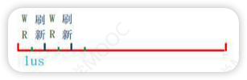
  - 异步刷新
    - 一共需要128次刷新，均匀分布到2ms中
    - 即每隔2ms/128=15.6μs刷新一次，每15.6μs内有0.5μs的“死时间”
    - 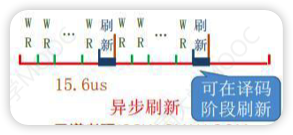

## 地址复用技术

- 由于DRAN芯片容量大，地址位数多，为了减少地址引脚线，采用**地址复用技术**
- DRAM因为分两次发送，长度相同，因此地址线可以复用，线数减少了一半
- 引脚数 = 地址线减半 + 数据线不变 + 行通选(1条) + 列通选(1条) + 读写控制线(2条)
- 片选线用行通选线替代
- **DRAM采用地址复用技术，SRAM不采用**

# 只读存储器

- 特点
  - 结构简单，位密度比可读写存储器高
  - 具有非易失性，可靠性高
- 类型
  - 掩模式只读存储器(MROM, Mask Read-Only Memory)
    - 内容在生产过程中写入
    - 可靠性高，集成度高，价格便宜，灵活性差
  - 一次可编程只读存储器(PROM, Programmable Read-Only Memory)
    - 用于用户实现一次性编程
  - 可擦除可编程只读存储器(EPROM, Mask Read-Only Memory)
    - 用于用户实现多次性编程
    - 可多次改写，但次数有限，写入时间过长
  - Flash存储器
    - 既可在不加电的情况下长期保存信息，又能在线进行快速擦除和重写
    - 价格便宜，集成度高，电可擦除重写且擦除重写速度快
  - 固态硬盘 SSD
    - SSD即闪存，是一种非

# 多模块存储器

 
