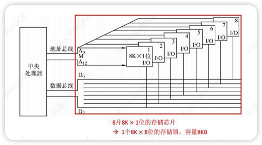
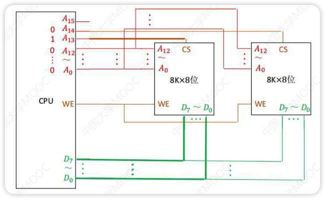
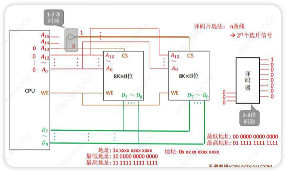
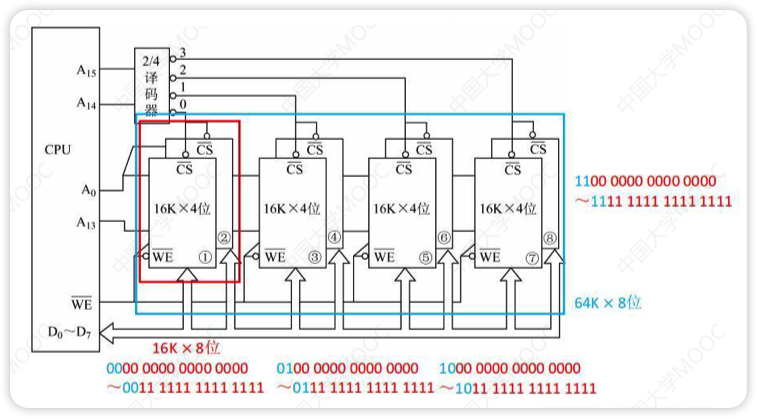
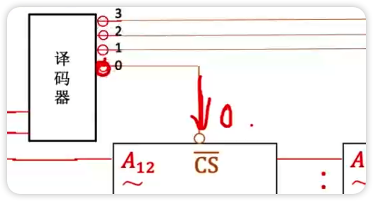

# 连接原理

- CPU读指令，通过地址线去访问存储器的MAR(地址寄存器)
- MAR(地址寄存器)通过选通线去访问矩阵中的数据
- 矩阵需要通过数据线与MDR(数据寄存器)进行收发

# 主存容量的扩展

## 位扩展法

- 8K * 8位的存储器 = 8片 8K * 1位的RAM组成
- 地址线并行，数据线一一接上

## 字扩展法(线选法)

- 16k * 8位的存储器 = 2片 8K * 8位的存储器
- 由片选信号来区分各芯片的地址范围
- 当A13为1时第一块存储器工作，此时A14必须为0，否则会造成数据冲突
  - 2位二进制时，只能用01或10(A13 A14)
  - n条线就有n个片选信号
- 谁工作，数据线就接送谁的数据，即将CS设置为1

## 字扩展法(译码片)

- 译码片就是通过非门控制实现不同电路的选择(如上图A13传给1-2译码器0或者1，这样译码器就可以连通一条线路)，是一个二进制转十进制的物理元件
- n条线路可以表示2n个选片信号(就像n位二进制数可以表示2n位十进制数)
- 常用译码器：
  - 1-2译码器：CPU输入1条线路，可以表示2个选片信号
  - 2-4译码器：CPU输入2条线路，可以表示4个选片信号
  - 3-8译码器：CPU输入3条线路，可以表示8个选片信号(如上图)

## 字位同时扩展法

- 一块芯片只有4位，因此通过2片叠加先实现位扩展
- 等价于实现了一个8位存储芯片
- 再通过译码片选的方式实现字扩展
- 在不同的地址线中选择不同的芯片组合进行工作

> 
>
> 注意这里的非门和低电平有效

| 线选法             | 译码片选法                       |
| ------------------ | -------------------------------- |
| n条线->n个选片信号 | n条线->2n个选片信号   |
| 电路简单           | 电路复杂                         |
| 地址空间不连续     | 地址空间可连续，可以增加逻辑设计 |

# 错题集

1. 

   

     
答案与解析：

      
     答案： A
      
     解析： 
     4B = 32bit = 32位 
     用8位存储芯片构造成32位需要位扩展，变成8K * 32位 = 32KB 
     所以不需要再进行字扩展
   

2. 

   

     
答案与解析：

      
     答案： A
      
     解析： 
     4K * 4位扩展成16KB需要8块存储芯片 
     如果16KB的存储器是32K * 4位，需要15根地址线，其中存储芯片用log24K = 12根，所以需要3根地址线作为地址线输入，答案都给的两根所以存储器不是4位 
     如果是16K * 8位，需要log216K = 14根地址线，存储芯片用12根所以剩下2根作为地址线输入，四个选项都是2根所以16KB的存储器是16K * 8位 
     这里的地址总线是从高位往低位排的，所以12根地址线是A4 - A15 
     再往前两根就是译码器输入的地址线，即A3和A2
     
   

3. 

   

     
答案与解析：

      
     答案： D
      
     解析： 
     CFFFF H - 90000 H + 1= 40000 H = 218 = 256K 
     按字节编址，一个地址是8位所以总容量为 256K * 8位 
     (256K * 8位) / (16K * 8位) = 16
   

4. 

   

     
答案与解析：

      
     答案： D
      
     解析： 
     8个高位地址为片选译码所以把四个选项的前8位写出来就是 
     A. 1010 1011		B.1011 1011 
     C. 1110 1111		D.1111 1110 
     灰色的是不生效线路，绿色部分有一个1即可输出1(题目中的A17和A18) 
     低电平生效所以译码输出为0，前面有非门所以译码器应该输出1 
     译码器中进行与运算，如果出现0就会导致输出0，即译码输出1，所接芯片不生效 
     四个选项中只有D选项的A12位置为0导致最后译码输出为1
   

5. 

   

     
答案与解析：

      
     答案： D
      
     解析： 
     
   

6. 

   

     
答案与解析：

      
     答案： D
      
     解析： 
     主存地址空间决定MAR位数，组成的32MB的主存储器只是没有把主存地址空间全部用完 
     64MB = 226B 
     所以至少为26位
   

7. 

   

     
答案与解析：

      
     答案： C
      
     解析： 
     依题意，这是一个 r * c位的芯片，r*c=2K*1=211 
     DRAM使用行列地址线复用技术，所以存储阵列越接近正方形越好，即r和c差值越小越好 
     为了减少刷新，行越少越好(按行刷新)，所以选C
   

8. 

   

     
答案与解析：

      
     答案： D
      
     解析： 
     3F FFFFH - 00 0000H + 1 = 40 0000H = 222个地址 
     按字编址且字长为32位，所以存储芯片为 222 * 32bit = 227bit 
     227bit / 219*8bit = 25 = 32
   

