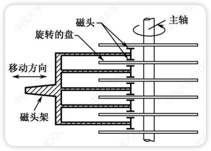
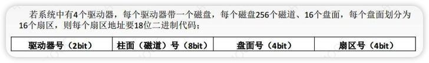
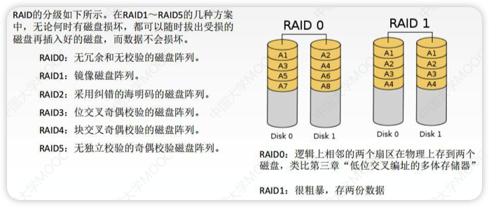
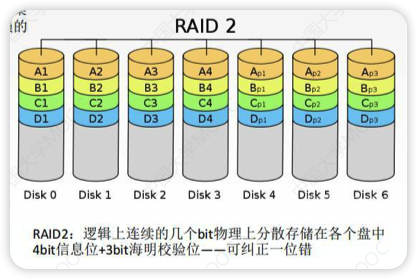
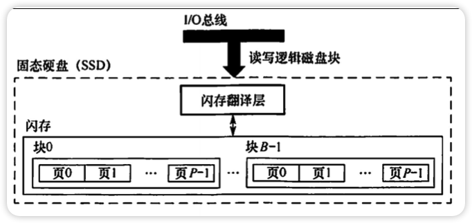

# 磁盘存储器

外存又称辅助存储器，主要使用磁表面存储器

- 优点
  - 存储容量大，位价格低
  - 记录介质可以重复使用
  - 记录信息可以长期保存不丢失，甚至可以脱机存档
  - 非破坏性读出，读出时不需要再生
- 缺点
  - 存取速度慢
  - 机械结构复杂
  - 对工作环境要求较高

- 一块硬盘含有若干个记录面，每个记录面划分若干条磁道，每条磁道划分为若干个扇区(块)，块是磁盘的最小单位(磁盘按块存取)
- 硬盘存储器由磁盘驱动器、磁盘控制器和盘片组成
- 每个扇区的数据量相同(如1KB)
- 簇：一组扇区
- 性能指标
  - 磁盘的容量：磁盘能存储的字节总数
    - 非格式化容量：磁记录表面可以利用的磁化单元总数
    - 格式化容量：按照某种特定的记录格式所能存储信息的总量(有部分扇区会被划分为其他用处，比如顶替坏掉的扇区用，所以格式化容量一般小于非格式化容量)
  - 记录密度：盘片戴维面积上记录的二进制的信息量
    - 道密度：沿磁盘半径方向单位长度上的磁道数
    - 位密度：磁道单位长度上能记录的二进制代码位数
    - 面密度：位密度 * 道密度
    - ==磁盘所有磁道记录的信息量一定相等，最大圈的磁道与最小圈的磁道记录信息量相同==
      - 磁道越靠内，位密度越大
  - 平均存取时间 = 寻道时间(磁头移动到目的磁道) + 旋转延迟时间(磁头定位到所在扇区) + 传输时间(传输数据所花费的时间)
  - 数据传输率：磁盘存储器在单位时间内向主机传送数据到字节数
    - 假设磁盘转速为r转/秒，每条磁道容量为N个字节，则数据传输率为$D_r=rN$
- 使用**驱动器号(C盘还是D盘)、柱面号、盘面号、扇区号**来定位任意一个磁盘块
  - 
- 工作方式：
  1. 将磁头移动到想要读/写的扇区所在的磁道
  2. 磁盘转动，让目标扇区从磁头下面划过才能完成对扇区的读/写操作
- 机械式部件，读写是串行的，不能同时既读又写或者同时读(写)两组数据
- 磁盘阵列
  - RAID0没有容错能力
  - RAID1容量少一半
  - 
  - 

# 固态硬盘SSD

- 是一种基于闪存技术的存储器
- 一个SSD由一个或多个闪存芯片(代替磁盘的机械驱动器)和闪存翻译层(代替磁盘控制器)组成
- 闪存翻译器可以将块地址修改
  - 比如块0磨损比较严重，可以将块0的地址指向另一个比较新的块
- 优点
  - 由半导体部件组成，没有移动的部件
  - 随机访问的时间比机械硬盘快很多(因为没有物理移动时间)
  - 没有机械噪声和振动(机械硬盘转盘有声音)
  - 能耗低(因为不用驱动转盘旋转)
  - 抗震性好
- 缺点
  - 容易磨损(所以当不了传家宝)
    - 一个块被擦除次数过多(重复写同一个块)可能会坏掉，机械硬盘的扇区不会
- 
- 磨损的均衡技术
  - 思想：将擦除平均分布在各个块上，以提升使用寿命
  - 动态磨损均衡：写入数据时有限选择累计擦除次数少的新闪存块
  - 静态磨损均衡：SSD检测并自动进行数据分配、迁移，让老旧的闪存块承担以读为主的存储任务，较新的闪存块承担更多的写任务