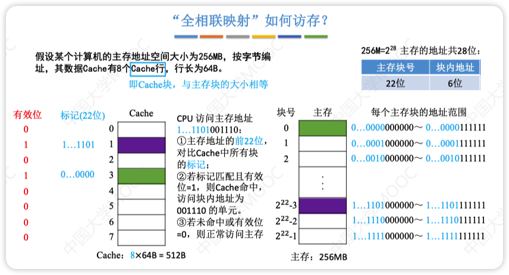
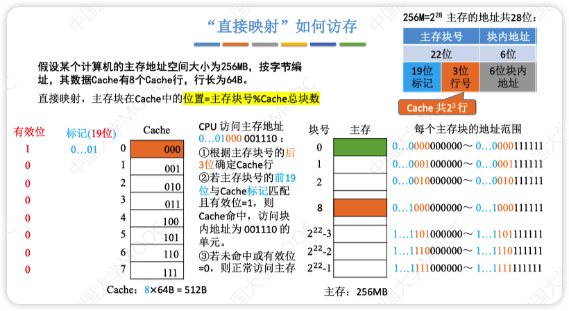
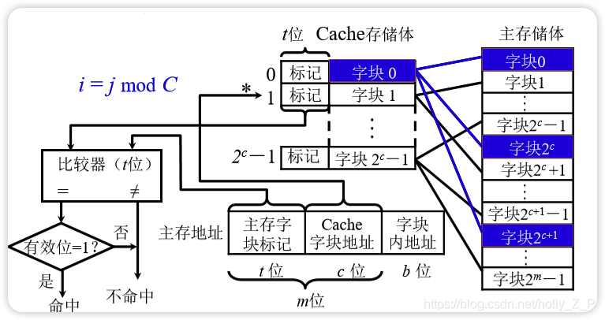
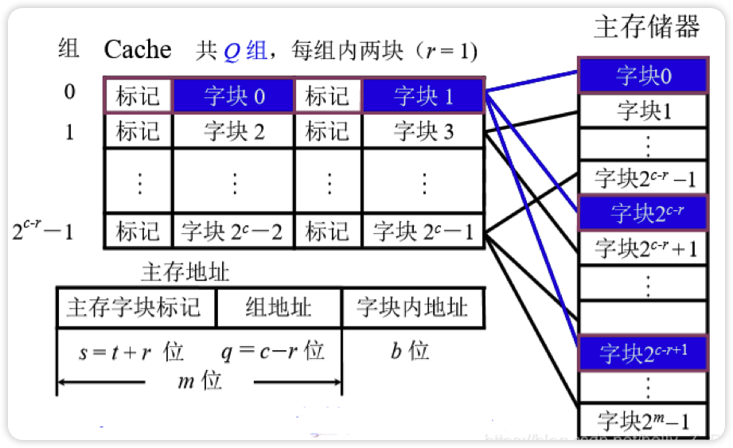
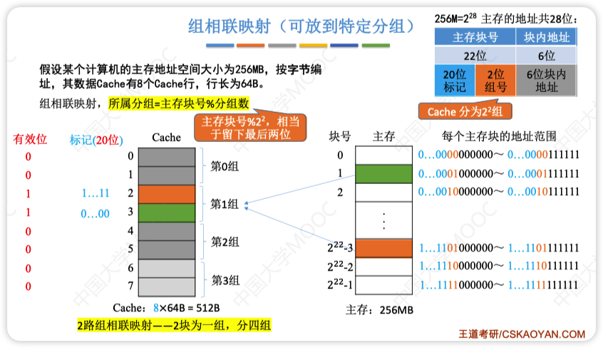
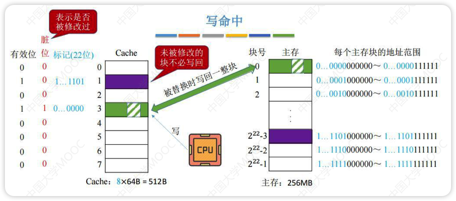
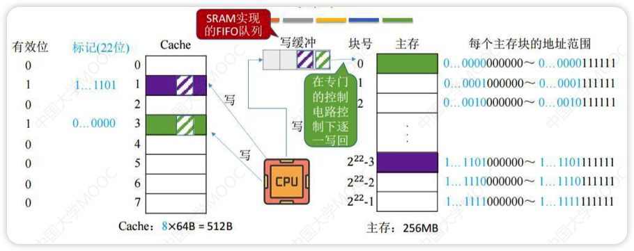
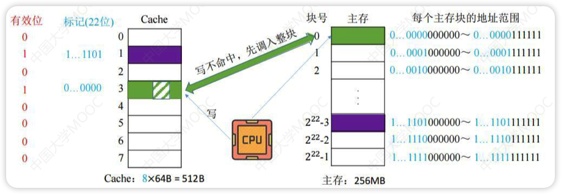
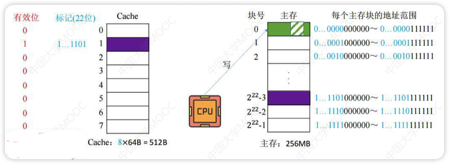
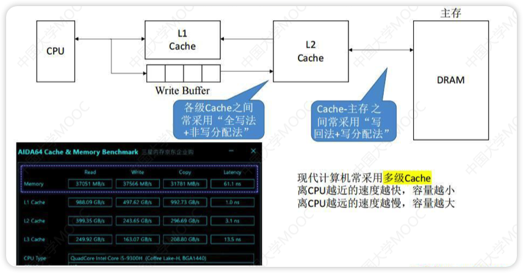

# Cache(高速缓冲存储器)
- 工作原理：将某些主存块复制到Cache中，缓和CPU与主存之间的速度矛盾
- 局部性原理
	- ==时间局部性==是指最近还要用到的信息，很可能是现在正在使用的信息
		- 比如循环
	- ==空间局部性==是指程序访问了某个存储单元，那么不久后其附近的存储单元也可能被访问
		- 比如线性表的访问，每个元素按顺序存放在存储单元中
- 性能分析
	- Cache命中率：CPU将要访问的数据已经存放到Cache中的概率
		- H(命中率),Nc(访问Cache的次数),Nm(访问主存的次数)
		- $H = \frac{N_c}{N_c + N_m}$ 
	- Cache缺失率：Cache没命中的概率
		- $1 - H$
	- 平均访问时间：
		- Tc(访问Cache需要的时间)，TM(访问主存需要的时间)
		- $T_a = H \times T_c + (1 - H) \times T_m$
	- 两种访存方式
		- 先访问Cache，未命中再访问主存
		- 同时访问Cache和主存，Cache命中后立即停止访问主存
		- 
- CPU与Cache/主存的信息交互单位为**字**，Cache与主存的信息交换单位为**块**
- 一个块通常由若干字组成
- ==每次被访问的主存块，一定会被立即调入Cache==

# 地址映射
> 数据从主存拿过来应该放到Cache的什么位置

- 全相联映射(随便放)
	- 只规定了主存需要映射到Cache中，没规定放在哪个位置
	- 通常使用按内容寻址的**相联存储器**进行地址映射
	- t,c,b,m参考下面直接映射的计算方法
	- 优点：空间利用率高，命中率也高
	- 缺点：标记的比较速度较慢，实现成本较高，需要相联存储器进行地址映射
	- 
- 直接映射(对号入座)
	- 规定好了主存中每一块都放置在Cache中的位置，且相邻块之间映射的位置也是相邻的
	  - 地址结构：标记(主存块号前几位) + Cache行号(主存块号末c位) + 块内地址
	- 优点：实现简单，访问时对于任意一个地址，只需要对比一次“标记”，速度最快
	- 缺点：块冲突频率最高，空间利用率最低
	- 计算方法
	  - 主存地址长度
	    - 主存中存储单元个数为210,则主存地址长度就是10
	  - Cache地址长度
	    - Cache中存储单元个数为210,则Cache地址长度就是10
	  - Cache行的总位数
	    - 标记位数t + 数据位 + 1位有效位 + 1位脏位(回写策略)
	    - t(主存区号、Tag位、主存字块标记)
	      - 通过主存区的标记位数就能知道这个Cache是属于主存的第几区
	      - t = 主存地址长度 - Cache地址长度
	      - ==t = 主存大小/Cache大小==
	    - c(Cache块的地址位数)
	      - 如果有1k个Cache行，则Cache的地址位数=c=10
	    - m(主存块的地址位数)
	      - 如果有1k个主存块，则主存块的地址位数=m=10
	    - b(块内地址总数)
	      - 如果块的大小为32B，按字节编址，块内地址位数=b=5
	    - 有效位
	      - 每个Cache行一般都有一个有效位，判断Cache是否命中(**计算位数一定要加上**)
	      - 有效位的作用是指出所在Cache行中的信息是否有效(标记0是指没有存放信息还是0号地址)
	      - cache命中条件：标记相等，有效位为1
	    - 脏位
	      - 如果是回写策略，则需要1个脏位(题目有回写策略需要加上脏位)
	    - LRU位
	      - 如果用LRU替换算法，则增加一位LRU位
	    - 其他
	      - m = t + c
	      - m = 主存地址 - b
	      - 主存地址长度 = t + c - b
	    - 
	  - 
- 组相联映射(安号分组，组内随便放)
	- 先按号分组(比如8块Cache分为4组)
	- 组内任意放(组内是全相联映射)
	- 
	- 计算
	  - Cache的总块数：2c
	  - Cache分组个数 = 2q = 分块个数 / 组内块数
	  - r路组相联映射 = 每r个Cache行为一组 = 每组包含r块
	- 

# 替换算法

## 随机算法

- 无脑换
- 不管被替换的数据是否经常使用，直接覆盖替换
- 现实中不会以这种方式设计

## FIFO(先进先出)

- 按调入cache的先后顺序来淘汰，先放进去的先被替换
- 需要记录进入cache的先后次序
- 实现起来比较简单
- 缺点是只考虑了时间层面的问题，有些常用的数据可能也会因为进去的早被替换，没有遵循局部性原理

## LRU(近期最少使用)

- 把最近比较少用的替换掉
- 需要记录进入cache的先后顺序
- 也需要软件技术器记录使用的频率
- 实现起来比较复杂且开销大
- 根据程序访问局部性原理选择近期使用的最少的存储块作为替换的块
- 实际运行效果优秀，Cache命中率高
- Cache块的总数若为2n,则计数器只需要n位
- 手算找哪一块被替换方法：
  - 例：Cache有4块，CPU已经访问主存地址块号`4,6,12,4,8`，下次访问块号`14`
  - Cache一共有4个位置，有一块应该放`14`（被替换的块号),剩下三块的块号就从后往前数三个(重复的算一个)
  - 三块不被替换的块号为`12,4,8`
  - 去掉前面与这三个相同的块号，就变成了~~4~~, 6, ~~12, 4, 8~~
  - 所以被替换的块是6

## LFU(最不经常使用)

- 只统计使用次数，谁被用的最少就替换谁
- 通常也需要硬件设计计数器支持
- 流程：
  - 每次命中cache时将使用次数+1
  - 替换时选择次数最小的进行替换
- 这样容易造成使用次数太大导致存不下，所以不如LRU

# 写策略

确保CPU修改Cache中数据副本后与主存数据母本一致

## 写命中

### 写回法

先只修改Cache的内容，不立即写入主存，为了表示数据是被修改过的，所以用一个脏位记录

当此块被换出时写入主存

减少了访存次数，但存在数据不一致的隐患

### 全写法/写直通法

将要写的数据字节写入Cache和写缓冲(SRAM实现，所以比写回法的直接写入主存快的多)中，写缓冲会自己一个个写到主存(此过程与CPU无关)

写的操作不频繁时效果非常好，但如果写操作繁琐，可能会因为写缓冲饱和而发生阻塞

## 写没命中

### 写分配法

先把主存中的块读到Cache中，然后就变成了写回法

### 非写分配法

直接写入到主存，不用读入Cache(只有“读”未命中时才调入Cache)

相当于不用往Cache中写的全写法

# 多级Cache

